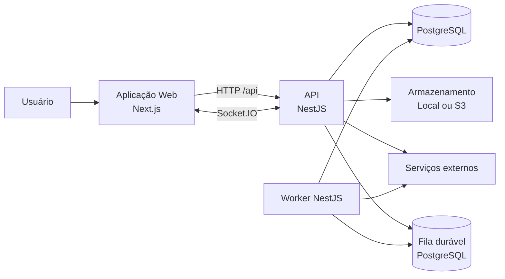
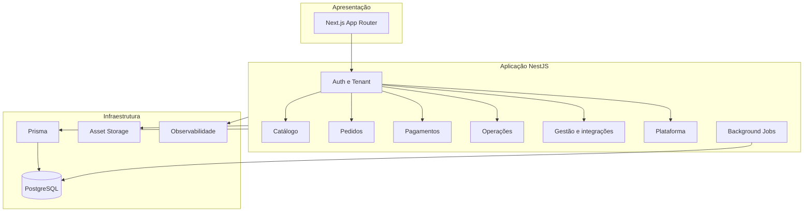
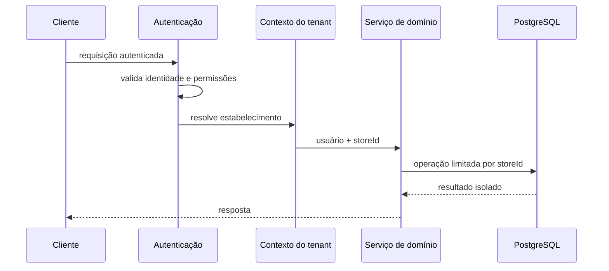
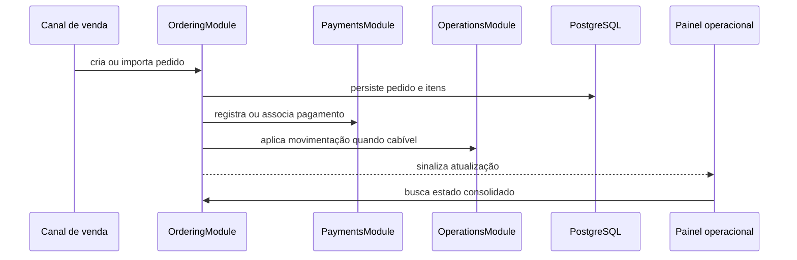
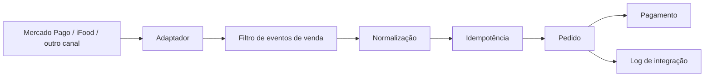
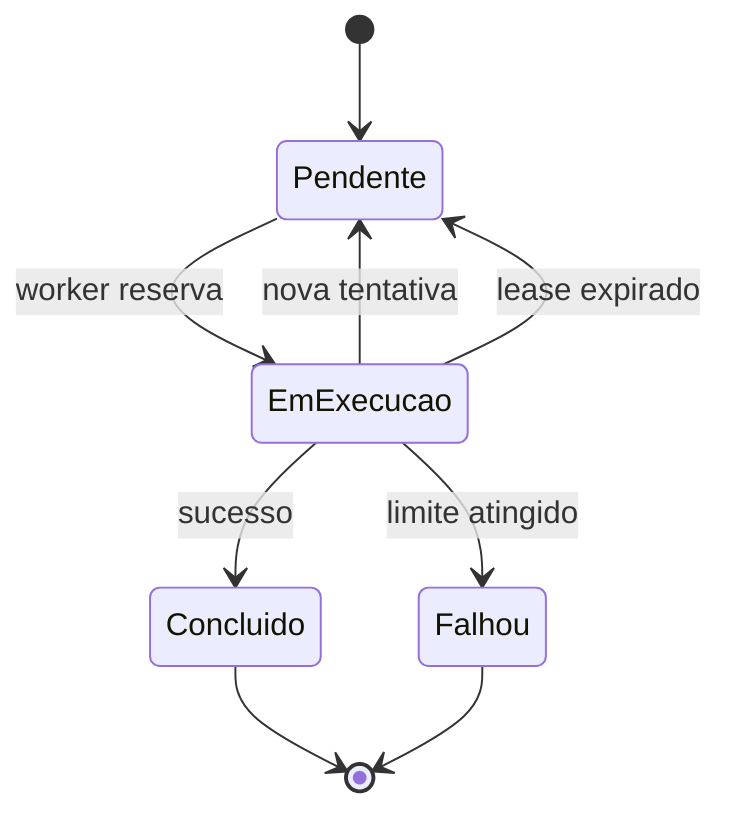
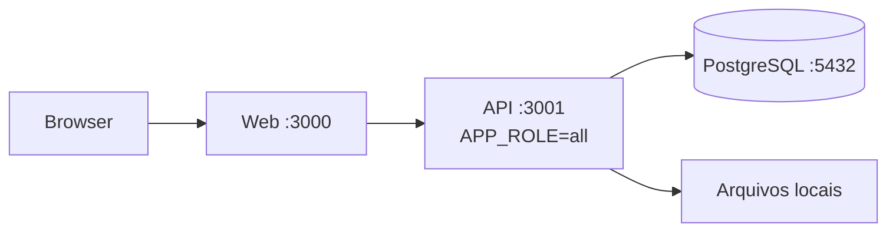
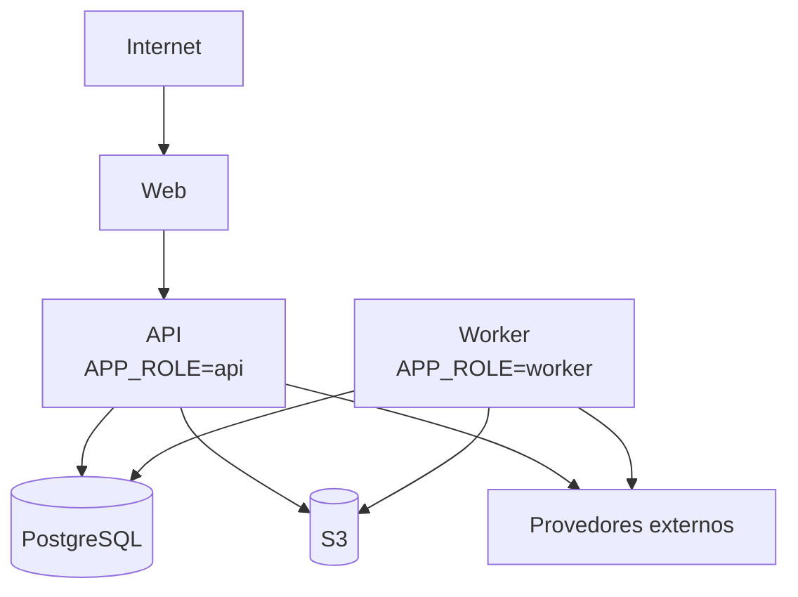

# Arquitetura do Sistema

Este documento descreve a arquitetura atual do BurgoOS, seus componentes, responsabilidades, fluxos principais e restrições operacionais. Deve ser atualizado sempre que houver mudança estrutural relevante.

## 1. Visão geral

O BurgoOS, mantido neste repositório `erp.lite`, é um monólito modular organizado em monorepo. A solução contém uma aplicação web, uma API NestJS, um processo de worker e pacotes compartilhados. O PostgreSQL é a fonte de verdade dos dados de negócio e também sustenta a fila durável de tarefas em segundo plano.



Características centrais:

- arquitetura de monólito modular, separada por domínio;
- frontend e backend implantáveis separadamente;
- execução de jobs separável da API por papéis de runtime;
- isolamento lógico por estabelecimento (`storeId`);
- comunicação síncrona por HTTP e assíncrona por jobs e eventos em tempo real;
- Prisma como camada de acesso ao PostgreSQL;
- foco em baixo consumo de memória e ambientes com limite de 512 MB.

## 2. Estrutura do monorepo

```text
apps/
  api/                       API, worker e regras de negócio
  web/                       interface web Next.js
packages/
  database/                  schema, migrations e cliente Prisma
  types/                     contratos e tipos compartilhados
  ui/                        componentes visuais compartilhados
docs/                        documentação transversal
scripts/                     automações locais e operacionais
specs/                       especificações, planos e tarefas de features
```

Os pacotes compartilhados evitam duplicação de contratos, componentes e configuração do banco entre as aplicações.

## 3. Arquitetura lógica



### 3.1 Frontend

A aplicação web utiliza Next.js 14 com App Router e React 18. Suas responsabilidades são renderizar as experiências públicas e administrativas, consumir a API REST, manter cache remoto com React Query e receber atualizações com Socket.IO. Componentes e contratos são compartilhados por `@burgoos/ui` e `@burgoos/types`.

O build utiliza saída `standalone`. Dados volumosos devem permanecer paginados; o navegador não deve carregar conjuntos completos quando a tela necessita apenas de uma janela de resultados.

### 3.2 Backend

A API utiliza NestJS e agrupa funcionalidades em módulos de domínio. `apps/api/src/app.module.ts` é sua composição principal.

| Módulo                       | Responsabilidade principal                                           |
| ---------------------------- | -------------------------------------------------------------------- |
| `AuthModule`                 | autenticação, sessão e autorização                                   |
| `TenantModule`               | resolução e isolamento do estabelecimento                            |
| `PlatformStoreModule`        | administração de estabelecimentos                                    |
| `PlatformUserModule`         | administração de usuários da plataforma                              |
| `PlatformIntegrationsModule` | integrações em nível de plataforma                                   |
| `BrandingModule`             | identidade visual e personalização                                   |
| `CatalogModule`              | categorias, produtos, cardápio e complementos                        |
| `OrderingModule`             | pedidos, balcão, comandas, KDS e importações históricas              |
| `OrderQueueModule`           | coordenação da fila operacional de pedidos                           |
| `PaymentsModule`             | cobranças, terminais, webhooks, conciliação e exceções               |
| `OperationsModule`           | estoque e rotinas operacionais                                       |
| `ManagementModule`           | financeiro, relatórios, notificações e integrações de venda/delivery |
| `BackgroundJobsModule`       | persistência, execução, recuperação e políticas de jobs              |
| `StorageModule`              | armazenamento local ou S3                                            |
| `ObservabilityModule`        | correlação, métricas e pressão de memória                            |
| `DatabaseModule`             | cliente Prisma                                                       |
| `IdempotencyModule`          | proteção contra repetição de operações                               |

O servidor HTTP usa prefixo `/api`, validação estrita de DTOs, CORS configurável e limites de corpo. O Swagger fica disponível somente fora de produção.

## 4. Persistência e modelo de dados

O PostgreSQL é a fonte de verdade. O Prisma centraliza entidades, relações, enums, migrations e o cliente tipado. O modelo atual possui 71 entidades e 73 enums, descritos no [Dicionário de Dados](DATA_DICTIONARY.md).

Princípios de persistência:

- toda consulta de negócio deve respeitar o estabelecimento;
- exclusões lógicas devem ser filtradas quando a consulta espera registros ativos;
- alterações de múltiplas entidades relacionadas devem usar transações;
- integrações externas devem ter identificadores idempotentes e rastreáveis;
- listagens e exportações volumosas devem usar paginação, lotes ou streaming;
- jobs não devem manter grandes conjuntos de registros simultaneamente em memória.

## 5. Multi-tenancy, autenticação e autorização

O isolamento é lógico e utiliza `storeId` nas entidades pertencentes a um estabelecimento. A resolução do tenant antecede a regra de negócio.



Regras arquiteturais:

- não confiar em `storeId` recebido do cliente sem validar o vínculo do usuário;
- aplicar autorização também no serviço responsável por operações sensíveis;
- não expor credenciais ou tokens de integrações;
- registrar operações administrativas relevantes para auditoria.

## 6. Pedidos e atualização em tempo real

Pedidos podem surgir de canais públicos, operação interna ou integrações. O domínio de pedidos centraliza o ciclo de vida; pagamentos e estoque participam conforme a operação.



Socket.IO é sinalização de mudança, não fonte de verdade. Após uma notificação, o cliente invalida ou busca apenas os dados afetados. Isso evita snapshots crescentes, timers redundantes e retenção de memória.

## 7. Pagamentos e integrações de venda

O módulo de pagamentos atende cobranças, terminais, webhooks, conciliação, lançamentos manuais e exceções. Integrações convertem eventos externos em pedidos do domínio.



Diretrizes:

- importar somente eventos que representem vendas;
- ignorar transferências, aplicações, resgates e movimentos sem origem em venda;
- preservar a data efetiva do provedor, com conversão explícita de fuso horário;
- separar a data do evento externo da criação técnica local;
- registrar o identificador externo para impedir duplicidade;
- processar páginas e períodos em lotes limitados;
- persistir checkpoints para retomada;
- limitar tamanho e retenção de payloads brutos.

## 8. Processamento em segundo plano

A fila durável fica no PostgreSQL. O `BackgroundJobsModule` contém registro, repositório, serviço, worker, recuperação e políticas.



Papéis controlados por `APP_ROLE`:

| Papel    | Servidor HTTP | Consome jobs | Uso esperado                        |
| -------- | ------------- | ------------ | ----------------------------------- |
| `api`    | sim           | não          | tráfego web                         |
| `worker` | não           | sim          | tarefas assíncronas                 |
| `all`    | sim           | sim          | desenvolvimento ou ambiente pequeno |

A separação impede que importações ou sincronizações pesadas concorram diretamente com requisições HTTP pelo mesmo limite de memória. Em produção com 512 MB, `all` deve ser usado somente após medição.

Handlers devem limitar concorrência e lotes, selecionar apenas campos necessários, evitar `Promise.all` irrestrito, renovar leases, ser idempotentes e registrar duração, memória e volume processado.

## 9. Armazenamento de arquivos

O `StorageModule` expõe uma abstração selecionada por `ASSET_STORAGE_PROVIDER`: armazenamento local em desenvolvimento ou compatível com S3 em produção. Arquivos devem ser transmitidos por stream quando possível; o banco guarda metadados e referências, não binários grandes.

## 10. Observabilidade e memória

O `ObservabilityModule` fornece correlação, monitoramento do processo, métricas de operações e pressão de memória.

Sinais mínimos:

- RSS e heap usado por processo;
- duração e erro das requisições;
- duração, tentativas e falhas dos jobs;
- tamanho e idade da fila;
- volume por importação ou exportação;
- conexões e tempo de consultas ao PostgreSQL;
- reconexões e clientes Socket.IO.

A arquitetura privilegia paginação, streaming, seleção explícita de campos, caches limitados, ausência de timers duplicados, processos HTTP e worker separados, limites de concorrência e encerramento correto de listeners, sockets e intervalos.

Alertas devem ocorrer antes do limite do provedor. Crescimento contínuo depois do término das operações sugere retenção e deve ser investigado com snapshots de heap em ambiente controlado.

## 11. Segurança

- validação estrita de entrada;
- autenticação e autorização por contexto;
- isolamento por tenant;
- CORS por origem permitida;
- segredos em variáveis de ambiente;
- autenticação de webhooks quando suportada;
- idempotência em operações repetíveis;
- logs sem tokens, credenciais ou dados pessoais desnecessários;
- Swagger desabilitado em produção.

## 12. Topologia de execução

### 12.1 Desenvolvimento local



O PostgreSQL local pode ser iniciado pelo Docker Compose. Scripts operacionais devem verificar processos e portas antes de subir ou encerrar as aplicações.

### 12.2 Produção recomendada



Web, API e worker podem ser escalados de forma independente. Antes de aumentar réplicas do worker, deve-se confirmar que a reserva dos jobs é atômica e que integrações respeitam limites de taxa.

## 13. Estratégia de testes

- testes unitários para regras de domínio e normalizadores;
- integração para Prisma, transações, tenant e idempotência;
- contrato para APIs e webhooks externos;
- ponta a ponta para pedido e pagamento;
- carga e memória para endpoints, sincronizações, exportações e jobs;
- recuperação para jobs interrompidos e webhooks repetidos.

Casos temporais devem usar fuso explícito e cobrir eventos próximos à mudança de dia. Integrações devem incluir amostras de venda e de movimentos financeiros descartáveis.

## 14. Decisões arquiteturais

| Decisão                      | Motivo                                                | Consequência                            |
| ---------------------------- | ----------------------------------------------------- | --------------------------------------- |
| Monólito modular             | reduz complexidade operacional com limites de domínio | exige disciplina contra acoplamento     |
| PostgreSQL como banco e fila | reduz infraestrutura                                  | requer locks, leases e índices corretos |
| API e worker por papéis      | isola carga e memória                                 | requer processos separados em produção  |
| Prisma                       | tipagem e migrations centralizadas                    | consultas críticas precisam de análise  |
| Socket.IO para sinalização   | atualização rápida                                    | clientes devem reconciliar com a API    |
| Storage abstrato             | suporta local e S3                                    | domínio não depende do provedor         |
| Isolamento por `storeId`     | múltiplas lojas no mesmo banco                        | toda consulta deve aplicar o escopo     |

## 15. Evolução

O monólito modular permanece adequado enquanto cumprir os objetivos de memória, disponibilidade e latência. Um serviço independente só deve ser extraído com evidência mensurável: escala muito diferente, falha externa afetando a API, processamento incompatível com o worker compartilhado ou necessidade específica de isolamento.

Antes de extrair, o módulo deve ter contrato claro, baixa dependência interna, idempotência, métricas e testes. A separação inicial mais natural é a execução de jobs ou integrações, já isolada pelo papel `worker`.

## 16. Fontes de verdade

| Assunto                 | Fonte de verdade                              |
| ----------------------- | --------------------------------------------- |
| composição da API       | `apps/api/src/app.module.ts`                  |
| inicialização e runtime | `apps/api/src/main.ts` e `RuntimeRoleService` |
| modelo de dados         | `packages/database/prisma/schema.prisma`      |
| histórico do banco      | `packages/database/prisma/migrations/`        |
| frontend                | `apps/web/`                                   |
| especificações          | `specs/`                                      |
| dicionário de dados     | `docs/DATA_DICTIONARY.md`                     |
| fluxo de contribuição   | `docs/GITFLOW.md`                             |

Ao alterar módulos, integrações, topologia, segurança, persistência ou jobs, atualize este documento no mesmo conjunto de mudanças.
