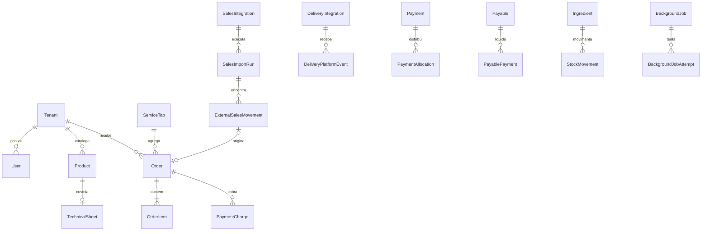

# Dicionário de dados — BurgoOS

> Fonte de verdade estrutural: `packages/database/prisma/schema.prisma`.
> Documento gerado por `node scripts/generate-data-dictionary.mjs`; complemente a semântica no gerador para preservar alterações.

## Escopo e leitura

Este catálogo descreve o modelo PostgreSQL atual exposto pelo Prisma: **71 entidades** e **73 enums**. Ele documenta nomes lógicos e físicos, tipos, nulabilidade, chaves, defaults, relacionamentos, índices e finalidade de negócio. Não registra valores de credenciais, dados pessoais reais nem conteúdo de produção.

### Convenções

- `tenantId` identifica o proprietário SaaS; consultas de negócio devem sempre respeitar esse escopo.
- IDs de entidades são normalmente UUID; identificadores externos permanecem `String` para preservar o formato do provedor.
- `DateTime` representa instante UTC na aplicação; conversões de dia comercial usam `America/Sao_Paulo`.
- `Decimal(p,s)` é obrigatório para valores monetários e quantidades que não toleram erro binário.
- Campos `Json` são fronteiras flexíveis; entradas externas devem ser validadas e dados sensíveis devem ser redigidos/cifrados.
- Sufixo `Ciphertext` indica conteúdo cifrado; nunca deve ser retornado por APIs ou logs.
- Exclusão lógica usa `deletedAt`; relações Prisma indicam `Cascade`, `Restrict` ou `SetNull` quando aplicável.
- `createdAt`/`updatedAt` representam auditoria técnica; datas do provedor permanecem em campos próprios.

## Mapa de domínios

| Domínio | Entidades |
|---|---|
| Tenancy, identidade e acesso | `Tenant`, `PlatformUser`, `User`, `UserStoreAssignment`, `AccessProfile`, `Permission`, `AccessProfilePermission`, `SessionToken`, `PasswordResetToken`, `AccessAuditEvent` |
| Configuração visual e catálogo | `LayoutPreset`, `StoreVisualConfiguration`, `Category`, `Product`, `ProductExternalMapping`, `ProductComplement`, `ProductComplementAssignment`, `Ingredient`, `TechnicalSheet`, `TechnicalSheetLine`, `ProductCostSnapshot` |
| Pedidos, comandas e operação | `Order`, `OrderItem`, `OrderItemModification`, `ServiceTab`, `OrderMaintenance`, `OrderOperationalEvent`, `OrderProfitabilitySnapshot`, `StockMovement` |
| Pagamentos | `PaymentTerminal`, `PaymentCharge`, `Payment`, `PaymentAllocation`, `PaymentProviderEvent`, `PaymentException`, `IdempotencyRecord` |
| Integrações de vendas | `SalesIntegration`, `SalesIntegrationCredential`, `SalesImportRun`, `SalesImportDay`, `ExternalSalesMovement`, `ExternalSaleIdentity`, `OAuthAuthorizationAttempt`, `ProviderTransactionState`, `ProviderNotification`, `IntegrationAuditEvent`, `PlatformIntegrationConfiguration` |
| Financeiro | `FinancialConfiguration`, `PurchaseUnit`, `Supplier`, `FinancialAccount`, `PaymentInstitutionConfiguration`, `FinancialCategory`, `PayableRecurrence`, `Payable`, `PayablePayment`, `CashMovement`, `FinancialAudit` |
| Delivery e marketplaces | `OrderPlatform`, `DeliveryIntegration`, `DeliveryIntegrationCredential`, `DeliveryPlatformEvent`, `PlatformOrderLink`, `PlatformSyncAttempt`, `PlatformCancellationReason`, `PlatformDispute`, `DeliveryIntegrationAudit` |
| Jobs, exportações e notificações | `ExportJob`, `BackgroundJob`, `BackgroundJobAttempt`, `OperationalNotification` |

## Relações centrais

## Catálogo de entidades

### Tenancy, identidade e acesso

#### Tenant

**Tabela física**: `tenants`  
**Finalidade**: Estabelecimento/loja que delimita propriedade e isolamento dos dados.

| Campo lógico | Coluna física | Tipo Prisma | Obrigatório | Regra/Chave | Descrição |
|---|---|---|---|---|---|
| `id` | `id` | `String` | sim | PK; default: uuid() | Identificador único do registro. |
| `name` | `name` | `String` | sim | — | Atributo name da entidade. |
| `slug` | `slug` | `String` | sim | UNIQUE | Atributo slug da entidade. |
| `publicDomain` | `public_domain` | `String?` | não | UNIQUE | Atributo publicDomain da entidade. |
| `phone` | `phone` | `String` | sim | — | Atributo phone da entidade. |
| `active` | `active` | `Boolean` | sim | default: true | Indicador verdadeiro/falso da condição nomeada. |
| `isOpen` | `is_open` | `Boolean` | sim | default: false | Indicador verdadeiro/falso da condição nomeada. |
| `openMode` | `open_mode` | `StoreOpenMode` | sim | default: FORCE_CLOSED | Valor controlado pelo enum StoreOpenMode. |
| `operatingHours` | `operating_hours` | `Json` | sim | default: "{}" | Atributo operatingHours da entidade. |
| `setupCompletedAt` | `setup_completed_at` | `DateTime?` | não | — | Data e hora de setupCompleted. |
| `deactivatedAt` | `deactivated_at` | `DateTime?` | não | — | Data e hora de deactivated. |
| `createdByPlatformUserId` | `created_by_platform_user_id` | `String?` | não | — | Identificador associado a createdByPlatformUser. |
| `defaultLayoutPresetKey` | `default_layout_preset_key` | `String` | sim | default: "classic" | Atributo defaultLayoutPresetKey da entidade. |
| `config` | `config` | `Json` | sim | default: "{}" | Atributo config da entidade. |
| `createdAt` | `created_at` | `DateTime` | sim | default: now() | Data e hora de criação. |
| `updatedAt` | `updated_at` | `DateTime` | sim | — | Data e hora da última atualização. |
| `createdByPlatformUser` | `—` | `PlatformUser?` | não | FK/relação | Referência relacionada a PlatformUser. |
| `defaultLayoutPreset` | `—` | `LayoutPreset` | sim | FK/relação | Referência relacionada a LayoutPreset. |
| `users` | `—` | `User[]` | coleção | relação 1:N/N:N | Coleção relacionada de User. |
| `visualConfigurations` | `—` | `StoreVisualConfiguration[]` | coleção | relação 1:N/N:N | Coleção relacionada de StoreVisualConfiguration. |
| `categories` | `—` | `Category[]` | coleção | relação 1:N/N:N | Coleção relacionada de Category. |
| `products` | `—` | `Product[]` | coleção | relação 1:N/N:N | Coleção relacionada de Product. |
| `productExternalMappings` | `—` | `ProductExternalMapping[]` | coleção | relação 1:N/N:N | Coleção relacionada de ProductExternalMapping. |
| `orders` | `—` | `Order[]` | coleção | relação 1:N/N:N | Coleção relacionada de Order. |
| `financialConfiguration` | `—` | `FinancialConfiguration?` | não | FK/relação | Referência relacionada a FinancialConfiguration. |
| `purchaseUnits` | `—` | `PurchaseUnit[]` | coleção | relação 1:N/N:N | Coleção relacionada de PurchaseUnit. |
| `suppliers` | `—` | `Supplier[]` | coleção | relação 1:N/N:N | Coleção relacionada de Supplier. |
| `orderPlatforms` | `—` | `OrderPlatform[]` | coleção | relação 1:N/N:N | Coleção relacionada de OrderPlatform. |
| `ingredients` | `—` | `Ingredient[]` | coleção | relação 1:N/N:N | Coleção relacionada de Ingredient. |
| `technicalSheets` | `—` | `TechnicalSheet[]` | coleção | relação 1:N/N:N | Coleção relacionada de TechnicalSheet. |
| `technicalSheetLines` | `—` | `TechnicalSheetLine[]` | coleção | relação 1:N/N:N | Coleção relacionada de TechnicalSheetLine. |
| `productCostSnapshots` | `—` | `ProductCostSnapshot[]` | coleção | relação 1:N/N:N | Coleção relacionada de ProductCostSnapshot. |
| `stockMovements` | `—` | `StockMovement[]` | coleção | relação 1:N/N:N | Coleção relacionada de StockMovement. |
| `orderProfitabilitySnapshots` | `—` | `OrderProfitabilitySnapshot[]` | coleção | relação 1:N/N:N | Coleção relacionada de OrderProfitabilitySnapshot. |
| `orderMaintenances` | `—` | `OrderMaintenance[]` | coleção | relação 1:N/N:N | Coleção relacionada de OrderMaintenance. |
| `financialAccounts` | `—` | `FinancialAccount[]` | coleção | relação 1:N/N:N | Coleção relacionada de FinancialAccount. |
| `paymentInstitutions` | `—` | `PaymentInstitutionConfiguration[]` | coleção | relação 1:N/N:N | Coleção relacionada de PaymentInstitutionConfiguration. |
| `financialCategories` | `—` | `FinancialCategory[]` | coleção | relação 1:N/N:N | Coleção relacionada de FinancialCategory. |
| `payableRecurrences` | `—` | `PayableRecurrence[]` | coleção | relação 1:N/N:N | Coleção relacionada de PayableRecurrence. |
| `payables` | `—` | `Payable[]` | coleção | relação 1:N/N:N | Coleção relacionada de Payable. |
| `payablePayments` | `—` | `PayablePayment[]` | coleção | relação 1:N/N:N | Coleção relacionada de PayablePayment. |
| `cashMovements` | `—` | `CashMovement[]` | coleção | relação 1:N/N:N | Coleção relacionada de CashMovement. |
| `financialAudits` | `—` | `FinancialAudit[]` | coleção | relação 1:N/N:N | Coleção relacionada de FinancialAudit. |
| `userStoreAssignments` | `—` | `UserStoreAssignment[]` | coleção | relação 1:N/N:N | Coleção relacionada de UserStoreAssignment. |
| `accessProfiles` | `—` | `AccessProfile[]` | coleção | relação 1:N/N:N | Coleção relacionada de AccessProfile. |
| `sessionTokens` | `—` | `SessionToken[]` | coleção | relação 1:N/N:N | Coleção relacionada de SessionToken. |
| `accessAuditEvents` | `—` | `AccessAuditEvent[]` | coleção | relação 1:N/N:N | Coleção relacionada de AccessAuditEvent. |
| `deliveryIntegrations` | `—` | `DeliveryIntegration[]` | coleção | relação 1:N/N:N | Coleção relacionada de DeliveryIntegration. |
| `deliveryCredentials` | `—` | `DeliveryIntegrationCredential[]` | coleção | relação 1:N/N:N | Coleção relacionada de DeliveryIntegrationCredential. |
| `deliveryPlatformEvents` | `—` | `DeliveryPlatformEvent[]` | coleção | relação 1:N/N:N | Coleção relacionada de DeliveryPlatformEvent. |
| `platformOrderLinks` | `—` | `PlatformOrderLink[]` | coleção | relação 1:N/N:N | Coleção relacionada de PlatformOrderLink. |
| `platformSyncAttempts` | `—` | `PlatformSyncAttempt[]` | coleção | relação 1:N/N:N | Coleção relacionada de PlatformSyncAttempt. |
| `platformCancellationReasons` | `—` | `PlatformCancellationReason[]` | coleção | relação 1:N/N:N | Coleção relacionada de PlatformCancellationReason. |
| `platformDisputes` | `—` | `PlatformDispute[]` | coleção | relação 1:N/N:N | Coleção relacionada de PlatformDispute. |
| `deliveryIntegrationAudits` | `—` | `DeliveryIntegrationAudit[]` | coleção | relação 1:N/N:N | Coleção relacionada de DeliveryIntegrationAudit. |
| `exportJobs` | `—` | `ExportJob[]` | coleção | relação 1:N/N:N | Coleção relacionada de ExportJob. |
| `backgroundJobs` | `—` | `BackgroundJob[]` | coleção | relação 1:N/N:N | Coleção relacionada de BackgroundJob. |
| `operationalNotifications` | `—` | `OperationalNotification[]` | coleção | relação 1:N/N:N | Coleção relacionada de OperationalNotification. |
| `salesIntegrations` | `—` | `SalesIntegration[]` | coleção | relação 1:N/N:N | Coleção relacionada de SalesIntegration. |
| `salesIntegrationCredentials` | `—` | `SalesIntegrationCredential[]` | coleção | relação 1:N/N:N | Coleção relacionada de SalesIntegrationCredential. |
| `salesImportRuns` | `—` | `SalesImportRun[]` | coleção | relação 1:N/N:N | Coleção relacionada de SalesImportRun. |
| `salesImportDays` | `—` | `SalesImportDay[]` | coleção | relação 1:N/N:N | Coleção relacionada de SalesImportDay. |
| `externalSalesMovements` | `—` | `ExternalSalesMovement[]` | coleção | relação 1:N/N:N | Coleção relacionada de ExternalSalesMovement. |
| `externalSaleIdentities` | `—` | `ExternalSaleIdentity[]` | coleção | relação 1:N/N:N | Coleção relacionada de ExternalSaleIdentity. |
| `oauthAuthorizationAttempts` | `—` | `OAuthAuthorizationAttempt[]` | coleção | relação 1:N/N:N | Coleção relacionada de OAuthAuthorizationAttempt. |
| `providerTransactionStates` | `—` | `ProviderTransactionState[]` | coleção | relação 1:N/N:N | Coleção relacionada de ProviderTransactionState. |
| `providerNotifications` | `—` | `ProviderNotification[]` | coleção | relação 1:N/N:N | Coleção relacionada de ProviderNotification. |
| `integrationAuditEvents` | `—` | `IntegrationAuditEvent[]` | coleção | relação 1:N/N:N | Coleção relacionada de IntegrationAuditEvent. |
| `serviceTabs` | `—` | `ServiceTab[]` | coleção | relação 1:N/N:N | Coleção relacionada de ServiceTab. |
| `productComplements` | `—` | `ProductComplement[]` | coleção | relação 1:N/N:N | Coleção relacionada de ProductComplement. |
| `orderItemModifications` | `—` | `OrderItemModification[]` | coleção | relação 1:N/N:N | Coleção relacionada de OrderItemModification. |
| `paymentTerminals` | `—` | `PaymentTerminal[]` | coleção | relação 1:N/N:N | Coleção relacionada de PaymentTerminal. |
| `paymentCharges` | `—` | `PaymentCharge[]` | coleção | relação 1:N/N:N | Coleção relacionada de PaymentCharge. |
| `payments` | `—` | `Payment[]` | coleção | relação 1:N/N:N | Coleção relacionada de Payment. |
| `paymentAllocations` | `—` | `PaymentAllocation[]` | coleção | relação 1:N/N:N | Coleção relacionada de PaymentAllocation. |
| `paymentProviderEvents` | `—` | `PaymentProviderEvent[]` | coleção | relação 1:N/N:N | Coleção relacionada de PaymentProviderEvent. |
| `paymentExceptions` | `—` | `PaymentException[]` | coleção | relação 1:N/N:N | Coleção relacionada de PaymentException. |
| `orderOperationalEvents` | `—` | `OrderOperationalEvent[]` | coleção | relação 1:N/N:N | Coleção relacionada de OrderOperationalEvent. |
| `idempotencyRecords` | `—` | `IdempotencyRecord[]` | coleção | relação 1:N/N:N | Coleção relacionada de IdempotencyRecord. |

**Restrições e índices do modelo**:

- `@@index([createdByPlatformUserId])`
- `@@index([defaultLayoutPresetKey])`

**Escopo de tenant**: raiz do isolamento.

#### PlatformUser

**Tabela física**: `platform_users`  
**Finalidade**: Usuário administrativo global da plataforma.

| Campo lógico | Coluna física | Tipo Prisma | Obrigatório | Regra/Chave | Descrição |
|---|---|---|---|---|---|
| `id` | `id` | `String` | sim | PK; default: uuid() | Identificador único do registro. |
| `role` | `role` | `PlatformUserRole` | sim | default: SUPPORT | Valor controlado pelo enum PlatformUserRole. |
| `name` | `name` | `String` | sim | — | Atributo name da entidade. |
| `email` | `email` | `String` | sim | UNIQUE | Atributo email da entidade. |
| `passwordHash` | `password_hash` | `String` | sim | — | Atributo passwordHash da entidade. |
| `active` | `active` | `Boolean` | sim | default: true | Indicador verdadeiro/falso da condição nomeada. |
| `createdAt` | `created_at` | `DateTime` | sim | default: now() | Data e hora de criação. |
| `updatedAt` | `updated_at` | `DateTime` | sim | — | Data e hora da última atualização. |
| `createdTenants` | `—` | `Tenant[]` | coleção | relação 1:N/N:N | Coleção relacionada de Tenant. |

**Escopo de tenant**: global ou derivado por relacionamento.

#### User

**Tabela física**: `users`  
**Finalidade**: Usuário administrativo ou operacional pertencente a um tenant.

| Campo lógico | Coluna física | Tipo Prisma | Obrigatório | Regra/Chave | Descrição |
|---|---|---|---|---|---|
| `id` | `id` | `String` | sim | PK; default: uuid() | Identificador único do registro. |
| `tenantId` | `tenant_id` | `String` | sim | — | Tenant proprietário; obrigatório para isolamento dos dados. |
| `role` | `role` | `UserRole` | sim | default: OPERATOR | Valor controlado pelo enum UserRole. |
| `status` | `status` | `AccessUserStatus` | sim | default: ACTIVE | Estado atual no ciclo de vida da entidade. |
| `isMaster` | `is_master` | `Boolean` | sim | default: false | Indicador verdadeiro/falso da condição nomeada. |
| `name` | `name` | `String` | sim | — | Atributo name da entidade. |
| `email` | `email` | `String` | sim | UNIQUE | Atributo email da entidade. |
| `phone` | `phone` | `String?` | não | — | Atributo phone da entidade. |
| `passwordHash` | `password_hash` | `String` | sim | — | Atributo passwordHash da entidade. |
| `lastLoginAt` | `last_login_at` | `DateTime?` | não | — | Data e hora de lastLogin. |
| `createdAt` | `created_at` | `DateTime` | sim | default: now() | Data e hora de criação. |
| `updatedAt` | `updated_at` | `DateTime` | sim | — | Data e hora da última atualização. |
| `tenant` | `—` | `Tenant` | sim | FK/relação | Referência relacionada a Tenant. |
| `visualConfigurationsCreated` | `—` | `StoreVisualConfiguration[]` | coleção | relação 1:N/N:N | Coleção relacionada de StoreVisualConfiguration. |
| `visualConfigurationsPublished` | `—` | `StoreVisualConfiguration[]` | coleção | relação 1:N/N:N | Coleção relacionada de StoreVisualConfiguration. |
| `deletedOrders` | `—` | `Order[]` | coleção | relação 1:N/N:N | Coleção relacionada de Order. |
| `orderMaintenances` | `—` | `OrderMaintenance[]` | coleção | relação 1:N/N:N | Coleção relacionada de OrderMaintenance. |
| `payablesCreated` | `—` | `Payable[]` | coleção | relação 1:N/N:N | Coleção relacionada de Payable. |
| `payablePaymentsCreated` | `—` | `PayablePayment[]` | coleção | relação 1:N/N:N | Coleção relacionada de PayablePayment. |
| `payablePaymentsReversed` | `—` | `PayablePayment[]` | coleção | relação 1:N/N:N | Coleção relacionada de PayablePayment. |
| `cashMovementsCreated` | `—` | `CashMovement[]` | coleção | relação 1:N/N:N | Coleção relacionada de CashMovement. |
| `cashMovementsReversed` | `—` | `CashMovement[]` | coleção | relação 1:N/N:N | Coleção relacionada de CashMovement. |
| `financialAudits` | `—` | `FinancialAudit[]` | coleção | relação 1:N/N:N | Coleção relacionada de FinancialAudit. |
| `storeAssignments` | `—` | `UserStoreAssignment[]` | coleção | relação 1:N/N:N | Coleção relacionada de UserStoreAssignment. |
| `sessionTokens` | `—` | `SessionToken[]` | coleção | relação 1:N/N:N | Coleção relacionada de SessionToken. |
| `passwordResetTokens` | `—` | `PasswordResetToken[]` | coleção | relação 1:N/N:N | Coleção relacionada de PasswordResetToken. |
| `accessAuditEventsAsActor` | `—` | `AccessAuditEvent[]` | coleção | relação 1:N/N:N | Coleção relacionada de AccessAuditEvent. |
| `accessAuditEventsAsTarget` | `—` | `AccessAuditEvent[]` | coleção | relação 1:N/N:N | Coleção relacionada de AccessAuditEvent. |
| `accessProfilesCreated` | `—` | `AccessProfile[]` | coleção | relação 1:N/N:N | Coleção relacionada de AccessProfile. |
| `accessProfilesUpdated` | `—` | `AccessProfile[]` | coleção | relação 1:N/N:N | Coleção relacionada de AccessProfile. |
| `deliveryIntegrationsCreated` | `—` | `DeliveryIntegration[]` | coleção | relação 1:N/N:N | Coleção relacionada de DeliveryIntegration. |
| `deliveryIntegrationsUpdated` | `—` | `DeliveryIntegration[]` | coleção | relação 1:N/N:N | Coleção relacionada de DeliveryIntegration. |
| `deliveryCredentialsCreated` | `—` | `DeliveryIntegrationCredential[]` | coleção | relação 1:N/N:N | Coleção relacionada de DeliveryIntegrationCredential. |
| `platformSyncAttemptsCreated` | `—` | `PlatformSyncAttempt[]` | coleção | relação 1:N/N:N | Coleção relacionada de PlatformSyncAttempt. |
| `deliveryIntegrationAudits` | `—` | `DeliveryIntegrationAudit[]` | coleção | relação 1:N/N:N | Coleção relacionada de DeliveryIntegrationAudit. |
| `exportJobsRequested` | `—` | `ExportJob[]` | coleção | relação 1:N/N:N | Coleção relacionada de ExportJob. |
| `operationalNotifications` | `—` | `OperationalNotification[]` | coleção | relação 1:N/N:N | Coleção relacionada de OperationalNotification. |
| `salesIntegrationsCreated` | `—` | `SalesIntegration[]` | coleção | relação 1:N/N:N | Coleção relacionada de SalesIntegration. |
| `salesIntegrationsUpdated` | `—` | `SalesIntegration[]` | coleção | relação 1:N/N:N | Coleção relacionada de SalesIntegration. |
| `salesCredentialsCreated` | `—` | `SalesIntegrationCredential[]` | coleção | relação 1:N/N:N | Coleção relacionada de SalesIntegrationCredential. |
| `salesImportRunsRequested` | `—` | `SalesImportRun[]` | coleção | relação 1:N/N:N | Coleção relacionada de SalesImportRun. |
| `oauthAttemptsRequested` | `—` | `OAuthAuthorizationAttempt[]` | coleção | relação 1:N/N:N | Coleção relacionada de OAuthAuthorizationAttempt. |
| `integrationAuditEvents` | `—` | `IntegrationAuditEvent[]` | coleção | relação 1:N/N:N | Coleção relacionada de IntegrationAuditEvent. |

**Restrições e índices do modelo**:

- `@@index([tenantId])`
- `@@index([status])`
- `@@index([isMaster])`

**Escopo de tenant**: próprio (`tenantId`).

#### UserStoreAssignment

**Tabela física**: `user_store_assignments`  
**Finalidade**: Vínculo de acesso de usuário a uma loja e perfil.

| Campo lógico | Coluna física | Tipo Prisma | Obrigatório | Regra/Chave | Descrição |
|---|---|---|---|---|---|
| `id` | `id` | `String` | sim | PK; default: uuid() | Identificador único do registro. |
| `userId` | `user_id` | `String` | sim | — | Identificador associado a user. |
| `tenantId` | `tenant_id` | `String` | sim | — | Tenant proprietário; obrigatório para isolamento dos dados. |
| `profileId` | `profile_id` | `String` | sim | — | Identificador associado a profile. |
| `canManageStoreAccess` | `can_manage_store_access` | `Boolean` | sim | default: false | Indicador verdadeiro/falso da condição nomeada. |
| `status` | `status` | `AccessProfileStatus` | sim | default: ACTIVE | Estado atual no ciclo de vida da entidade. |
| `createdAt` | `created_at` | `DateTime` | sim | default: now() | Data e hora de criação. |
| `updatedAt` | `updated_at` | `DateTime` | sim | — | Data e hora da última atualização. |
| `user` | `—` | `User` | sim | FK/relação | Referência relacionada a User. |
| `tenant` | `—` | `Tenant` | sim | FK/relação | Referência relacionada a Tenant. |
| `profile` | `—` | `AccessProfile` | sim | FK/relação | Referência relacionada a AccessProfile. |

**Restrições e índices do modelo**:

- `@@unique([userId, tenantId])`
- `@@index([tenantId, status])`
- `@@index([profileId])`

**Escopo de tenant**: próprio (`tenantId`).

#### AccessProfile

**Tabela física**: `access_profiles`  
**Finalidade**: Perfil configurável de autorização, global ou por loja.

| Campo lógico | Coluna física | Tipo Prisma | Obrigatório | Regra/Chave | Descrição |
|---|---|---|---|---|---|
| `id` | `id` | `String` | sim | PK; default: uuid() | Identificador único do registro. |
| `tenantId` | `tenant_id` | `String?` | não | — | Tenant proprietário; obrigatório para isolamento dos dados. |
| `name` | `name` | `String` | sim | — | Atributo name da entidade. |
| `description` | `description` | `String?` | não | — | Atributo description da entidade. |
| `scope` | `scope` | `AccessProfileScope` | sim | default: STORE | Valor controlado pelo enum AccessProfileScope. |
| `status` | `status` | `AccessProfileStatus` | sim | default: ACTIVE | Estado atual no ciclo de vida da entidade. |
| `createdByUserId` | `created_by_user_id` | `String?` | não | — | Identificador associado a createdByUser. |
| `updatedByUserId` | `updated_by_user_id` | `String?` | não | — | Identificador associado a updatedByUser. |
| `createdAt` | `created_at` | `DateTime` | sim | default: now() | Data e hora de criação. |
| `updatedAt` | `updated_at` | `DateTime` | sim | — | Data e hora da última atualização. |
| `tenant` | `—` | `Tenant?` | não | FK/relação | Referência relacionada a Tenant. |
| `createdByUser` | `—` | `User?` | não | FK/relação | Referência relacionada a User. |
| `updatedByUser` | `—` | `User?` | não | FK/relação | Referência relacionada a User. |
| `permissions` | `—` | `AccessProfilePermission[]` | coleção | relação 1:N/N:N | Coleção relacionada de AccessProfilePermission. |
| `assignments` | `—` | `UserStoreAssignment[]` | coleção | relação 1:N/N:N | Coleção relacionada de UserStoreAssignment. |

**Restrições e índices do modelo**:

- `@@unique([tenantId, name])`
- `@@index([tenantId, status])`
- `@@index([scope, status])`

**Escopo de tenant**: próprio (`tenantId`).

#### Permission

**Tabela física**: `permissions`  
**Finalidade**: Permissão atômica de recurso e ação.

| Campo lógico | Coluna física | Tipo Prisma | Obrigatório | Regra/Chave | Descrição |
|---|---|---|---|---|---|
| `id` | `id` | `String` | sim | PK; default: uuid() | Identificador único do registro. |
| `key` | `key` | `String` | sim | UNIQUE | Atributo key da entidade. |
| `area` | `area` | `String` | sim | — | Atributo area da entidade. |
| `screen` | `screen` | `String` | sim | — | Atributo screen da entidade. |
| `action` | `action` | `AccessPermissionAction` | sim | — | Valor controlado pelo enum AccessPermissionAction. |
| `description` | `description` | `String` | sim | — | Atributo description da entidade. |
| `sensitive` | `sensitive` | `Boolean` | sim | default: false | Indicador verdadeiro/falso da condição nomeada. |
| `createdAt` | `created_at` | `DateTime` | sim | default: now() | Data e hora de criação. |
| `updatedAt` | `updated_at` | `DateTime` | sim | — | Data e hora da última atualização. |
| `profiles` | `—` | `AccessProfilePermission[]` | coleção | relação 1:N/N:N | Coleção relacionada de AccessProfilePermission. |

**Restrições e índices do modelo**:

- `@@index([area, screen])`

**Escopo de tenant**: global ou derivado por relacionamento.

#### AccessProfilePermission

**Tabela física**: `access_profile_permissions`  
**Finalidade**: Associação N:N entre perfil e permissão.

| Campo lógico | Coluna física | Tipo Prisma | Obrigatório | Regra/Chave | Descrição |
|---|---|---|---|---|---|
| `profileId` | `profile_id` | `String` | sim | — | Identificador associado a profile. |
| `permissionId` | `permission_id` | `String` | sim | — | Identificador associado a permission. |
| `createdAt` | `created_at` | `DateTime` | sim | default: now() | Data e hora de criação. |
| `profile` | `—` | `AccessProfile` | sim | FK/relação | Referência relacionada a AccessProfile. |
| `permission` | `—` | `Permission` | sim | FK/relação | Referência relacionada a Permission. |

**Restrições e índices do modelo**:

- `@@id([profileId, permissionId])`
- `@@index([permissionId])`

**Escopo de tenant**: global ou derivado por relacionamento.

#### SessionToken

**Tabela física**: `session_tokens`  
**Finalidade**: Sessão/refresh token com revogação e expiração.

| Campo lógico | Coluna física | Tipo Prisma | Obrigatório | Regra/Chave | Descrição |
|---|---|---|---|---|---|
| `id` | `id` | `String` | sim | PK; default: uuid() | Identificador único do registro. |
| `userId` | `user_id` | `String` | sim | — | Identificador associado a user. |
| `activeTenantId` | `active_tenant_id` | `String?` | não | — | Identificador associado a activeTenant. |
| `refreshTokenHash` | `refresh_token_hash` | `String` | sim | — | Atributo refreshTokenHash da entidade. |
| `status` | `status` | `SessionTokenStatus` | sim | default: ACTIVE | Estado atual no ciclo de vida da entidade. |
| `expiresAt` | `expires_at` | `DateTime` | sim | — | Data e hora de expires. |
| `createdAt` | `created_at` | `DateTime` | sim | default: now() | Data e hora de criação. |
| `revokedAt` | `revoked_at` | `DateTime?` | não | — | Data e hora de revoked. |
| `user` | `—` | `User` | sim | FK/relação | Referência relacionada a User. |
| `activeTenant` | `—` | `Tenant?` | não | FK/relação | Referência relacionada a Tenant. |

**Restrições e índices do modelo**:

- `@@index([userId, status])`
- `@@index([activeTenantId])`

**Escopo de tenant**: global ou derivado por relacionamento.

#### PasswordResetToken

**Tabela física**: `password_reset_tokens`  
**Finalidade**: Token de primeiro acesso ou redefinição de senha.

| Campo lógico | Coluna física | Tipo Prisma | Obrigatório | Regra/Chave | Descrição |
|---|---|---|---|---|---|
| `id` | `id` | `String` | sim | PK; default: uuid() | Identificador único do registro. |
| `userId` | `user_id` | `String` | sim | — | Identificador associado a user. |
| `purpose` | `purpose` | `PasswordResetPurpose` | sim | — | Valor controlado pelo enum PasswordResetPurpose. |
| `tokenHash` | `token_hash` | `String` | sim | — | Atributo tokenHash da entidade. |
| `status` | `status` | `PasswordResetTokenStatus` | sim | default: ACTIVE | Estado atual no ciclo de vida da entidade. |
| `expiresAt` | `expires_at` | `DateTime` | sim | — | Data e hora de expires. |
| `createdAt` | `created_at` | `DateTime` | sim | default: now() | Data e hora de criação. |
| `usedAt` | `used_at` | `DateTime?` | não | — | Data e hora de used. |
| `user` | `—` | `User` | sim | FK/relação | Referência relacionada a User. |

**Restrições e índices do modelo**:

- `@@index([userId, status])`

**Escopo de tenant**: global ou derivado por relacionamento.

#### AccessAuditEvent

**Tabela física**: `access_audit_events`  
**Finalidade**: Trilha de auditoria de autenticação e autorização.

| Campo lógico | Coluna física | Tipo Prisma | Obrigatório | Regra/Chave | Descrição |
|---|---|---|---|---|---|
| `id` | `id` | `String` | sim | PK; default: uuid() | Identificador único do registro. |
| `actorUserId` | `actor_user_id` | `String?` | não | — | Identificador associado a actorUser. |
| `targetUserId` | `target_user_id` | `String?` | não | — | Identificador associado a targetUser. |
| `storeId` | `store_id` | `String?` | não | — | Identificador associado a store. |
| `eventType` | `event_type` | `AccessAuditEventType` | sim | — | Valor controlado pelo enum AccessAuditEventType. |
| `result` | `result` | `AccessAuditResult` | sim | — | Valor controlado pelo enum AccessAuditResult. |
| `reason` | `reason` | `String?` | não | — | Atributo reason da entidade. |
| `metadata` | `metadata` | `Json?` | não | — | Estrutura JSON com dados complementares controlados pelo domínio. |
| `occurredAt` | `occurred_at` | `DateTime` | sim | default: now() | Data e hora de occurred. |
| `actorUser` | `—` | `User?` | não | FK/relação | Referência relacionada a User. |
| `targetUser` | `—` | `User?` | não | FK/relação | Referência relacionada a User. |
| `store` | `—` | `Tenant?` | não | FK/relação | Referência relacionada a Tenant. |

**Restrições e índices do modelo**:

- `@@index([storeId, eventType, occurredAt])`
- `@@index([actorUserId, occurredAt])`
- `@@index([targetUserId, occurredAt])`

**Escopo de tenant**: global ou derivado por relacionamento.

### Configuração visual e catálogo

#### LayoutPreset

**Tabela física**: `layout_presets`  
**Finalidade**: Preset de layout reutilizável em superfícies do produto.

| Campo lógico | Coluna física | Tipo Prisma | Obrigatório | Regra/Chave | Descrição |
|---|---|---|---|---|---|
| `key` | `key` | `String` | sim | PK | Atributo key da entidade. |
| `name` | `name` | `String` | sim | — | Atributo name da entidade. |
| `description` | `description` | `String` | sim | — | Atributo description da entidade. |
| `targetSurface` | `target_surface` | `LayoutPresetSurface` | sim | default: PUBLIC_MENU | Valor controlado pelo enum LayoutPresetSurface. |
| `active` | `active` | `Boolean` | sim | default: true | Indicador verdadeiro/falso da condição nomeada. |
| `createdAt` | `created_at` | `DateTime` | sim | default: now() | Data e hora de criação. |
| `updatedAt` | `updated_at` | `DateTime` | sim | — | Data e hora da última atualização. |
| `tenantsUsingDefault` | `—` | `Tenant[]` | coleção | relação 1:N/N:N | Coleção relacionada de Tenant. |
| `visualConfigurations` | `—` | `StoreVisualConfiguration[]` | coleção | relação 1:N/N:N | Coleção relacionada de StoreVisualConfiguration. |

**Escopo de tenant**: global ou derivado por relacionamento.

#### StoreVisualConfiguration

**Tabela física**: `store_visual_configurations`  
**Finalidade**: Versão da identidade visual publicada ou em edição da loja.

| Campo lógico | Coluna física | Tipo Prisma | Obrigatório | Regra/Chave | Descrição |
|---|---|---|---|---|---|
| `id` | `id` | `String` | sim | PK; default: uuid() | Identificador único do registro. |
| `tenantId` | `tenant_id` | `String` | sim | — | Tenant proprietário; obrigatório para isolamento dos dados. |
| `status` | `status` | `VisualConfigurationStatus` | sim | default: DRAFT | Estado atual no ciclo de vida da entidade. |
| `logoUrl` | `logo_url` | `String?` | não | — | Atributo logoUrl da entidade. |
| `headerImageUrl` | `header_image_url` | `String?` | não | — | Atributo headerImageUrl da entidade. |
| `bodyImageUrl` | `body_image_url` | `String?` | não | — | Atributo bodyImageUrl da entidade. |
| `footerImageUrl` | `footer_image_url` | `String?` | não | — | Atributo footerImageUrl da entidade. |
| `primaryColor` | `primary_color` | `String` | sim | — | Atributo primaryColor da entidade. |
| `accentColor` | `accent_color` | `String` | sim | — | Atributo accentColor da entidade. |
| `neutralTheme` | `neutral_theme` | `NeutralTheme` | sim | default: LIGHT | Valor controlado pelo enum NeutralTheme. |
| `layoutPresetKey` | `layout_preset_key` | `String` | sim | — | Atributo layoutPresetKey da entidade. |
| `showProductImages` | `show_product_images` | `Boolean` | sim | default: false | Indicador verdadeiro/falso da condição nomeada. |
| `showProductDescriptions` | `show_product_descriptions` | `Boolean` | sim | default: false | Indicador verdadeiro/falso da condição nomeada. |
| `orderingEnabled` | `ordering_enabled` | `Boolean` | sim | default: true | Indicador verdadeiro/falso da condição nomeada. |
| `createdByUserId` | `created_by_user_id` | `String?` | não | — | Identificador associado a createdByUser. |
| `publishedByUserId` | `published_by_user_id` | `String?` | não | — | Identificador associado a publishedByUser. |
| `publishedAt` | `published_at` | `DateTime?` | não | — | Data e hora de published. |
| `createdAt` | `created_at` | `DateTime` | sim | default: now() | Data e hora de criação. |
| `updatedAt` | `updated_at` | `DateTime` | sim | — | Data e hora da última atualização. |
| `tenant` | `—` | `Tenant` | sim | FK/relação | Referência relacionada a Tenant. |
| `layoutPreset` | `—` | `LayoutPreset` | sim | FK/relação | Referência relacionada a LayoutPreset. |
| `createdByUser` | `—` | `User?` | não | FK/relação | Referência relacionada a User. |
| `publishedByUser` | `—` | `User?` | não | FK/relação | Referência relacionada a User. |

**Restrições e índices do modelo**:

- `@@index([tenantId, status])`
- `@@index([layoutPresetKey])`
- `@@index([createdByUserId])`
- `@@index([publishedByUserId])`

**Escopo de tenant**: próprio (`tenantId`).

#### Category

**Tabela física**: `categories`  
**Finalidade**: Categoria de produtos do cardápio.

| Campo lógico | Coluna física | Tipo Prisma | Obrigatório | Regra/Chave | Descrição |
|---|---|---|---|---|---|
| `id` | `id` | `String` | sim | PK; default: uuid() | Identificador único do registro. |
| `tenantId` | `tenant_id` | `String` | sim | — | Tenant proprietário; obrigatório para isolamento dos dados. |
| `name` | `name` | `String` | sim | — | Atributo name da entidade. |
| `sortOrder` | `sort_order` | `Int` | sim | default: 0 | Atributo sortOrder da entidade. |
| `active` | `active` | `Boolean` | sim | default: true | Indicador verdadeiro/falso da condição nomeada. |
| `createdAt` | `created_at` | `DateTime` | sim | default: now() | Data e hora de criação. |
| `updatedAt` | `updated_at` | `DateTime` | sim | — | Data e hora da última atualização. |
| `tenant` | `—` | `Tenant` | sim | FK/relação | Referência relacionada a Tenant. |
| `products` | `—` | `Product[]` | coleção | relação 1:N/N:N | Coleção relacionada de Product. |

**Restrições e índices do modelo**:

- `@@index([tenantId])`

**Escopo de tenant**: próprio (`tenantId`).

#### Product

**Tabela física**: `products`  
**Finalidade**: Produto vendável, com preço e disponibilidade.

| Campo lógico | Coluna física | Tipo Prisma | Obrigatório | Regra/Chave | Descrição |
|---|---|---|---|---|---|
| `id` | `id` | `String` | sim | PK; default: uuid() | Identificador único do registro. |
| `tenantId` | `tenant_id` | `String` | sim | — | Tenant proprietário; obrigatório para isolamento dos dados. |
| `categoryId` | `category_id` | `String` | sim | — | Identificador associado a category. |
| `name` | `name` | `String` | sim | — | Atributo name da entidade. |
| `description` | `description` | `String` | sim | default: "" | Atributo description da entidade. |
| `price` | `price` | `Decimal` | sim | — | Atributo price da entidade. |
| `imageUrl` | `image_url` | `String?` | não | — | Atributo imageUrl da entidade. |
| `active` | `active` | `Boolean` | sim | default: true | Indicador verdadeiro/falso da condição nomeada. |
| `createdAt` | `created_at` | `DateTime` | sim | default: now() | Data e hora de criação. |
| `updatedAt` | `updated_at` | `DateTime` | sim | — | Data e hora da última atualização. |
| `tenant` | `—` | `Tenant` | sim | FK/relação | Referência relacionada a Tenant. |
| `category` | `—` | `Category` | sim | FK/relação | Referência relacionada a Category. |
| `orderItems` | `—` | `OrderItem[]` | coleção | relação 1:N/N:N | Coleção relacionada de OrderItem. |
| `technicalSheets` | `—` | `TechnicalSheet[]` | coleção | relação 1:N/N:N | Coleção relacionada de TechnicalSheet. |
| `productCostSnapshots` | `—` | `ProductCostSnapshot[]` | coleção | relação 1:N/N:N | Coleção relacionada de ProductCostSnapshot. |
| `externalMappings` | `—` | `ProductExternalMapping[]` | coleção | relação 1:N/N:N | Coleção relacionada de ProductExternalMapping. |
| `complementAssignments` | `—` | `ProductComplementAssignment[]` | coleção | relação 1:N/N:N | Coleção relacionada de ProductComplementAssignment. |

**Restrições e índices do modelo**:

- `@@index([tenantId])`
- `@@index([categoryId])`

**Escopo de tenant**: próprio (`tenantId`).

#### ProductExternalMapping

**Tabela física**: `product_external_mappings`  
**Finalidade**: Mapeamento entre produto interno e identificador de plataforma externa.

| Campo lógico | Coluna física | Tipo Prisma | Obrigatório | Regra/Chave | Descrição |
|---|---|---|---|---|---|
| `id` | `id` | `String` | sim | PK; default: uuid() | Identificador único do registro. |
| `tenantId` | `tenant_id` | `String` | sim | — | Tenant proprietário; obrigatório para isolamento dos dados. |
| `productId` | `product_id` | `String` | sim | — | Identificador associado a product. |
| `provider` | `provider` | `DeliveryProvider` | sim | — | Valor controlado pelo enum DeliveryProvider. |
| `externalProductId` | `external_product_id` | `String` | sim | — | Identificador associado a externalProduct. |
| `createdAt` | `created_at` | `DateTime` | sim | default: now() | Data e hora de criação. |
| `updatedAt` | `updated_at` | `DateTime` | sim | — | Data e hora da última atualização. |
| `tenant` | `—` | `Tenant` | sim | FK/relação | Referência relacionada a Tenant. |
| `product` | `—` | `Product` | sim | FK/relação | Referência relacionada a Product. |

**Restrições e índices do modelo**:

- `@@unique([tenantId, provider, externalProductId])`
- `@@unique([productId, provider])`
- `@@index([tenantId, productId])`

**Escopo de tenant**: próprio (`tenantId`).

#### ProductComplement

**Tabela física**: `product_complements`  
**Finalidade**: Complemento opcional de produto e seu impacto de preço.

| Campo lógico | Coluna física | Tipo Prisma | Obrigatório | Regra/Chave | Descrição |
|---|---|---|---|---|---|
| `id` | `id` | `String` | sim | PK; default: uuid() | Identificador único do registro. |
| `tenantId` | `tenant_id` | `String` | sim | — | Tenant proprietário; obrigatório para isolamento dos dados. |
| `name` | `name` | `String` | sim | — | Atributo name da entidade. |
| `description` | `description` | `String?` | não | — | Atributo description da entidade. |
| `price` | `price` | `Decimal` | sim | — | Atributo price da entidade. |
| `ingredientId` | `ingredient_id` | `String?` | não | — | Identificador associado a ingredient. |
| `active` | `active` | `Boolean` | sim | default: true | Indicador verdadeiro/falso da condição nomeada. |
| `maxQuantity` | `max_quantity` | `Int` | sim | default: 1 | Atributo maxQuantity da entidade. |
| `sortOrder` | `sort_order` | `Int` | sim | default: 0 | Atributo sortOrder da entidade. |
| `createdAt` | `created_at` | `DateTime` | sim | default: now() | Data e hora de criação. |
| `updatedAt` | `updated_at` | `DateTime` | sim | — | Data e hora da última atualização. |
| `tenant` | `—` | `Tenant` | sim | FK/relação | Referência relacionada a Tenant. |
| `assignments` | `—` | `ProductComplementAssignment[]` | coleção | relação 1:N/N:N | Coleção relacionada de ProductComplementAssignment. |
| `modifications` | `—` | `OrderItemModification[]` | coleção | relação 1:N/N:N | Coleção relacionada de OrderItemModification. |

**Restrições e índices do modelo**:

- `@@index([tenantId, active, sortOrder])`
- `@@index([tenantId, ingredientId])`

**Escopo de tenant**: próprio (`tenantId`).

#### ProductComplementAssignment

**Tabela física**: `product_complement_assignments`  
**Finalidade**: Disponibilidade de complemento por produto.

| Campo lógico | Coluna física | Tipo Prisma | Obrigatório | Regra/Chave | Descrição |
|---|---|---|---|---|---|
| `productId` | `product_id` | `String` | sim | — | Identificador associado a product. |
| `complementId` | `complement_id` | `String` | sim | — | Identificador associado a complement. |
| `active` | `active` | `Boolean` | sim | default: true | Indicador verdadeiro/falso da condição nomeada. |
| `minQuantity` | `min_quantity` | `Int` | sim | default: 0 | Atributo minQuantity da entidade. |
| `maxQuantity` | `max_quantity` | `Int` | sim | default: 1 | Atributo maxQuantity da entidade. |
| `createdAt` | `created_at` | `DateTime` | sim | default: now() | Data e hora de criação. |
| `product` | `—` | `Product` | sim | FK/relação | Referência relacionada a Product. |
| `complement` | `—` | `ProductComplement` | sim | FK/relação | Referência relacionada a ProductComplement. |

**Restrições e índices do modelo**:

- `@@id([productId, complementId])`
- `@@index([complementId, active])`

**Escopo de tenant**: global ou derivado por relacionamento.

#### Ingredient

**Tabela física**: `ingredients`  
**Finalidade**: Insumo estocável e unidade de medida.

| Campo lógico | Coluna física | Tipo Prisma | Obrigatório | Regra/Chave | Descrição |
|---|---|---|---|---|---|
| `id` | `id` | `String` | sim | PK; default: uuid() | Identificador único do registro. |
| `tenantId` | `tenant_id` | `String` | sim | — | Tenant proprietário; obrigatório para isolamento dos dados. |
| `purchaseUnitId` | `purchase_unit_id` | `String` | sim | — | Identificador associado a purchaseUnit. |
| `supplierId` | `supplier_id` | `String?` | não | — | Identificador associado a supplier. |
| `name` | `name` | `String` | sim | — | Atributo name da entidade. |
| `category` | `category` | `String` | sim | — | Atributo category da entidade. |
| `purchaseQuantity` | `purchase_quantity` | `Decimal` | sim | — | Atributo purchaseQuantity da entidade. |
| `purchaseCost` | `purchase_cost` | `Decimal` | sim | — | Atributo purchaseCost da entidade. |
| `unitCost` | `unit_cost` | `Decimal` | sim | — | Atributo unitCost da entidade. |
| `currentStock` | `current_stock` | `Decimal` | sim | default: 0 | Atributo currentStock da entidade. |
| `minimumStock` | `minimum_stock` | `Decimal` | sim | default: 0 | Atributo minimumStock da entidade. |
| `active` | `active` | `Boolean` | sim | default: true | Indicador verdadeiro/falso da condição nomeada. |
| `createdAt` | `created_at` | `DateTime` | sim | default: now() | Data e hora de criação. |
| `updatedAt` | `updated_at` | `DateTime` | sim | — | Data e hora da última atualização. |
| `tenant` | `—` | `Tenant` | sim | FK/relação | Referência relacionada a Tenant. |
| `purchaseUnit` | `—` | `PurchaseUnit` | sim | FK/relação | Referência relacionada a PurchaseUnit. |
| `supplier` | `—` | `Supplier?` | não | FK/relação | Referência relacionada a Supplier. |
| `technicalSheetLines` | `—` | `TechnicalSheetLine[]` | coleção | relação 1:N/N:N | Coleção relacionada de TechnicalSheetLine. |
| `stockMovements` | `—` | `StockMovement[]` | coleção | relação 1:N/N:N | Coleção relacionada de StockMovement. |

**Restrições e índices do modelo**:

- `@@index([tenantId])`
- `@@index([purchaseUnitId])`
- `@@index([supplierId])`

**Escopo de tenant**: próprio (`tenantId`).

#### TechnicalSheet

**Tabela física**: `technical_sheets`  
**Finalidade**: Ficha técnica versionada de um produto.

| Campo lógico | Coluna física | Tipo Prisma | Obrigatório | Regra/Chave | Descrição |
|---|---|---|---|---|---|
| `id` | `id` | `String` | sim | PK; default: uuid() | Identificador único do registro. |
| `tenantId` | `tenant_id` | `String` | sim | — | Tenant proprietário; obrigatório para isolamento dos dados. |
| `productId` | `product_id` | `String` | sim | — | Identificador associado a product. |
| `active` | `active` | `Boolean` | sim | default: true | Indicador verdadeiro/falso da condição nomeada. |
| `createdAt` | `created_at` | `DateTime` | sim | default: now() | Data e hora de criação. |
| `updatedAt` | `updated_at` | `DateTime` | sim | — | Data e hora da última atualização. |
| `tenant` | `—` | `Tenant` | sim | FK/relação | Referência relacionada a Tenant. |
| `product` | `—` | `Product` | sim | FK/relação | Referência relacionada a Product. |
| `lines` | `—` | `TechnicalSheetLine[]` | coleção | relação 1:N/N:N | Coleção relacionada de TechnicalSheetLine. |

**Restrições e índices do modelo**:

- `@@unique([tenantId, productId, active])`
- `@@index([tenantId])`
- `@@index([productId])`

**Escopo de tenant**: próprio (`tenantId`).

#### TechnicalSheetLine

**Tabela física**: `technical_sheet_lines`  
**Finalidade**: Consumo de ingrediente definido na ficha técnica.

| Campo lógico | Coluna física | Tipo Prisma | Obrigatório | Regra/Chave | Descrição |
|---|---|---|---|---|---|
| `id` | `id` | `String` | sim | PK; default: uuid() | Identificador único do registro. |
| `tenantId` | `tenant_id` | `String` | sim | — | Tenant proprietário; obrigatório para isolamento dos dados. |
| `technicalSheetId` | `technical_sheet_id` | `String` | sim | — | Identificador associado a technicalSheet. |
| `ingredientId` | `ingredient_id` | `String` | sim | — | Identificador associado a ingredient. |
| `quantityUsed` | `quantity_used` | `Decimal` | sim | — | Atributo quantityUsed da entidade. |
| `unitCostSnapshot` | `unit_cost_snapshot` | `Decimal` | sim | — | Atributo unitCostSnapshot da entidade. |
| `itemCost` | `item_cost` | `Decimal` | sim | — | Atributo itemCost da entidade. |
| `isPackaging` | `is_packaging` | `Boolean` | sim | default: false | Indicador verdadeiro/falso da condição nomeada. |
| `notes` | `notes` | `String?` | não | — | Atributo notes da entidade. |
| `createdAt` | `created_at` | `DateTime` | sim | default: now() | Data e hora de criação. |
| `updatedAt` | `updated_at` | `DateTime` | sim | — | Data e hora da última atualização. |
| `tenant` | `—` | `Tenant` | sim | FK/relação | Referência relacionada a Tenant. |
| `technicalSheet` | `—` | `TechnicalSheet` | sim | FK/relação | Referência relacionada a TechnicalSheet. |
| `ingredient` | `—` | `Ingredient` | sim | FK/relação | Referência relacionada a Ingredient. |

**Restrições e índices do modelo**:

- `@@index([tenantId])`
- `@@index([technicalSheetId])`
- `@@index([ingredientId])`

**Escopo de tenant**: próprio (`tenantId`).

#### ProductCostSnapshot

**Tabela física**: `product_cost_snapshots`  
**Finalidade**: Fotografia do custo calculado de um produto.

| Campo lógico | Coluna física | Tipo Prisma | Obrigatório | Regra/Chave | Descrição |
|---|---|---|---|---|---|
| `id` | `id` | `String` | sim | PK; default: uuid() | Identificador único do registro. |
| `tenantId` | `tenant_id` | `String` | sim | — | Tenant proprietário; obrigatório para isolamento dos dados. |
| `productId` | `product_id` | `String` | sim | — | Identificador associado a product. |
| `orderPlatformId` | `order_platform_id` | `String?` | não | — | Identificador associado a orderPlatform. |
| `ingredientCmv` | `ingredient_cmv` | `Decimal` | sim | — | Atributo ingredientCmv da entidade. |
| `packagingCost` | `packaging_cost` | `Decimal` | sim | — | Atributo packagingCost da entidade. |
| `operationalLossCost` | `operational_loss_cost` | `Decimal` | sim | — | Atributo operationalLossCost da entidade. |
| `totalCmv` | `total_cmv` | `Decimal` | sim | — | Atributo totalCmv da entidade. |
| `currentPrice` | `current_price` | `Decimal` | sim | — | Atributo currentPrice da entidade. |
| `cmvRate` | `cmv_rate` | `Decimal` | sim | — | Atributo cmvRate da entidade. |
| `desiredMarginRate` | `desired_margin_rate` | `Decimal` | sim | — | Atributo desiredMarginRate da entidade. |
| `feeRate` | `fee_rate` | `Decimal` | sim | — | Atributo feeRate da entidade. |
| `idealPrice` | `ideal_price` | `Decimal` | sim | — | Atributo idealPrice da entidade. |
| `estimatedProfit` | `estimated_profit` | `Decimal` | sim | — | Atributo estimatedProfit da entidade. |
| `estimatedMarginRate` | `estimated_margin_rate` | `Decimal` | sim | — | Atributo estimatedMarginRate da entidade. |
| `status` | `status` | `ProductCostStatus` | sim | default: MISSING_TECHNICAL_SHEET | Estado atual no ciclo de vida da entidade. |
| `createdAt` | `created_at` | `DateTime` | sim | default: now() | Data e hora de criação. |
| `tenant` | `—` | `Tenant` | sim | FK/relação | Referência relacionada a Tenant. |
| `product` | `—` | `Product` | sim | FK/relação | Referência relacionada a Product. |
| `orderPlatform` | `—` | `OrderPlatform?` | não | FK/relação | Referência relacionada a OrderPlatform. |

**Restrições e índices do modelo**:

- `@@index([tenantId])`
- `@@index([productId])`
- `@@index([orderPlatformId])`

**Escopo de tenant**: próprio (`tenantId`).

### Pedidos, comandas e operação

#### Order

**Tabela física**: `orders`  
**Finalidade**: Pedido comercial e seus dados operacionais e financeiros.

| Campo lógico | Coluna física | Tipo Prisma | Obrigatório | Regra/Chave | Descrição |
|---|---|---|---|---|---|
| `id` | `id` | `String` | sim | PK; default: uuid() | Identificador único do registro. |
| `tenantId` | `tenant_id` | `String` | sim | — | Tenant proprietário; obrigatório para isolamento dos dados. |
| `status` | `status` | `OrderStatus` | sim | default: PENDING | Estado atual no ciclo de vida da entidade. |
| `source` | `source` | `OrderSource` | sim | default: LEGACY | Valor controlado pelo enum OrderSource. |
| `publicCode` | `public_code` | `String?` | não | — | Atributo publicCode da entidade. |
| `serviceTabId` | `service_tab_id` | `String?` | não | — | Identificador associado a serviceTab. |
| `assignedUserId` | `assigned_user_id` | `String?` | não | — | Identificador associado a assignedUser. |
| `productionStartedAt` | `production_started_at` | `DateTime?` | não | — | Data e hora de productionStarted. |
| `readyAt` | `ready_at` | `DateTime?` | não | — | Data e hora de ready. |
| `completedAt` | `completed_at` | `DateTime?` | não | — | Data e hora de completed. |
| `version` | `version` | `Int` | sim | default: 0 | Versão usada para controle de concorrência ou evolução. |
| `total` | `total` | `Decimal` | sim | — | Atributo total da entidade. |
| `customerName` | `customer_name` | `String` | sim | — | Atributo customerName da entidade. |
| `customerPhone` | `customer_phone` | `String` | sim | — | Atributo customerPhone da entidade. |
| `fulfillmentMethod` | `fulfillment_method` | `FulfillmentMethod` | sim | — | Valor controlado pelo enum FulfillmentMethod. |
| `deliveryAddress` | `delivery_address` | `Json?` | não | — | Atributo deliveryAddress da entidade. |
| `paymentMethod` | `payment_method` | `PaymentMethod` | sim | — | Valor controlado pelo enum PaymentMethod. |
| `paymentInstitution` | `payment_institution` | `PaymentInstitution?` | não | — | Valor controlado pelo enum PaymentInstitution. |
| `paymentInstitutionId` | `payment_institution_id` | `String?` | não | — | Identificador associado a paymentInstitution. |
| `externalPaymentId` | `external_payment_id` | `String?` | não | — | Identificador associado a externalPayment. |
| `paymentGrossAmount` | `payment_gross_amount` | `Decimal?` | não | — | Atributo paymentGrossAmount da entidade. |
| `paymentFeeAmount` | `payment_fee_amount` | `Decimal?` | não | — | Atributo paymentFeeAmount da entidade. |
| `paymentNetAmount` | `payment_net_amount` | `Decimal?` | não | — | Atributo paymentNetAmount da entidade. |
| `paymentBrand` | `payment_brand` | `String?` | não | — | Atributo paymentBrand da entidade. |
| `paymentReleaseExpectedAt` | `payment_release_expected_at` | `DateTime?` | não | — | Data e hora de paymentReleaseExpected. |
| `paymentReleaseSource` | `payment_release_source` | `PaymentReleaseSource?` | não | — | Valor controlado pelo enum PaymentReleaseSource. |
| `orderPlatformId` | `order_platform_id` | `String?` | não | — | Identificador associado a orderPlatform. |
| `notes` | `notes` | `String?` | não | — | Atributo notes da entidade. |
| `deletedAt` | `deleted_at` | `DateTime?` | não | — | Data e hora de deleted. |
| `deletedByUserId` | `deleted_by_user_id` | `String?` | não | — | Identificador associado a deletedByUser. |
| `deletionReason` | `deletion_reason` | `String?` | não | — | Atributo deletionReason da entidade. |
| `createdAt` | `created_at` | `DateTime` | sim | default: now() | Data e hora de criação. |
| `updatedAt` | `updated_at` | `DateTime` | sim | — | Data e hora da última atualização. |
| `tenant` | `—` | `Tenant` | sim | FK/relação | Referência relacionada a Tenant. |
| `deletedByUser` | `—` | `User?` | não | FK/relação | Referência relacionada a User. |
| `institution` | `—` | `PaymentInstitutionConfiguration?` | não | FK/relação | Referência relacionada a PaymentInstitutionConfiguration. |
| `orderPlatform` | `—` | `OrderPlatform?` | não | FK/relação | Referência relacionada a OrderPlatform. |
| `serviceTab` | `—` | `ServiceTab?` | não | FK/relação | Referência relacionada a ServiceTab. |
| `items` | `—` | `OrderItem[]` | coleção | relação 1:N/N:N | Coleção relacionada de OrderItem. |
| `stockMovements` | `—` | `StockMovement[]` | coleção | relação 1:N/N:N | Coleção relacionada de StockMovement. |
| `profitabilitySnapshots` | `—` | `OrderProfitabilitySnapshot[]` | coleção | relação 1:N/N:N | Coleção relacionada de OrderProfitabilitySnapshot. |
| `maintenances` | `—` | `OrderMaintenance[]` | coleção | relação 1:N/N:N | Coleção relacionada de OrderMaintenance. |
| `platformOrderLink` | `—` | `PlatformOrderLink?` | não | FK/relação | Referência relacionada a PlatformOrderLink. |
| `externalSaleIdentities` | `—` | `ExternalSaleIdentity[]` | coleção | relação 1:N/N:N | Coleção relacionada de ExternalSaleIdentity. |
| `externalSalesMovements` | `—` | `ExternalSalesMovement[]` | coleção | relação 1:N/N:N | Coleção relacionada de ExternalSalesMovement. |
| `providerTransactionStates` | `—` | `ProviderTransactionState[]` | coleção | relação 1:N/N:N | Coleção relacionada de ProviderTransactionState. |
| `paymentCharges` | `—` | `PaymentCharge[]` | coleção | relação 1:N/N:N | Coleção relacionada de PaymentCharge. |
| `paymentAllocations` | `—` | `PaymentAllocation[]` | coleção | relação 1:N/N:N | Coleção relacionada de PaymentAllocation. |
| `operationalEvents` | `—` | `OrderOperationalEvent[]` | coleção | relação 1:N/N:N | Coleção relacionada de OrderOperationalEvent. |

**Restrições e índices do modelo**:

- `@@index([tenantId, status])`
- `@@index([tenantId, createdAt])`
- `@@index([tenantId, externalPaymentId])`
- `@@index([tenantId, paymentInstitutionId])`
- `@@index([tenantId, deletedAt])`
- `@@index([deletedByUserId])`
- `@@index([orderPlatformId])`
- `@@index([tenantId, source, createdAt])`
- `@@index([tenantId, publicCode])`
- `@@index([tenantId, serviceTabId])`
- `@@index([tenantId, assignedUserId, status])`

**Escopo de tenant**: próprio (`tenantId`).

#### OrderMaintenance

**Tabela física**: `order_maintenances`  
**Finalidade**: Alteração auditável aplicada a pedido existente.

| Campo lógico | Coluna física | Tipo Prisma | Obrigatório | Regra/Chave | Descrição |
|---|---|---|---|---|---|
| `id` | `id` | `String` | sim | PK; default: uuid() | Identificador único do registro. |
| `tenantId` | `tenant_id` | `String` | sim | — | Tenant proprietário; obrigatório para isolamento dos dados. |
| `orderId` | `order_id` | `String` | sim | — | Identificador associado a order. |
| `actorUserId` | `actor_user_id` | `String` | sim | — | Identificador associado a actorUser. |
| `action` | `action` | `OrderMaintenanceAction` | sim | — | Valor controlado pelo enum OrderMaintenanceAction. |
| `reason` | `reason` | `String` | sim | — | Atributo reason da entidade. |
| `expectedUpdatedAt` | `expected_updated_at` | `DateTime` | sim | — | Data e hora de expectedUpdated. |
| `beforeSnapshot` | `before_snapshot` | `Json` | sim | — | Atributo beforeSnapshot da entidade. |
| `afterSnapshot` | `after_snapshot` | `Json?` | não | — | Atributo afterSnapshot da entidade. |
| `impactSummary` | `impact_summary` | `Json` | sim | — | Atributo impactSummary da entidade. |
| `createdAt` | `created_at` | `DateTime` | sim | default: now() | Data e hora de criação. |
| `tenant` | `—` | `Tenant` | sim | FK/relação | Referência relacionada a Tenant. |
| `order` | `—` | `Order` | sim | FK/relação | Referência relacionada a Order. |
| `actorUser` | `—` | `User` | sim | FK/relação | Referência relacionada a User. |

**Restrições e índices do modelo**:

- `@@index([tenantId, orderId, createdAt])`
- `@@index([tenantId, actorUserId, createdAt])`
- `@@index([tenantId, action, createdAt])`

**Escopo de tenant**: próprio (`tenantId`).

#### OrderItem

**Tabela física**: `order_items`  
**Finalidade**: Item vendido dentro de um pedido.

| Campo lógico | Coluna física | Tipo Prisma | Obrigatório | Regra/Chave | Descrição |
|---|---|---|---|---|---|
| `id` | `id` | `String` | sim | PK; default: uuid() | Identificador único do registro. |
| `tenantId` | `tenant_id` | `String` | sim | — | Tenant proprietário; obrigatório para isolamento dos dados. |
| `orderId` | `order_id` | `String` | sim | — | Identificador associado a order. |
| `productId` | `product_id` | `String` | sim | — | Identificador associado a product. |
| `productNameSnapshot` | `product_name_snapshot` | `String` | sim | — | Atributo productNameSnapshot da entidade. |
| `quantity` | `quantity` | `Int` | sim | — | Atributo quantity da entidade. |
| `unitPrice` | `unit_price` | `Decimal` | sim | — | Atributo unitPrice da entidade. |
| `total` | `total` | `Decimal` | sim | — | Atributo total da entidade. |
| `baseUnitPrice` | `base_unit_price` | `Decimal?` | não | — | Atributo baseUnitPrice da entidade. |
| `calculatedUnitPrice` | `calculated_unit_price` | `Decimal?` | não | — | Atributo calculatedUnitPrice da entidade. |
| `chargedUnitPrice` | `charged_unit_price` | `Decimal?` | não | — | Atributo chargedUnitPrice da entidade. |
| `manualAdjustmentAmount` | `manual_adjustment_amount` | `Decimal?` | não | — | Atributo manualAdjustmentAmount da entidade. |
| `manualAdjustmentReason` | `manual_adjustment_reason` | `String?` | não | — | Atributo manualAdjustmentReason da entidade. |
| `manualAdjustmentByUserId` | `manual_adjustment_by_user_id` | `String?` | não | — | Identificador associado a manualAdjustmentByUser. |
| `notes` | `notes` | `String?` | não | — | Atributo notes da entidade. |
| `order` | `—` | `Order` | sim | FK/relação | Referência relacionada a Order. |
| `product` | `—` | `Product` | sim | FK/relação | Referência relacionada a Product. |
| `stockMovements` | `—` | `StockMovement[]` | coleção | relação 1:N/N:N | Coleção relacionada de StockMovement. |
| `profitabilitySnapshots` | `—` | `OrderProfitabilitySnapshot[]` | coleção | relação 1:N/N:N | Coleção relacionada de OrderProfitabilitySnapshot. |
| `modifications` | `—` | `OrderItemModification[]` | coleção | relação 1:N/N:N | Coleção relacionada de OrderItemModification. |

**Restrições e índices do modelo**:

- `@@index([tenantId])`
- `@@index([orderId])`

**Escopo de tenant**: próprio (`tenantId`).

#### ServiceTab

**Tabela física**: `service_tabs`  
**Finalidade**: Comanda que agrega pedidos e pagamentos.

| Campo lógico | Coluna física | Tipo Prisma | Obrigatório | Regra/Chave | Descrição |
|---|---|---|---|---|---|
| `id` | `id` | `String` | sim | PK; default: uuid() | Identificador único do registro. |
| `tenantId` | `tenant_id` | `String` | sim | — | Tenant proprietário; obrigatório para isolamento dos dados. |
| `number` | `number` | `String` | sim | — | Atributo number da entidade. |
| `normalizedNumber` | `normalized_number` | `String` | sim | — | Atributo normalizedNumber da entidade. |
| `displayName` | `display_name` | `String?` | não | — | Atributo displayName da entidade. |
| `publicCode` | `public_code` | `String` | sim | — | Atributo publicCode da entidade. |
| `status` | `status` | `ServiceTabStatus` | sim | default: OPEN | Estado atual no ciclo de vida da entidade. |
| `assignedUserId` | `assigned_user_id` | `String?` | não | — | Identificador associado a assignedUser. |
| `openedByUserId` | `opened_by_user_id` | `String` | sim | — | Identificador associado a openedByUser. |
| `checkoutStartedByUserId` | `checkout_started_by_user_id` | `String?` | não | — | Identificador associado a checkoutStartedByUser. |
| `closedByUserId` | `closed_by_user_id` | `String?` | não | — | Identificador associado a closedByUser. |
| `openedAt` | `opened_at` | `DateTime` | sim | default: now() | Data e hora de opened. |
| `checkoutStartedAt` | `checkout_started_at` | `DateTime?` | não | — | Data e hora de checkoutStarted. |
| `closedAt` | `closed_at` | `DateTime?` | não | — | Data e hora de closed. |
| `version` | `version` | `Int` | sim | default: 0 | Versão usada para controle de concorrência ou evolução. |
| `notes` | `notes` | `String?` | não | — | Atributo notes da entidade. |
| `createdAt` | `created_at` | `DateTime` | sim | default: now() | Data e hora de criação. |
| `updatedAt` | `updated_at` | `DateTime` | sim | — | Data e hora da última atualização. |
| `tenant` | `—` | `Tenant` | sim | FK/relação | Referência relacionada a Tenant. |
| `orders` | `—` | `Order[]` | coleção | relação 1:N/N:N | Coleção relacionada de Order. |
| `charges` | `—` | `PaymentCharge[]` | coleção | relação 1:N/N:N | Coleção relacionada de PaymentCharge. |
| `paymentAllocations` | `—` | `PaymentAllocation[]` | coleção | relação 1:N/N:N | Coleção relacionada de PaymentAllocation. |
| `operationalEvents` | `—` | `OrderOperationalEvent[]` | coleção | relação 1:N/N:N | Coleção relacionada de OrderOperationalEvent. |

**Restrições e índices do modelo**:

- `@@unique([tenantId, publicCode])`
- `@@index([tenantId, status, openedAt])`
- `@@index([tenantId, normalizedNumber, status])`
- `@@index([tenantId, assignedUserId, status])`

**Escopo de tenant**: próprio (`tenantId`).

#### OrderItemModification

**Tabela física**: `order_item_modifications`  
**Finalidade**: Remoção de ingrediente ou inclusão de complemento no item.

| Campo lógico | Coluna física | Tipo Prisma | Obrigatório | Regra/Chave | Descrição |
|---|---|---|---|---|---|
| `id` | `id` | `String` | sim | PK; default: uuid() | Identificador único do registro. |
| `tenantId` | `tenant_id` | `String` | sim | — | Tenant proprietário; obrigatório para isolamento dos dados. |
| `orderItemId` | `order_item_id` | `String` | sim | — | Identificador associado a orderItem. |
| `type` | `type` | `ItemModificationType` | sim | — | Valor controlado pelo enum ItemModificationType. |
| `ingredientId` | `ingredient_id` | `String?` | não | — | Identificador associado a ingredient. |
| `complementId` | `complement_id` | `String?` | não | — | Identificador associado a complement. |
| `nameSnapshot` | `name_snapshot` | `String` | sim | — | Atributo nameSnapshot da entidade. |
| `quantity` | `quantity` | `Decimal` | sim | — | Atributo quantity da entidade. |
| `unitPriceDelta` | `unit_price_delta` | `Decimal` | sim | default: 0 | Atributo unitPriceDelta da entidade. |
| `totalPriceDelta` | `total_price_delta` | `Decimal` | sim | default: 0 | Atributo totalPriceDelta da entidade. |
| `createdAt` | `created_at` | `DateTime` | sim | default: now() | Data e hora de criação. |
| `tenant` | `—` | `Tenant` | sim | FK/relação | Referência relacionada a Tenant. |
| `orderItem` | `—` | `OrderItem` | sim | FK/relação | Referência relacionada a OrderItem. |
| `complement` | `—` | `ProductComplement?` | não | FK/relação | Referência relacionada a ProductComplement. |

**Restrições e índices do modelo**:

- `@@index([tenantId, orderItemId])`
- `@@index([complementId])`

**Escopo de tenant**: próprio (`tenantId`).

#### OrderOperationalEvent

**Tabela física**: `order_operational_events`  
**Finalidade**: Evento cronológico do ciclo operacional de pedido/comanda/pagamento.

| Campo lógico | Coluna física | Tipo Prisma | Obrigatório | Regra/Chave | Descrição |
|---|---|---|---|---|---|
| `id` | `id` | `String` | sim | PK; default: uuid() | Identificador único do registro. |
| `tenantId` | `tenant_id` | `String` | sim | — | Tenant proprietário; obrigatório para isolamento dos dados. |
| `orderId` | `order_id` | `String?` | não | — | Identificador associado a order. |
| `serviceTabId` | `service_tab_id` | `String?` | não | — | Identificador associado a serviceTab. |
| `chargeId` | `charge_id` | `String?` | não | — | Identificador associado a charge. |
| `type` | `type` | `OperationalEventType` | sim | — | Valor controlado pelo enum OperationalEventType. |
| `actorUserId` | `actor_user_id` | `String?` | não | — | Identificador associado a actorUser. |
| `source` | `source` | `OperationalEventSource` | sim | — | Valor controlado pelo enum OperationalEventSource. |
| `reason` | `reason` | `String?` | não | — | Atributo reason da entidade. |
| `metadata` | `metadata` | `Json` | sim | default: "{}" | Estrutura JSON com dados complementares controlados pelo domínio. |
| `occurredAt` | `occurred_at` | `DateTime` | sim | default: now() | Data e hora de occurred. |
| `tenant` | `—` | `Tenant` | sim | FK/relação | Referência relacionada a Tenant. |
| `order` | `—` | `Order?` | não | FK/relação | Referência relacionada a Order. |
| `serviceTab` | `—` | `ServiceTab?` | não | FK/relação | Referência relacionada a ServiceTab. |
| `charge` | `—` | `PaymentCharge?` | não | FK/relação | Referência relacionada a PaymentCharge. |

**Restrições e índices do modelo**:

- `@@index([tenantId, orderId, occurredAt])`
- `@@index([tenantId, serviceTabId, occurredAt])`
- `@@index([tenantId, chargeId, occurredAt])`

**Escopo de tenant**: próprio (`tenantId`).

#### StockMovement

**Tabela física**: `stock_movements`  
**Finalidade**: Movimentação de estoque vinculável a pedido/item.

| Campo lógico | Coluna física | Tipo Prisma | Obrigatório | Regra/Chave | Descrição |
|---|---|---|---|---|---|
| `id` | `id` | `String` | sim | PK; default: uuid() | Identificador único do registro. |
| `tenantId` | `tenant_id` | `String` | sim | — | Tenant proprietário; obrigatório para isolamento dos dados. |
| `ingredientId` | `ingredient_id` | `String` | sim | — | Identificador associado a ingredient. |
| `orderId` | `order_id` | `String?` | não | — | Identificador associado a order. |
| `orderItemId` | `order_item_id` | `String?` | não | — | Identificador associado a orderItem. |
| `movementType` | `movement_type` | `StockMovementType` | sim | — | Valor controlado pelo enum StockMovementType. |
| `quantity` | `quantity` | `Decimal` | sim | — | Atributo quantity da entidade. |
| `reason` | `reason` | `String?` | não | — | Atributo reason da entidade. |
| `createdAt` | `created_at` | `DateTime` | sim | default: now() | Data e hora de criação. |
| `tenant` | `—` | `Tenant` | sim | FK/relação | Referência relacionada a Tenant. |
| `ingredient` | `—` | `Ingredient` | sim | FK/relação | Referência relacionada a Ingredient. |
| `order` | `—` | `Order?` | não | FK/relação | Referência relacionada a Order. |
| `orderItem` | `—` | `OrderItem?` | não | FK/relação | Referência relacionada a OrderItem. |

**Restrições e índices do modelo**:

- `@@index([tenantId])`
- `@@index([ingredientId])`
- `@@index([orderId])`

**Escopo de tenant**: próprio (`tenantId`).

#### OrderProfitabilitySnapshot

**Tabela física**: `order_profitability_snapshots`  
**Finalidade**: Fotografia financeira da rentabilidade do pedido.

| Campo lógico | Coluna física | Tipo Prisma | Obrigatório | Regra/Chave | Descrição |
|---|---|---|---|---|---|
| `id` | `id` | `String` | sim | PK; default: uuid() | Identificador único do registro. |
| `tenantId` | `tenant_id` | `String` | sim | — | Tenant proprietário; obrigatório para isolamento dos dados. |
| `orderId` | `order_id` | `String` | sim | — | Identificador associado a order. |
| `orderItemId` | `order_item_id` | `String?` | não | — | Identificador associado a orderItem. |
| `orderPlatformId` | `order_platform_id` | `String?` | não | — | Identificador associado a orderPlatform. |
| `grossRevenue` | `gross_revenue` | `Decimal` | sim | — | Atributo grossRevenue da entidade. |
| `discount` | `discount` | `Decimal` | sim | default: 0 | Atributo discount da entidade. |
| `netRevenue` | `net_revenue` | `Decimal` | sim | — | Atributo netRevenue da entidade. |
| `cmv` | `cmv` | `Decimal` | sim | — | Atributo cmv da entidade. |
| `platformFee` | `platform_fee` | `Decimal` | sim | — | Atributo platformFee da entidade. |
| `taxAmount` | `tax_amount` | `Decimal` | sim | — | Atributo taxAmount da entidade. |
| `paymentFee` | `payment_fee` | `Decimal` | sim | — | Atributo paymentFee da entidade. |
| `grossProfit` | `gross_profit` | `Decimal` | sim | — | Atributo grossProfit da entidade. |
| `createdAt` | `created_at` | `DateTime` | sim | default: now() | Data e hora de criação. |
| `tenant` | `—` | `Tenant` | sim | FK/relação | Referência relacionada a Tenant. |
| `order` | `—` | `Order` | sim | FK/relação | Referência relacionada a Order. |
| `orderItem` | `—` | `OrderItem?` | não | FK/relação | Referência relacionada a OrderItem. |
| `orderPlatform` | `—` | `OrderPlatform?` | não | FK/relação | Referência relacionada a OrderPlatform. |

**Restrições e índices do modelo**:

- `@@index([tenantId])`
- `@@index([orderId])`
- `@@index([orderPlatformId])`

**Escopo de tenant**: próprio (`tenantId`).

### Pagamentos

#### PaymentTerminal

**Tabela física**: `payment_terminals`  
**Finalidade**: Terminal físico habilitado para cobranças.

| Campo lógico | Coluna física | Tipo Prisma | Obrigatório | Regra/Chave | Descrição |
|---|---|---|---|---|---|
| `id` | `id` | `String` | sim | PK; default: uuid() | Identificador único do registro. |
| `tenantId` | `tenant_id` | `String` | sim | — | Tenant proprietário; obrigatório para isolamento dos dados. |
| `connectionId` | `connection_id` | `String` | sim | — | Identificador associado a connection. |
| `provider` | `provider` | `PaymentInstitution` | sim | — | Valor controlado pelo enum PaymentInstitution. |
| `providerTerminalId` | `provider_terminal_id` | `String` | sim | — | Identificador associado a providerTerminal. |
| `providerStoreId` | `provider_store_id` | `String?` | não | — | Identificador associado a providerStore. |
| `providerPosId` | `provider_pos_id` | `String?` | não | — | Identificador associado a providerPos. |
| `model` | `model` | `String?` | não | — | Atributo model da entidade. |
| `serialNumberMasked` | `serial_number_masked` | `String?` | não | — | Atributo serialNumberMasked da entidade. |
| `operatingMode` | `operating_mode` | `String?` | não | — | Atributo operatingMode da entidade. |
| `displayName` | `display_name` | `String` | sim | — | Atributo displayName da entidade. |
| `enabled` | `enabled` | `Boolean` | sim | default: false | Indicador verdadeiro/falso da condição nomeada. |
| `lastSeenAt` | `last_seen_at` | `DateTime` | sim | — | Data e hora de lastSeen. |
| `createdAt` | `created_at` | `DateTime` | sim | default: now() | Data e hora de criação. |
| `updatedAt` | `updated_at` | `DateTime` | sim | — | Data e hora da última atualização. |
| `tenant` | `—` | `Tenant` | sim | FK/relação | Referência relacionada a Tenant. |
| `charges` | `—` | `PaymentCharge[]` | coleção | relação 1:N/N:N | Coleção relacionada de PaymentCharge. |

**Restrições e índices do modelo**:

- `@@unique([connectionId, providerTerminalId])`
- `@@index([tenantId, enabled])`

**Escopo de tenant**: próprio (`tenantId`).

#### PaymentCharge

**Tabela física**: `payment_charges`  
**Finalidade**: Tentativa de cobrança associada a pedido ou comanda.

| Campo lógico | Coluna física | Tipo Prisma | Obrigatório | Regra/Chave | Descrição |
|---|---|---|---|---|---|
| `id` | `id` | `String` | sim | PK; default: uuid() | Identificador único do registro. |
| `tenantId` | `tenant_id` | `String` | sim | — | Tenant proprietário; obrigatório para isolamento dos dados. |
| `targetType` | `target_type` | `PaymentTargetType` | sim | — | Valor controlado pelo enum PaymentTargetType. |
| `orderId` | `order_id` | `String?` | não | — | Identificador associado a order. |
| `serviceTabId` | `service_tab_id` | `String?` | não | — | Identificador associado a serviceTab. |
| `institution` | `institution` | `PaymentInstitution` | sim | — | Valor controlado pelo enum PaymentInstitution. |
| `method` | `method` | `PaymentMethod` | sim | — | Valor controlado pelo enum PaymentMethod. |
| `mode` | `mode` | `ChargeMode` | sim | — | Valor controlado pelo enum ChargeMode. |
| `status` | `status` | `ChargeStatus` | sim | default: CREATED | Estado atual no ciclo de vida da entidade. |
| `amount` | `amount` | `Decimal` | sim | — | Atributo amount da entidade. |
| `terminalId` | `terminal_id` | `String?` | não | — | Identificador associado a terminal. |
| `connectionId` | `connection_id` | `String?` | não | — | Identificador associado a connection. |
| `idempotencyKey` | `idempotency_key` | `String` | sim | — | Atributo idempotencyKey da entidade. |
| `providerOrderId` | `provider_order_id` | `String?` | não | — | Identificador associado a providerOrder. |
| `providerTransactionId` | `provider_transaction_id` | `String?` | não | — | Identificador associado a providerTransaction. |
| `providerStatus` | `provider_status` | `String?` | não | — | Atributo providerStatus da entidade. |
| `providerStatusDetail` | `provider_status_detail` | `String?` | não | — | Atributo providerStatusDetail da entidade. |
| `externalReference` | `external_reference` | `String?` | não | — | Atributo externalReference da entidade. |
| `cashReceivedAmount` | `cash_received_amount` | `Decimal?` | não | — | Atributo cashReceivedAmount da entidade. |
| `cashChangeAmount` | `cash_change_amount` | `Decimal?` | não | — | Atributo cashChangeAmount da entidade. |
| `manualReference` | `manual_reference` | `String?` | não | — | Atributo manualReference da entidade. |
| `createdByUserId` | `created_by_user_id` | `String` | sim | — | Identificador associado a createdByUser. |
| `confirmedByUserId` | `confirmed_by_user_id` | `String?` | não | — | Identificador associado a confirmedByUser. |
| `expiresAt` | `expires_at` | `DateTime?` | não | — | Data e hora de expires. |
| `finalizedAt` | `finalized_at` | `DateTime?` | não | — | Data e hora de finalized. |
| `lastCheckedAt` | `last_checked_at` | `DateTime?` | não | — | Data e hora de lastChecked. |
| `version` | `version` | `Int` | sim | default: 0 | Versão usada para controle de concorrência ou evolução. |
| `createdAt` | `created_at` | `DateTime` | sim | default: now() | Data e hora de criação. |
| `updatedAt` | `updated_at` | `DateTime` | sim | — | Data e hora da última atualização. |
| `tenant` | `—` | `Tenant` | sim | FK/relação | Referência relacionada a Tenant. |
| `order` | `—` | `Order?` | não | FK/relação | Referência relacionada a Order. |
| `serviceTab` | `—` | `ServiceTab?` | não | FK/relação | Referência relacionada a ServiceTab. |
| `terminal` | `—` | `PaymentTerminal?` | não | FK/relação | Referência relacionada a PaymentTerminal. |
| `payment` | `—` | `Payment?` | não | FK/relação | Referência relacionada a Payment. |
| `exceptions` | `—` | `PaymentException[]` | coleção | relação 1:N/N:N | Coleção relacionada de PaymentException. |
| `operationalEvents` | `—` | `OrderOperationalEvent[]` | coleção | relação 1:N/N:N | Coleção relacionada de OrderOperationalEvent. |

**Restrições e índices do modelo**:

- `@@unique([tenantId, idempotencyKey])`
- `@@unique([connectionId, providerOrderId])`
- `@@index([tenantId, status, createdAt])`
- `@@index([tenantId, orderId])`
- `@@index([tenantId, serviceTabId])`

**Escopo de tenant**: próprio (`tenantId`).

#### Payment

**Tabela física**: `payments`  
**Finalidade**: Pagamento confirmado e seus identificadores externos.

| Campo lógico | Coluna física | Tipo Prisma | Obrigatório | Regra/Chave | Descrição |
|---|---|---|---|---|---|
| `id` | `id` | `String` | sim | PK; default: uuid() | Identificador único do registro. |
| `tenantId` | `tenant_id` | `String` | sim | — | Tenant proprietário; obrigatório para isolamento dos dados. |
| `chargeId` | `charge_id` | `String` | sim | UNIQUE | Identificador associado a charge. |
| `institution` | `institution` | `PaymentInstitution` | sim | — | Valor controlado pelo enum PaymentInstitution. |
| `method` | `method` | `PaymentMethod` | sim | — | Valor controlado pelo enum PaymentMethod. |
| `grossAmount` | `gross_amount` | `Decimal` | sim | — | Atributo grossAmount da entidade. |
| `feeAmount` | `fee_amount` | `Decimal?` | não | — | Atributo feeAmount da entidade. |
| `netAmount` | `net_amount` | `Decimal?` | não | — | Atributo netAmount da entidade. |
| `refundedAmount` | `refunded_amount` | `Decimal` | sim | default: 0 | Atributo refundedAmount da entidade. |
| `providerPaymentId` | `provider_payment_id` | `String?` | não | — | Identificador associado a providerPayment. |
| `approvedAt` | `approved_at` | `DateTime` | sim | — | Data e hora de approved. |
| `cancelledAt` | `cancelled_at` | `DateTime?` | não | — | Data e hora de cancelled. |
| `refundedAt` | `refunded_at` | `DateTime?` | não | — | Data e hora de refunded. |
| `createdAt` | `created_at` | `DateTime` | sim | default: now() | Data e hora de criação. |
| `updatedAt` | `updated_at` | `DateTime` | sim | — | Data e hora da última atualização. |
| `tenant` | `—` | `Tenant` | sim | FK/relação | Referência relacionada a Tenant. |
| `charge` | `—` | `PaymentCharge` | sim | FK/relação | Referência relacionada a PaymentCharge. |
| `allocations` | `—` | `PaymentAllocation[]` | coleção | relação 1:N/N:N | Coleção relacionada de PaymentAllocation. |
| `exceptions` | `—` | `PaymentException[]` | coleção | relação 1:N/N:N | Coleção relacionada de PaymentException. |

**Restrições e índices do modelo**:

- `@@unique([tenantId, providerPaymentId])`
- `@@index([tenantId, approvedAt])`

**Escopo de tenant**: próprio (`tenantId`).

#### PaymentAllocation

**Tabela física**: `payment_allocations`  
**Finalidade**: Rateio de um pagamento entre alvos comerciais.

| Campo lógico | Coluna física | Tipo Prisma | Obrigatório | Regra/Chave | Descrição |
|---|---|---|---|---|---|
| `id` | `id` | `String` | sim | PK; default: uuid() | Identificador único do registro. |
| `tenantId` | `tenant_id` | `String` | sim | — | Tenant proprietário; obrigatório para isolamento dos dados. |
| `paymentId` | `payment_id` | `String` | sim | — | Identificador associado a payment. |
| `orderId` | `order_id` | `String?` | não | — | Identificador associado a order. |
| `serviceTabId` | `service_tab_id` | `String?` | não | — | Identificador associado a serviceTab. |
| `amount` | `amount` | `Decimal` | sim | — | Atributo amount da entidade. |
| `createdAt` | `created_at` | `DateTime` | sim | default: now() | Data e hora de criação. |
| `tenant` | `—` | `Tenant` | sim | FK/relação | Referência relacionada a Tenant. |
| `payment` | `—` | `Payment` | sim | FK/relação | Referência relacionada a Payment. |
| `order` | `—` | `Order?` | não | FK/relação | Referência relacionada a Order. |
| `serviceTab` | `—` | `ServiceTab?` | não | FK/relação | Referência relacionada a ServiceTab. |

**Restrições e índices do modelo**:

- `@@index([tenantId, orderId])`
- `@@index([tenantId, serviceTabId])`
- `@@index([paymentId])`

**Escopo de tenant**: próprio (`tenantId`).

#### PaymentProviderEvent

**Tabela física**: `payment_provider_events`  
**Finalidade**: Evento bruto/idempotente recebido do provedor de pagamento.

| Campo lógico | Coluna física | Tipo Prisma | Obrigatório | Regra/Chave | Descrição |
|---|---|---|---|---|---|
| `id` | `id` | `String` | sim | PK; default: uuid() | Identificador único do registro. |
| `tenantId` | `tenant_id` | `String?` | não | — | Tenant proprietário; obrigatório para isolamento dos dados. |
| `provider` | `provider` | `PaymentInstitution` | sim | — | Valor controlado pelo enum PaymentInstitution. |
| `providerEventId` | `provider_event_id` | `String` | sim | — | Identificador associado a providerEvent. |
| `providerResourceId` | `provider_resource_id` | `String` | sim | — | Identificador associado a providerResource. |
| `topic` | `topic` | `String` | sim | — | Atributo topic da entidade. |
| `signatureValid` | `signature_valid` | `Boolean` | sim | — | Indicador verdadeiro/falso da condição nomeada. |
| `payloadRedacted` | `payload_redacted` | `Json` | sim | — | Atributo payloadRedacted da entidade. |
| `status` | `status` | `PaymentProviderEventStatus` | sim | default: PENDING | Estado atual no ciclo de vida da entidade. |
| `attempts` | `attempts` | `Int` | sim | default: 0 | Atributo attempts da entidade. |
| `receivedAt` | `received_at` | `DateTime` | sim | default: now() | Data e hora de received. |
| `processedAt` | `processed_at` | `DateTime?` | não | — | Data e hora de processed. |
| `lastError` | `last_error` | `String?` | não | — | Atributo lastError da entidade. |
| `tenant` | `—` | `Tenant?` | não | FK/relação | Referência relacionada a Tenant. |

**Restrições e índices do modelo**:

- `@@unique([provider, providerEventId])`
- `@@index([provider, providerResourceId])`
- `@@index([status, receivedAt])`

**Escopo de tenant**: próprio (`tenantId`).

#### PaymentException

**Tabela física**: `payment_exceptions`  
**Finalidade**: Divergência de pagamento que requer tratamento operacional.

| Campo lógico | Coluna física | Tipo Prisma | Obrigatório | Regra/Chave | Descrição |
|---|---|---|---|---|---|
| `id` | `id` | `String` | sim | PK; default: uuid() | Identificador único do registro. |
| `tenantId` | `tenant_id` | `String` | sim | — | Tenant proprietário; obrigatório para isolamento dos dados. |
| `chargeId` | `charge_id` | `String?` | não | — | Identificador associado a charge. |
| `paymentId` | `payment_id` | `String?` | não | — | Identificador associado a payment. |
| `type` | `type` | `PaymentExceptionType` | sim | — | Valor controlado pelo enum PaymentExceptionType. |
| `status` | `status` | `PaymentExceptionStatus` | sim | default: OPEN | Estado atual no ciclo de vida da entidade. |
| `description` | `description` | `String` | sim | — | Atributo description da entidade. |
| `resolution` | `resolution` | `String?` | não | — | Atributo resolution da entidade. |
| `openedAt` | `opened_at` | `DateTime` | sim | default: now() | Data e hora de opened. |
| `resolvedAt` | `resolved_at` | `DateTime?` | não | — | Data e hora de resolved. |
| `resolvedByUserId` | `resolved_by_user_id` | `String?` | não | — | Identificador associado a resolvedByUser. |
| `tenant` | `—` | `Tenant` | sim | FK/relação | Referência relacionada a Tenant. |
| `charge` | `—` | `PaymentCharge?` | não | FK/relação | Referência relacionada a PaymentCharge. |
| `payment` | `—` | `Payment?` | não | FK/relação | Referência relacionada a Payment. |

**Restrições e índices do modelo**:

- `@@index([tenantId, status, openedAt])`
- `@@index([chargeId])`
- `@@index([paymentId])`

**Escopo de tenant**: próprio (`tenantId`).

#### IdempotencyRecord

**Tabela física**: `idempotency_records`  
**Finalidade**: Resultado reutilizável de uma operação protegida por chave idempotente.

| Campo lógico | Coluna física | Tipo Prisma | Obrigatório | Regra/Chave | Descrição |
|---|---|---|---|---|---|
| `id` | `id` | `String` | sim | PK; default: uuid() | Identificador único do registro. |
| `tenantId` | `tenant_id` | `String` | sim | — | Tenant proprietário; obrigatório para isolamento dos dados. |
| `scope` | `scope` | `String` | sim | — | Atributo scope da entidade. |
| `key` | `key` | `String` | sim | — | Atributo key da entidade. |
| `requestHash` | `request_hash` | `String` | sim | — | Atributo requestHash da entidade. |
| `status` | `status` | `IdempotencyStatus` | sim | default: PENDING | Estado atual no ciclo de vida da entidade. |
| `responseCode` | `response_code` | `Int?` | não | — | Atributo responseCode da entidade. |
| `responseBody` | `response_body` | `Json?` | não | — | Atributo responseBody da entidade. |
| `expiresAt` | `expires_at` | `DateTime` | sim | — | Data e hora de expires. |
| `createdAt` | `created_at` | `DateTime` | sim | default: now() | Data e hora de criação. |
| `updatedAt` | `updated_at` | `DateTime` | sim | — | Data e hora da última atualização. |
| `tenant` | `—` | `Tenant` | sim | FK/relação | Referência relacionada a Tenant. |

**Restrições e índices do modelo**:

- `@@unique([tenantId, scope, key])`
- `@@index([status, expiresAt])`

**Escopo de tenant**: próprio (`tenantId`).

### Integrações de vendas

#### SalesIntegration

**Tabela física**: `sales_integrations`  
**Finalidade**: Conexão de importação de vendas com um provedor externo.

| Campo lógico | Coluna física | Tipo Prisma | Obrigatório | Regra/Chave | Descrição |
|---|---|---|---|---|---|
| `id` | `id` | `String` | sim | PK; default: uuid() | Identificador único do registro. |
| `tenantId` | `tenant_id` | `String` | sim | — | Tenant proprietário; obrigatório para isolamento dos dados. |
| `provider` | `provider` | `SalesProvider` | sim | — | Valor controlado pelo enum SalesProvider. |
| `channel` | `channel` | `SalesInputChannel` | sim | default: API | Valor controlado pelo enum SalesInputChannel. |
| `environment` | `environment` | `SalesIntegrationEnvironment` | sim | default: PRODUCTION | Valor controlado pelo enum SalesIntegrationEnvironment. |
| `credentialMode` | `credential_mode` | `SalesCredentialMode` | sim | default: PROVIDER_TOKEN | Valor controlado pelo enum SalesCredentialMode. |
| `status` | `status` | `SalesIntegrationStatus` | sim | default: DRAFT | Estado atual no ciclo de vida da entidade. |
| `displayName` | `display_name` | `String` | sim | — | Atributo displayName da entidade. |
| `externalMerchantId` | `external_merchant_id` | `String?` | não | — | Identificador associado a externalMerchant. |
| `providerUserId` | `provider_user_id` | `String?` | não | — | Identificador associado a providerUser. |
| `settings` | `settings` | `Json` | sim | default: "{}" | Atributo settings da entidade. |
| `tokenExpiresAt` | `token_expires_at` | `DateTime?` | não | — | Data e hora de tokenExpires. |
| `scopes` | `scopes` | `Json` | sim | default: "[]" | Atributo scopes da entidade. |
| `connectedAt` | `connected_at` | `DateTime?` | não | — | Data e hora de connected. |
| `lastSyncAt` | `last_sync_at` | `DateTime?` | não | — | Data e hora de lastSync. |
| `disconnectedAt` | `disconnected_at` | `DateTime?` | não | — | Data e hora de disconnected. |
| `operationLockOwner` | `operation_lock_owner` | `String?` | não | — | Atributo operationLockOwner da entidade. |
| `operationLockUntil` | `operation_lock_until` | `DateTime?` | não | — | Atributo operationLockUntil da entidade. |
| `lastValidationAt` | `last_validation_at` | `DateTime?` | não | — | Data e hora de lastValidation. |
| `lastErrorCode` | `last_error_code` | `String?` | não | — | Atributo lastErrorCode da entidade. |
| `lastErrorMessage` | `last_error_message` | `String?` | não | — | Atributo lastErrorMessage da entidade. |
| `createdByUserId` | `created_by_user_id` | `String?` | não | — | Identificador associado a createdByUser. |
| `updatedByUserId` | `updated_by_user_id` | `String?` | não | — | Identificador associado a updatedByUser. |
| `createdAt` | `created_at` | `DateTime` | sim | default: now() | Data e hora de criação. |
| `updatedAt` | `updated_at` | `DateTime` | sim | — | Data e hora da última atualização. |
| `tenant` | `—` | `Tenant` | sim | FK/relação | Referência relacionada a Tenant. |
| `createdByUser` | `—` | `User?` | não | FK/relação | Referência relacionada a User. |
| `updatedByUser` | `—` | `User?` | não | FK/relação | Referência relacionada a User. |
| `credentials` | `—` | `SalesIntegrationCredential[]` | coleção | relação 1:N/N:N | Coleção relacionada de SalesIntegrationCredential. |
| `runs` | `—` | `SalesImportRun[]` | coleção | relação 1:N/N:N | Coleção relacionada de SalesImportRun. |
| `movements` | `—` | `ExternalSalesMovement[]` | coleção | relação 1:N/N:N | Coleção relacionada de ExternalSalesMovement. |
| `oauthAttempts` | `—` | `OAuthAuthorizationAttempt[]` | coleção | relação 1:N/N:N | Coleção relacionada de OAuthAuthorizationAttempt. |
| `transactionStates` | `—` | `ProviderTransactionState[]` | coleção | relação 1:N/N:N | Coleção relacionada de ProviderTransactionState. |
| `notifications` | `—` | `ProviderNotification[]` | coleção | relação 1:N/N:N | Coleção relacionada de ProviderNotification. |
| `auditEvents` | `—` | `IntegrationAuditEvent[]` | coleção | relação 1:N/N:N | Coleção relacionada de IntegrationAuditEvent. |
| `externalIdentities` | `—` | `ExternalSaleIdentity[]` | coleção | relação 1:N/N:N | Coleção relacionada de ExternalSaleIdentity. |

**Restrições e índices do modelo**:

- `@@unique([tenantId, provider, channel, environment])`
- `@@unique([provider, providerUserId, environment])`
- `@@index([tenantId, status])`
- `@@index([provider, credentialMode, tokenExpiresAt])`

**Escopo de tenant**: próprio (`tenantId`).

#### SalesIntegrationCredential

**Tabela física**: `sales_integration_credentials`  
**Finalidade**: Credencial cifrada e ciclo de validade da integração de vendas.

| Campo lógico | Coluna física | Tipo Prisma | Obrigatório | Regra/Chave | Descrição |
|---|---|---|---|---|---|
| `id` | `id` | `String` | sim | PK; default: uuid() | Identificador único do registro. |
| `tenantId` | `tenant_id` | `String` | sim | — | Tenant proprietário; obrigatório para isolamento dos dados. |
| `integrationId` | `integration_id` | `String` | sim | — | Identificador associado a integration. |
| `status` | `status` | `SalesCredentialStatus` | sim | default: ACTIVE | Estado atual no ciclo de vida da entidade. |
| `credentialType` | `credential_type` | `String` | sim | — | Atributo credentialType da entidade. |
| `secretCiphertext` | `secret_ciphertext` | `String` | sim | — | Atributo secretCiphertext da entidade. |
| `fingerprint` | `fingerprint` | `String` | sim | — | Atributo fingerprint da entidade. |
| `expiresAt` | `expires_at` | `DateTime?` | não | — | Data e hora de expires. |
| `scopes` | `scopes` | `Json` | sim | default: "[]" | Atributo scopes da entidade. |
| `validatedProviderUserId` | `validated_provider_user_id` | `String?` | não | — | Identificador associado a validatedProviderUser. |
| `validationStatus` | `validation_status` | `String?` | não | — | Atributo validationStatus da entidade. |
| `createdByUserId` | `created_by_user_id` | `String?` | não | — | Identificador associado a createdByUser. |
| `rotatedAt` | `rotated_at` | `DateTime?` | não | — | Data e hora de rotated. |
| `createdAt` | `created_at` | `DateTime` | sim | default: now() | Data e hora de criação. |
| `tenant` | `—` | `Tenant` | sim | FK/relação | Referência relacionada a Tenant. |
| `integration` | `—` | `SalesIntegration` | sim | FK/relação | Referência relacionada a SalesIntegration. |
| `createdByUser` | `—` | `User?` | não | FK/relação | Referência relacionada a User. |

**Restrições e índices do modelo**:

- `@@index([tenantId, integrationId, status])`

**Escopo de tenant**: próprio (`tenantId`).

#### SalesImportRun

**Tabela física**: `sales_import_runs`  
**Finalidade**: Execução delimitada de preview ou importação de vendas.

| Campo lógico | Coluna física | Tipo Prisma | Obrigatório | Regra/Chave | Descrição |
|---|---|---|---|---|---|
| `id` | `id` | `String` | sim | PK; default: uuid() | Identificador único do registro. |
| `tenantId` | `tenant_id` | `String` | sim | — | Tenant proprietário; obrigatório para isolamento dos dados. |
| `integrationId` | `integration_id` | `String` | sim | — | Identificador associado a integration. |
| `provider` | `provider` | `SalesProvider` | sim | — | Valor controlado pelo enum SalesProvider. |
| `channel` | `channel` | `SalesInputChannel` | sim | — | Valor controlado pelo enum SalesInputChannel. |
| `requestedByUserId` | `requested_by_user_id` | `String?` | não | — | Identificador associado a requestedByUser. |
| `startDate` | `start_date` | `DateTime` | sim | — | Data de start. |
| `endDate` | `end_date` | `DateTime` | sim | — | Data de end. |
| `status` | `status` | `SalesImportRunStatus` | sim | default: PENDING | Estado atual no ciclo de vida da entidade. |
| `trigger` | `trigger` | `SalesRunTrigger` | sim | default: MANUAL | Valor controlado pelo enum SalesRunTrigger. |
| `strategy` | `strategy` | `String` | sim | — | Atributo strategy da entidade. |
| `fixedProductId` | `fixed_product_id` | `String?` | não | — | Identificador associado a fixedProduct. |
| `counts` | `counts` | `Json` | sim | default: "{}" | Atributo counts da entidade. |
| `startedAt` | `started_at` | `DateTime?` | não | — | Data e hora de started. |
| `completedAt` | `completed_at` | `DateTime?` | não | — | Data e hora de completed. |
| `errorCode` | `error_code` | `String?` | não | — | Atributo errorCode da entidade. |
| `errorMessage` | `error_message` | `String?` | não | — | Atributo errorMessage da entidade. |
| `createdAt` | `created_at` | `DateTime` | sim | default: now() | Data e hora de criação. |
| `updatedAt` | `updated_at` | `DateTime` | sim | — | Data e hora da última atualização. |
| `tenant` | `—` | `Tenant` | sim | FK/relação | Referência relacionada a Tenant. |
| `integration` | `—` | `SalesIntegration` | sim | FK/relação | Referência relacionada a SalesIntegration. |
| `requestedByUser` | `—` | `User?` | não | FK/relação | Referência relacionada a User. |
| `days` | `—` | `SalesImportDay[]` | coleção | relação 1:N/N:N | Coleção relacionada de SalesImportDay. |
| `movements` | `—` | `ExternalSalesMovement[]` | coleção | relação 1:N/N:N | Coleção relacionada de ExternalSalesMovement. |

**Restrições e índices do modelo**:

- `@@index([tenantId, createdAt])`
- `@@index([tenantId, integrationId, status])`
- `@@index([tenantId, provider, startDate, endDate])`

**Escopo de tenant**: próprio (`tenantId`).

#### SalesImportDay

**Tabela física**: `sales_import_days`  
**Finalidade**: Estado e evidências de um dia dentro de uma importação.

| Campo lógico | Coluna física | Tipo Prisma | Obrigatório | Regra/Chave | Descrição |
|---|---|---|---|---|---|
| `id` | `id` | `String` | sim | PK; default: uuid() | Identificador único do registro. |
| `tenantId` | `tenant_id` | `String` | sim | — | Tenant proprietário; obrigatório para isolamento dos dados. |
| `runId` | `run_id` | `String` | sim | — | Identificador associado a run. |
| `movementDate` | `movement_date` | `DateTime` | sim | — | Data de movement. |
| `status` | `status` | `SalesImportDayStatus` | sim | default: PENDING | Estado atual no ciclo de vida da entidade. |
| `validated` | `validated` | `Boolean?` | não | — | Indicador verdadeiro/falso da condição nomeada. |
| `pagesFetched` | `pages_fetched` | `Int` | sim | default: 0 | Atributo pagesFetched da entidade. |
| `totalPages` | `total_pages` | `Int?` | não | — | Atributo totalPages da entidade. |
| `totalElements` | `total_elements` | `Int?` | não | — | Atributo totalElements da entidade. |
| `errorCode` | `error_code` | `String?` | não | — | Atributo errorCode da entidade. |
| `errorMessage` | `error_message` | `String?` | não | — | Atributo errorMessage da entidade. |
| `startedAt` | `started_at` | `DateTime?` | não | — | Data e hora de started. |
| `completedAt` | `completed_at` | `DateTime?` | não | — | Data e hora de completed. |
| `tenant` | `—` | `Tenant` | sim | FK/relação | Referência relacionada a Tenant. |
| `run` | `—` | `SalesImportRun` | sim | FK/relação | Referência relacionada a SalesImportRun. |
| `movements` | `—` | `ExternalSalesMovement[]` | coleção | relação 1:N/N:N | Coleção relacionada de ExternalSalesMovement. |

**Restrições e índices do modelo**:

- `@@unique([runId, movementDate])`
- `@@index([tenantId, status])`

**Escopo de tenant**: próprio (`tenantId`).

#### ExternalSalesMovement

**Tabela física**: `external_sales_movements`  
**Finalidade**: Movimento externo classificado, normalizado e eventualmente ligado a pedido.

| Campo lógico | Coluna física | Tipo Prisma | Obrigatório | Regra/Chave | Descrição |
|---|---|---|---|---|---|
| `id` | `id` | `String` | sim | PK; default: uuid() | Identificador único do registro. |
| `tenantId` | `tenant_id` | `String` | sim | — | Tenant proprietário; obrigatório para isolamento dos dados. |
| `runId` | `run_id` | `String` | sim | — | Identificador associado a run. |
| `dayId` | `day_id` | `String` | sim | — | Identificador associado a day. |
| `integrationId` | `integration_id` | `String` | sim | — | Identificador associado a integration. |
| `provider` | `provider` | `SalesProvider` | sim | — | Valor controlado pelo enum SalesProvider. |
| `channel` | `channel` | `SalesInputChannel` | sim | — | Valor controlado pelo enum SalesInputChannel. |
| `providerMovementId` | `provider_movement_id` | `String` | sim | — | Identificador associado a providerMovement. |
| `externalSaleId` | `external_sale_id` | `String?` | não | — | Identificador associado a externalSale. |
| `externalEventCode` | `external_event_code` | `String?` | não | — | Atributo externalEventCode da entidade. |
| `kind` | `kind` | `ExternalMovementKind` | sim | — | Valor controlado pelo enum ExternalMovementKind. |
| `status` | `status` | `ExternalMovementStatus` | sim | default: NEW | Estado atual no ciclo de vida da entidade. |
| `occurredAt` | `occurred_at` | `DateTime?` | não | — | Data e hora de occurred. |
| `grossAmount` | `gross_amount` | `Decimal?` | não | — | Atributo grossAmount da entidade. |
| `netAmount` | `net_amount` | `Decimal?` | não | — | Atributo netAmount da entidade. |
| `feeAmount` | `fee_amount` | `Decimal?` | não | — | Atributo feeAmount da entidade. |
| `paymentMethod` | `payment_method` | `PaymentMethod?` | não | — | Valor controlado pelo enum PaymentMethod. |
| `installments` | `installments` | `Int?` | não | — | Atributo installments da entidade. |
| `normalizedData` | `normalized_data` | `Json?` | não | — | Estrutura JSON com dados complementares controlados pelo domínio. |
| `rawPayload` | `raw_payload` | `Json` | sim | — | Estrutura JSON com dados complementares controlados pelo domínio. |
| `rejectionCode` | `rejection_code` | `String?` | não | — | Atributo rejectionCode da entidade. |
| `rejectionMessage` | `rejection_message` | `String?` | não | — | Atributo rejectionMessage da entidade. |
| `orderId` | `order_id` | `String?` | não | — | Identificador associado a order. |
| `providerTransactionStateId` | `provider_transaction_state_id` | `String?` | não | — | Identificador associado a providerTransactionState. |
| `importedAt` | `imported_at` | `DateTime?` | não | — | Data e hora de imported. |
| `createdAt` | `created_at` | `DateTime` | sim | default: now() | Data e hora de criação. |
| `updatedAt` | `updated_at` | `DateTime` | sim | — | Data e hora da última atualização. |
| `tenant` | `—` | `Tenant` | sim | FK/relação | Referência relacionada a Tenant. |
| `run` | `—` | `SalesImportRun` | sim | FK/relação | Referência relacionada a SalesImportRun. |
| `day` | `—` | `SalesImportDay` | sim | FK/relação | Referência relacionada a SalesImportDay. |
| `integration` | `—` | `SalesIntegration` | sim | FK/relação | Referência relacionada a SalesIntegration. |
| `order` | `—` | `Order?` | não | FK/relação | Referência relacionada a Order. |
| `providerTransactionState` | `—` | `ProviderTransactionState?` | não | FK/relação | Referência relacionada a ProviderTransactionState. |

**Restrições e índices do modelo**:

- `@@unique([runId, providerMovementId])`
- `@@index([tenantId, runId, status])`
- `@@index([tenantId, provider, externalSaleId])`
- `@@index([providerTransactionStateId])`

**Escopo de tenant**: próprio (`tenantId`).

#### ExternalSaleIdentity

**Tabela física**: `external_sale_identities`  
**Finalidade**: Identidade idempotente global de venda externa.

| Campo lógico | Coluna física | Tipo Prisma | Obrigatório | Regra/Chave | Descrição |
|---|---|---|---|---|---|
| `id` | `id` | `String` | sim | PK; default: uuid() | Identificador único do registro. |
| `tenantId` | `tenant_id` | `String` | sim | — | Tenant proprietário; obrigatório para isolamento dos dados. |
| `integrationId` | `integration_id` | `String?` | não | — | Identificador associado a integration. |
| `provider` | `provider` | `SalesProvider` | sim | — | Valor controlado pelo enum SalesProvider. |
| `environment` | `environment` | `SalesIntegrationEnvironment` | sim | default: PRODUCTION | Valor controlado pelo enum SalesIntegrationEnvironment. |
| `externalSaleId` | `external_sale_id` | `String` | sim | — | Identificador associado a externalSale. |
| `firstChannel` | `first_channel` | `SalesInputChannel` | sim | — | Valor controlado pelo enum SalesInputChannel. |
| `orderId` | `order_id` | `String?` | não | — | Identificador associado a order. |
| `firstSeenAt` | `first_seen_at` | `DateTime` | sim | default: now() | Data e hora de firstSeen. |
| `importedAt` | `imported_at` | `DateTime?` | não | — | Data e hora de imported. |
| `tenant` | `—` | `Tenant` | sim | FK/relação | Referência relacionada a Tenant. |
| `integration` | `—` | `SalesIntegration?` | não | FK/relação | Referência relacionada a SalesIntegration. |
| `order` | `—` | `Order?` | não | FK/relação | Referência relacionada a Order. |

**Restrições e índices do modelo**:

- `@@unique([tenantId, provider, environment, externalSaleId])`
- `@@index([tenantId, orderId])`
- `@@index([integrationId])`

**Escopo de tenant**: próprio (`tenantId`).

#### OAuthAuthorizationAttempt

**Tabela física**: `oauth_authorization_attempts`  
**Finalidade**: Tentativa temporária de autorização OAuth/PKCE.

| Campo lógico | Coluna física | Tipo Prisma | Obrigatório | Regra/Chave | Descrição |
|---|---|---|---|---|---|
| `id` | `id` | `String` | sim | PK; default: uuid() | Identificador único do registro. |
| `tenantId` | `tenant_id` | `String` | sim | — | Tenant proprietário; obrigatório para isolamento dos dados. |
| `integrationId` | `integration_id` | `String` | sim | — | Identificador associado a integration. |
| `requestedByUserId` | `requested_by_user_id` | `String` | sim | — | Identificador associado a requestedByUser. |
| `environment` | `environment` | `SalesIntegrationEnvironment` | sim | — | Valor controlado pelo enum SalesIntegrationEnvironment. |
| `initialLoadDays` | `initial_load_days` | `Int` | sim | default: 30 | Atributo initialLoadDays da entidade. |
| `stateHash` | `state_hash` | `String` | sim | UNIQUE | Atributo stateHash da entidade. |
| `codeVerifierCiphertext` | `code_verifier_ciphertext` | `String?` | não | — | Atributo codeVerifierCiphertext da entidade. |
| `status` | `status` | `OAuthAuthorizationAttemptStatus` | sim | default: PENDING | Estado atual no ciclo de vida da entidade. |
| `expiresAt` | `expires_at` | `DateTime` | sim | — | Data e hora de expires. |
| `consumedAt` | `consumed_at` | `DateTime?` | não | — | Data e hora de consumed. |
| `errorCode` | `error_code` | `String?` | não | — | Atributo errorCode da entidade. |
| `createdAt` | `created_at` | `DateTime` | sim | default: now() | Data e hora de criação. |
| `updatedAt` | `updated_at` | `DateTime` | sim | — | Data e hora da última atualização. |
| `tenant` | `—` | `Tenant` | sim | FK/relação | Referência relacionada a Tenant. |
| `integration` | `—` | `SalesIntegration` | sim | FK/relação | Referência relacionada a SalesIntegration. |
| `requestedByUser` | `—` | `User` | sim | FK/relação | Referência relacionada a User. |

**Restrições e índices do modelo**:

- `@@index([tenantId, integrationId, status])`
- `@@index([status, expiresAt])`

**Escopo de tenant**: próprio (`tenantId`).

#### ProviderTransactionState

**Tabela física**: `provider_transaction_states`  
**Finalidade**: Estado canônico mais recente de uma transação no provedor.

| Campo lógico | Coluna física | Tipo Prisma | Obrigatório | Regra/Chave | Descrição |
|---|---|---|---|---|---|
| `id` | `id` | `String` | sim | PK; default: uuid() | Identificador único do registro. |
| `tenantId` | `tenant_id` | `String` | sim | — | Tenant proprietário; obrigatório para isolamento dos dados. |
| `integrationId` | `integration_id` | `String` | sim | — | Identificador associado a integration. |
| `provider` | `provider` | `SalesProvider` | sim | — | Valor controlado pelo enum SalesProvider. |
| `resourceType` | `resource_type` | `ProviderResourceType` | sim | — | Valor controlado pelo enum ProviderResourceType. |
| `providerResourceId` | `provider_resource_id` | `String` | sim | — | Identificador associado a providerResource. |
| `externalSaleId` | `external_sale_id` | `String?` | não | — | Identificador associado a externalSale. |
| `status` | `status` | `String` | sim | — | Estado atual no ciclo de vida da entidade. |
| `statusDetail` | `status_detail` | `String?` | não | — | Atributo statusDetail da entidade. |
| `grossAmount` | `gross_amount` | `Decimal?` | não | — | Atributo grossAmount da entidade. |
| `feeAmount` | `fee_amount` | `Decimal?` | não | — | Atributo feeAmount da entidade. |
| `netAmount` | `net_amount` | `Decimal?` | não | — | Atributo netAmount da entidade. |
| `createdAtProvider` | `created_at_provider` | `DateTime?` | não | — | Atributo createdAtProvider da entidade. |
| `approvedAtProvider` | `approved_at_provider` | `DateTime?` | não | — | Atributo approvedAtProvider da entidade. |
| `updatedAtProvider` | `updated_at_provider` | `DateTime?` | não | — | Atributo updatedAtProvider da entidade. |
| `normalizedData` | `normalized_data` | `Json` | sim | default: "{}" | Estrutura JSON com dados complementares controlados pelo domínio. |
| `rawPayload` | `raw_payload` | `Json` | sim | — | Estrutura JSON com dados complementares controlados pelo domínio. |
| `lastSynchronizedAt` | `last_synchronized_at` | `DateTime` | sim | — | Data e hora de lastSynchronized. |
| `orderId` | `order_id` | `String?` | não | — | Identificador associado a order. |
| `attentionRequired` | `attention_required` | `Boolean` | sim | default: false | Indicador verdadeiro/falso da condição nomeada. |
| `createdAt` | `created_at` | `DateTime` | sim | default: now() | Data e hora de criação. |
| `updatedAt` | `updated_at` | `DateTime` | sim | — | Data e hora da última atualização. |
| `tenant` | `—` | `Tenant` | sim | FK/relação | Referência relacionada a Tenant. |
| `integration` | `—` | `SalesIntegration` | sim | FK/relação | Referência relacionada a SalesIntegration. |
| `order` | `—` | `Order?` | não | FK/relação | Referência relacionada a Order. |
| `movements` | `—` | `ExternalSalesMovement[]` | coleção | relação 1:N/N:N | Coleção relacionada de ExternalSalesMovement. |

**Restrições e índices do modelo**:

- `@@unique([integrationId, resourceType, providerResourceId])`
- `@@index([tenantId, provider, updatedAtProvider])`
- `@@index([tenantId, attentionRequired])`
- `@@index([orderId])`

**Escopo de tenant**: próprio (`tenantId`).

#### ProviderNotification

**Tabela física**: `provider_notifications`  
**Finalidade**: Webhook recebido, validado e processado de forma idempotente.

| Campo lógico | Coluna física | Tipo Prisma | Obrigatório | Regra/Chave | Descrição |
|---|---|---|---|---|---|
| `id` | `id` | `String` | sim | PK; default: uuid() | Identificador único do registro. |
| `tenantId` | `tenant_id` | `String?` | não | — | Tenant proprietário; obrigatório para isolamento dos dados. |
| `integrationId` | `integration_id` | `String?` | não | — | Identificador associado a integration. |
| `provider` | `provider` | `SalesProvider` | sim | — | Valor controlado pelo enum SalesProvider. |
| `environment` | `environment` | `SalesIntegrationEnvironment` | sim | — | Valor controlado pelo enum SalesIntegrationEnvironment. |
| `eventKey` | `event_key` | `String` | sim | — | Atributo eventKey da entidade. |
| `providerEventId` | `provider_event_id` | `String?` | não | — | Identificador associado a providerEvent. |
| `providerUserId` | `provider_user_id` | `String?` | não | — | Identificador associado a providerUser. |
| `resourceType` | `resource_type` | `ProviderResourceType` | sim | — | Valor controlado pelo enum ProviderResourceType. |
| `providerResourceId` | `provider_resource_id` | `String` | sim | — | Identificador associado a providerResource. |
| `action` | `action` | `String?` | não | — | Atributo action da entidade. |
| `signatureStatus` | `signature_status` | `ProviderNotificationSignatureStatus` | sim | — | Valor controlado pelo enum ProviderNotificationSignatureStatus. |
| `status` | `status` | `ProviderNotificationStatus` | sim | default: RECEIVED | Estado atual no ciclo de vida da entidade. |
| `attempts` | `attempts` | `Int` | sim | default: 0 | Atributo attempts da entidade. |
| `nextAttemptAt` | `next_attempt_at` | `DateTime?` | não | — | Data e hora de nextAttempt. |
| `payload` | `payload` | `Json` | sim | — | Atributo payload da entidade. |
| `receivedAt` | `received_at` | `DateTime` | sim | default: now() | Data e hora de received. |
| `processedAt` | `processed_at` | `DateTime?` | não | — | Data e hora de processed. |
| `tenant` | `—` | `Tenant?` | não | FK/relação | Referência relacionada a Tenant. |
| `integration` | `—` | `SalesIntegration?` | não | FK/relação | Referência relacionada a SalesIntegration. |

**Restrições e índices do modelo**:

- `@@unique([provider, environment, eventKey])`
- `@@index([status, nextAttemptAt])`
- `@@index([provider, providerUserId, environment])`
- `@@index([tenantId, receivedAt])`

**Escopo de tenant**: próprio (`tenantId`).

#### IntegrationAuditEvent

**Tabela física**: `integration_audit_events`  
**Finalidade**: Auditoria de ações e resultados da integração.

| Campo lógico | Coluna física | Tipo Prisma | Obrigatório | Regra/Chave | Descrição |
|---|---|---|---|---|---|
| `id` | `id` | `String` | sim | PK; default: uuid() | Identificador único do registro. |
| `tenantId` | `tenant_id` | `String` | sim | — | Tenant proprietário; obrigatório para isolamento dos dados. |
| `integrationId` | `integration_id` | `String` | sim | — | Identificador associado a integration. |
| `actorUserId` | `actor_user_id` | `String?` | não | — | Identificador associado a actorUser. |
| `action` | `action` | `String` | sim | — | Atributo action da entidade. |
| `outcome` | `outcome` | `String` | sim | — | Atributo outcome da entidade. |
| `metadata` | `metadata` | `Json` | sim | default: "{}" | Estrutura JSON com dados complementares controlados pelo domínio. |
| `createdAt` | `created_at` | `DateTime` | sim | default: now() | Data e hora de criação. |
| `tenant` | `—` | `Tenant` | sim | FK/relação | Referência relacionada a Tenant. |
| `integration` | `—` | `SalesIntegration` | sim | FK/relação | Referência relacionada a SalesIntegration. |
| `actorUser` | `—` | `User?` | não | FK/relação | Referência relacionada a User. |

**Restrições e índices do modelo**:

- `@@index([tenantId, integrationId, createdAt])`
- `@@index([actorUserId])`

**Escopo de tenant**: próprio (`tenantId`).

#### PlatformIntegrationConfiguration

**Tabela física**: `platform_integration_configurations`  
**Finalidade**: Configuração central cifrada de um provedor.

| Campo lógico | Coluna física | Tipo Prisma | Obrigatório | Regra/Chave | Descrição |
|---|---|---|---|---|---|
| `id` | `id` | `String` | sim | PK; default: uuid() | Identificador único do registro. |
| `provider` | `provider` | `SalesProvider` | sim | UNIQUE | Valor controlado pelo enum SalesProvider. |
| `configurationCiphertext` | `configuration_ciphertext` | `String` | sim | — | Atributo configurationCiphertext da entidade. |
| `updatedByUserId` | `updated_by_user_id` | `String?` | não | — | Identificador associado a updatedByUser. |
| `createdAt` | `created_at` | `DateTime` | sim | default: now() | Data e hora de criação. |
| `updatedAt` | `updated_at` | `DateTime` | sim | — | Data e hora da última atualização. |

**Escopo de tenant**: global ou derivado por relacionamento.

### Financeiro

#### FinancialConfiguration

**Tabela física**: `financial_configurations`  
**Finalidade**: Preferências financeiras do tenant.

| Campo lógico | Coluna física | Tipo Prisma | Obrigatório | Regra/Chave | Descrição |
|---|---|---|---|---|---|
| `id` | `id` | `String` | sim | PK; default: uuid() | Identificador único do registro. |
| `tenantId` | `tenant_id` | `String` | sim | UNIQUE | Tenant proprietário; obrigatório para isolamento dos dados. |
| `taxRate` | `tax_rate` | `Decimal` | sim | default: 0 | Atributo taxRate da entidade. |
| `cardFeeRate` | `card_fee_rate` | `Decimal` | sim | default: 0 | Atributo cardFeeRate da entidade. |
| `operationalLossRate` | `operational_loss_rate` | `Decimal` | sim | default: 0 | Atributo operationalLossRate da entidade. |
| `desiredMarginRate` | `desired_margin_rate` | `Decimal` | sim | default: 0.3 | Atributo desiredMarginRate da entidade. |
| `averagePackagingCost` | `average_packaging_cost` | `Decimal` | sim | default: 0 | Atributo averagePackagingCost da entidade. |
| `monthlyFixedCost` | `monthly_fixed_cost` | `Decimal` | sim | default: 0 | Atributo monthlyFixedCost da entidade. |
| `monthlyRevenueGoal` | `monthly_revenue_goal` | `Decimal` | sim | default: 0 | Atributo monthlyRevenueGoal da entidade. |
| `cmvWarningRate` | `cmv_warning_rate` | `Decimal` | sim | default: 0.35 | Atributo cmvWarningRate da entidade. |
| `netMarginGoalRate` | `net_margin_goal_rate` | `Decimal` | sim | default: 0.15 | Atributo netMarginGoalRate da entidade. |
| `createdAt` | `created_at` | `DateTime` | sim | default: now() | Data e hora de criação. |
| `updatedAt` | `updated_at` | `DateTime` | sim | — | Data e hora da última atualização. |
| `tenant` | `—` | `Tenant` | sim | FK/relação | Referência relacionada a Tenant. |

**Escopo de tenant**: próprio (`tenantId`).

#### PurchaseUnit

**Tabela física**: `purchase_units`  
**Finalidade**: Unidade de compra e conversão para estoque.

| Campo lógico | Coluna física | Tipo Prisma | Obrigatório | Regra/Chave | Descrição |
|---|---|---|---|---|---|
| `id` | `id` | `String` | sim | PK; default: uuid() | Identificador único do registro. |
| `tenantId` | `tenant_id` | `String` | sim | — | Tenant proprietário; obrigatório para isolamento dos dados. |
| `name` | `name` | `String` | sim | — | Atributo name da entidade. |
| `abbreviation` | `abbreviation` | `String` | sim | — | Atributo abbreviation da entidade. |
| `kind` | `kind` | `PurchaseUnitKind` | sim | — | Valor controlado pelo enum PurchaseUnitKind. |
| `active` | `active` | `Boolean` | sim | default: true | Indicador verdadeiro/falso da condição nomeada. |
| `createdAt` | `created_at` | `DateTime` | sim | default: now() | Data e hora de criação. |
| `updatedAt` | `updated_at` | `DateTime` | sim | — | Data e hora da última atualização. |
| `tenant` | `—` | `Tenant` | sim | FK/relação | Referência relacionada a Tenant. |
| `ingredients` | `—` | `Ingredient[]` | coleção | relação 1:N/N:N | Coleção relacionada de Ingredient. |

**Restrições e índices do modelo**:

- `@@unique([tenantId, name])`
- `@@unique([tenantId, abbreviation])`
- `@@index([tenantId])`

**Escopo de tenant**: próprio (`tenantId`).

#### Supplier

**Tabela física**: `suppliers`  
**Finalidade**: Fornecedor do tenant.

| Campo lógico | Coluna física | Tipo Prisma | Obrigatório | Regra/Chave | Descrição |
|---|---|---|---|---|---|
| `id` | `id` | `String` | sim | PK; default: uuid() | Identificador único do registro. |
| `tenantId` | `tenant_id` | `String` | sim | — | Tenant proprietário; obrigatório para isolamento dos dados. |
| `name` | `name` | `String` | sim | — | Atributo name da entidade. |
| `category` | `category` | `String` | sim | — | Atributo category da entidade. |
| `contactName` | `contact_name` | `String?` | não | — | Atributo contactName da entidade. |
| `phone` | `phone` | `String?` | não | — | Atributo phone da entidade. |
| `email` | `email` | `String?` | não | — | Atributo email da entidade. |
| `notes` | `notes` | `String?` | não | — | Atributo notes da entidade. |
| `active` | `active` | `Boolean` | sim | default: true | Indicador verdadeiro/falso da condição nomeada. |
| `createdAt` | `created_at` | `DateTime` | sim | default: now() | Data e hora de criação. |
| `updatedAt` | `updated_at` | `DateTime` | sim | — | Data e hora da última atualização. |
| `tenant` | `—` | `Tenant` | sim | FK/relação | Referência relacionada a Tenant. |
| `ingredients` | `—` | `Ingredient[]` | coleção | relação 1:N/N:N | Coleção relacionada de Ingredient. |
| `payables` | `—` | `Payable[]` | coleção | relação 1:N/N:N | Coleção relacionada de Payable. |

**Restrições e índices do modelo**:

- `@@index([tenantId])`

**Escopo de tenant**: próprio (`tenantId`).

#### FinancialAccount

**Tabela física**: `financial_accounts`  
**Finalidade**: Conta usada na movimentação de caixa/banco.

| Campo lógico | Coluna física | Tipo Prisma | Obrigatório | Regra/Chave | Descrição |
|---|---|---|---|---|---|
| `id` | `id` | `String` | sim | PK; default: uuid() | Identificador único do registro. |
| `tenantId` | `tenant_id` | `String` | sim | — | Tenant proprietário; obrigatório para isolamento dos dados. |
| `name` | `name` | `String` | sim | — | Atributo name da entidade. |
| `paymentInstitution` | `payment_institution` | `PaymentInstitution?` | não | — | Valor controlado pelo enum PaymentInstitution. |
| `paymentInstitutionId` | `payment_institution_id` | `String?` | não | — | Identificador associado a paymentInstitution. |
| `openingBalance` | `opening_balance` | `Decimal` | sim | default: 0 | Atributo openingBalance da entidade. |
| `openingBalanceAt` | `opening_balance_at` | `DateTime` | sim | — | Data e hora de openingBalance. |
| `active` | `active` | `Boolean` | sim | default: true | Indicador verdadeiro/falso da condição nomeada. |
| `createdAt` | `created_at` | `DateTime` | sim | default: now() | Data e hora de criação. |
| `updatedAt` | `updated_at` | `DateTime` | sim | — | Data e hora da última atualização. |
| `tenant` | `—` | `Tenant` | sim | FK/relação | Referência relacionada a Tenant. |
| `institution` | `—` | `PaymentInstitutionConfiguration?` | não | FK/relação | Referência relacionada a PaymentInstitutionConfiguration. |
| `payablePayments` | `—` | `PayablePayment[]` | coleção | relação 1:N/N:N | Coleção relacionada de PayablePayment. |
| `cashMovements` | `—` | `CashMovement[]` | coleção | relação 1:N/N:N | Coleção relacionada de CashMovement. |
| `transferDestinations` | `—` | `CashMovement[]` | coleção | relação 1:N/N:N | Coleção relacionada de CashMovement. |

**Restrições e índices do modelo**:

- `@@unique([tenantId, name])`
- `@@unique([tenantId, paymentInstitution])`
- `@@index([tenantId, active])`
- `@@index([tenantId, paymentInstitutionId])`

**Escopo de tenant**: próprio (`tenantId`).

#### PaymentInstitutionConfiguration

**Tabela física**: `payment_institution_configurations`  
**Finalidade**: Instituição/meio e regras de liquidação configuradas.

| Campo lógico | Coluna física | Tipo Prisma | Obrigatório | Regra/Chave | Descrição |
|---|---|---|---|---|---|
| `id` | `id` | `String` | sim | PK; default: uuid() | Identificador único do registro. |
| `tenantId` | `tenant_id` | `String` | sim | — | Tenant proprietário; obrigatório para isolamento dos dados. |
| `name` | `name` | `String` | sim | — | Atributo name da entidade. |
| `code` | `code` | `String` | sim | — | Atributo code da entidade. |
| `paymentInstitution` | `payment_institution` | `PaymentInstitution?` | não | — | Valor controlado pelo enum PaymentInstitution. |
| `active` | `active` | `Boolean` | sim | default: true | Indicador verdadeiro/falso da condição nomeada. |
| `createdAt` | `created_at` | `DateTime` | sim | default: now() | Data e hora de criação. |
| `updatedAt` | `updated_at` | `DateTime` | sim | — | Data e hora da última atualização. |
| `tenant` | `—` | `Tenant` | sim | FK/relação | Referência relacionada a Tenant. |
| `financialAccounts` | `—` | `FinancialAccount[]` | coleção | relação 1:N/N:N | Coleção relacionada de FinancialAccount. |
| `orders` | `—` | `Order[]` | coleção | relação 1:N/N:N | Coleção relacionada de Order. |

**Restrições e índices do modelo**:

- `@@unique([tenantId, name])`
- `@@unique([tenantId, code])`
- `@@unique([tenantId, paymentInstitution])`
- `@@index([tenantId, active])`

**Escopo de tenant**: próprio (`tenantId`).

#### FinancialCategory

**Tabela física**: `financial_categories`  
**Finalidade**: Classificação hierárquica de lançamentos financeiros.

| Campo lógico | Coluna física | Tipo Prisma | Obrigatório | Regra/Chave | Descrição |
|---|---|---|---|---|---|
| `id` | `id` | `String` | sim | PK; default: uuid() | Identificador único do registro. |
| `tenantId` | `tenant_id` | `String` | sim | — | Tenant proprietário; obrigatório para isolamento dos dados. |
| `name` | `name` | `String` | sim | — | Atributo name da entidade. |
| `active` | `active` | `Boolean` | sim | default: true | Indicador verdadeiro/falso da condição nomeada. |
| `createdAt` | `created_at` | `DateTime` | sim | default: now() | Data e hora de criação. |
| `updatedAt` | `updated_at` | `DateTime` | sim | — | Data e hora da última atualização. |
| `tenant` | `—` | `Tenant` | sim | FK/relação | Referência relacionada a Tenant. |
| `payables` | `—` | `Payable[]` | coleção | relação 1:N/N:N | Coleção relacionada de Payable. |
| `cashMovements` | `—` | `CashMovement[]` | coleção | relação 1:N/N:N | Coleção relacionada de CashMovement. |

**Restrições e índices do modelo**:

- `@@unique([tenantId, name])`
- `@@index([tenantId, active])`

**Escopo de tenant**: próprio (`tenantId`).

#### PayableRecurrence

**Tabela física**: `payable_recurrences`  
**Finalidade**: Regra que origina contas a pagar recorrentes.

| Campo lógico | Coluna física | Tipo Prisma | Obrigatório | Regra/Chave | Descrição |
|---|---|---|---|---|---|
| `id` | `id` | `String` | sim | PK; default: uuid() | Identificador único do registro. |
| `tenantId` | `tenant_id` | `String` | sim | — | Tenant proprietário; obrigatório para isolamento dos dados. |
| `frequency` | `frequency` | `FinancialRecurrenceFrequency` | sim | — | Valor controlado pelo enum FinancialRecurrenceFrequency. |
| `interval` | `interval` | `Int` | sim | default: 1 | Atributo interval da entidade. |
| `startsOn` | `starts_on` | `DateTime` | sim | — | Atributo startsOn da entidade. |
| `endsOn` | `ends_on` | `DateTime?` | não | — | Atributo endsOn da entidade. |
| `occurrenceCount` | `occurrence_count` | `Int?` | não | — | Atributo occurrenceCount da entidade. |
| `active` | `active` | `Boolean` | sim | default: true | Indicador verdadeiro/falso da condição nomeada. |
| `createdAt` | `created_at` | `DateTime` | sim | default: now() | Data e hora de criação. |
| `updatedAt` | `updated_at` | `DateTime` | sim | — | Data e hora da última atualização. |
| `tenant` | `—` | `Tenant` | sim | FK/relação | Referência relacionada a Tenant. |
| `payables` | `—` | `Payable[]` | coleção | relação 1:N/N:N | Coleção relacionada de Payable. |

**Restrições e índices do modelo**:

- `@@index([tenantId, active])`

**Escopo de tenant**: próprio (`tenantId`).

#### Payable

**Tabela física**: `payables`  
**Finalidade**: Título de conta a pagar e seu fluxo de vencimento/pagamento.

| Campo lógico | Coluna física | Tipo Prisma | Obrigatório | Regra/Chave | Descrição |
|---|---|---|---|---|---|
| `id` | `id` | `String` | sim | PK; default: uuid() | Identificador único do registro. |
| `tenantId` | `tenant_id` | `String` | sim | — | Tenant proprietário; obrigatório para isolamento dos dados. |
| `categoryId` | `category_id` | `String` | sim | — | Identificador associado a category. |
| `supplierId` | `supplier_id` | `String?` | não | — | Identificador associado a supplier. |
| `recurrenceGroupId` | `recurrence_group_id` | `String?` | não | — | Identificador associado a recurrenceGroup. |
| `description` | `description` | `String` | sim | — | Atributo description da entidade. |
| `documentReference` | `document_reference` | `String?` | não | — | Atributo documentReference da entidade. |
| `competenceDate` | `competence_date` | `DateTime?` | não | — | Data de competence. |
| `dueDate` | `due_date` | `DateTime` | sim | — | Data de due. |
| `expectedAmount` | `expected_amount` | `Decimal` | sim | — | Atributo expectedAmount da entidade. |
| `notes` | `notes` | `String?` | não | — | Atributo notes da entidade. |
| `cancelledAt` | `cancelled_at` | `DateTime?` | não | — | Data e hora de cancelled. |
| `cancellationReason` | `cancellation_reason` | `String?` | não | — | Atributo cancellationReason da entidade. |
| `createdByUserId` | `created_by_user_id` | `String` | sim | — | Identificador associado a createdByUser. |
| `createdAt` | `created_at` | `DateTime` | sim | default: now() | Data e hora de criação. |
| `updatedAt` | `updated_at` | `DateTime` | sim | — | Data e hora da última atualização. |
| `tenant` | `—` | `Tenant` | sim | FK/relação | Referência relacionada a Tenant. |
| `category` | `—` | `FinancialCategory` | sim | FK/relação | Referência relacionada a FinancialCategory. |
| `supplier` | `—` | `Supplier?` | não | FK/relação | Referência relacionada a Supplier. |
| `recurrenceGroup` | `—` | `PayableRecurrence?` | não | FK/relação | Referência relacionada a PayableRecurrence. |
| `createdByUser` | `—` | `User` | sim | FK/relação | Referência relacionada a User. |
| `payments` | `—` | `PayablePayment[]` | coleção | relação 1:N/N:N | Coleção relacionada de PayablePayment. |

**Restrições e índices do modelo**:

- `@@index([tenantId, dueDate])`
- `@@index([tenantId, supplierId, dueDate])`
- `@@index([tenantId, categoryId, dueDate])`
- `@@index([tenantId, recurrenceGroupId])`
- `@@index([createdByUserId])`

**Escopo de tenant**: próprio (`tenantId`).

#### PayablePayment

**Tabela física**: `payable_payments`  
**Finalidade**: Baixa parcial ou total de uma conta a pagar.

| Campo lógico | Coluna física | Tipo Prisma | Obrigatório | Regra/Chave | Descrição |
|---|---|---|---|---|---|
| `id` | `id` | `String` | sim | PK; default: uuid() | Identificador único do registro. |
| `tenantId` | `tenant_id` | `String` | sim | — | Tenant proprietário; obrigatório para isolamento dos dados. |
| `payableId` | `payable_id` | `String` | sim | — | Identificador associado a payable. |
| `financialAccountId` | `financial_account_id` | `String` | sim | — | Identificador associado a financialAccount. |
| `amount` | `amount` | `Decimal` | sim | — | Atributo amount da entidade. |
| `paidAt` | `paid_at` | `DateTime` | sim | — | Data e hora de paid. |
| `notes` | `notes` | `String?` | não | — | Atributo notes da entidade. |
| `reversedAt` | `reversed_at` | `DateTime?` | não | — | Data e hora de reversed. |
| `reversalReason` | `reversal_reason` | `String?` | não | — | Atributo reversalReason da entidade. |
| `createdByUserId` | `created_by_user_id` | `String` | sim | — | Identificador associado a createdByUser. |
| `reversedByUserId` | `reversed_by_user_id` | `String?` | não | — | Identificador associado a reversedByUser. |
| `createdAt` | `created_at` | `DateTime` | sim | default: now() | Data e hora de criação. |
| `tenant` | `—` | `Tenant` | sim | FK/relação | Referência relacionada a Tenant. |
| `payable` | `—` | `Payable` | sim | FK/relação | Referência relacionada a Payable. |
| `financialAccount` | `—` | `FinancialAccount` | sim | FK/relação | Referência relacionada a FinancialAccount. |
| `createdByUser` | `—` | `User` | sim | FK/relação | Referência relacionada a User. |
| `reversedByUser` | `—` | `User?` | não | FK/relação | Referência relacionada a User. |

**Restrições e índices do modelo**:

- `@@index([tenantId, payableId, paidAt])`
- `@@index([tenantId, financialAccountId, paidAt])`
- `@@index([createdByUserId])`
- `@@index([reversedByUserId])`

**Escopo de tenant**: próprio (`tenantId`).

#### CashMovement

**Tabela física**: `cash_movements`  
**Finalidade**: Movimento de entrada, saída ou transferência entre contas.

| Campo lógico | Coluna física | Tipo Prisma | Obrigatório | Regra/Chave | Descrição |
|---|---|---|---|---|---|
| `id` | `id` | `String` | sim | PK; default: uuid() | Identificador único do registro. |
| `tenantId` | `tenant_id` | `String` | sim | — | Tenant proprietário; obrigatório para isolamento dos dados. |
| `type` | `type` | `CashMovementType` | sim | — | Valor controlado pelo enum CashMovementType. |
| `financialAccountId` | `financial_account_id` | `String` | sim | — | Identificador associado a financialAccount. |
| `destinationAccountId` | `destination_account_id` | `String?` | não | — | Identificador associado a destinationAccount. |
| `categoryId` | `category_id` | `String?` | não | — | Identificador associado a category. |
| `amount` | `amount` | `Decimal` | sim | — | Atributo amount da entidade. |
| `occurredAt` | `occurred_at` | `DateTime` | sim | — | Data e hora de occurred. |
| `description` | `description` | `String` | sim | — | Atributo description da entidade. |
| `justification` | `justification` | `String?` | não | — | Atributo justification da entidade. |
| `reversedAt` | `reversed_at` | `DateTime?` | não | — | Data e hora de reversed. |
| `reversalReason` | `reversal_reason` | `String?` | não | — | Atributo reversalReason da entidade. |
| `createdByUserId` | `created_by_user_id` | `String` | sim | — | Identificador associado a createdByUser. |
| `reversedByUserId` | `reversed_by_user_id` | `String?` | não | — | Identificador associado a reversedByUser. |
| `createdAt` | `created_at` | `DateTime` | sim | default: now() | Data e hora de criação. |
| `tenant` | `—` | `Tenant` | sim | FK/relação | Referência relacionada a Tenant. |
| `financialAccount` | `—` | `FinancialAccount` | sim | FK/relação | Referência relacionada a FinancialAccount. |
| `destinationAccount` | `—` | `FinancialAccount?` | não | FK/relação | Referência relacionada a FinancialAccount. |
| `category` | `—` | `FinancialCategory?` | não | FK/relação | Referência relacionada a FinancialCategory. |
| `createdByUser` | `—` | `User` | sim | FK/relação | Referência relacionada a User. |
| `reversedByUser` | `—` | `User?` | não | FK/relação | Referência relacionada a User. |

**Restrições e índices do modelo**:

- `@@index([tenantId, financialAccountId, occurredAt])`
- `@@index([tenantId, destinationAccountId, occurredAt])`
- `@@index([tenantId, categoryId, occurredAt])`
- `@@index([createdByUserId])`
- `@@index([reversedByUserId])`

**Escopo de tenant**: próprio (`tenantId`).

#### FinancialAudit

**Tabela física**: `financial_audits`  
**Finalidade**: Auditoria de operações do módulo financeiro.

| Campo lógico | Coluna física | Tipo Prisma | Obrigatório | Regra/Chave | Descrição |
|---|---|---|---|---|---|
| `id` | `id` | `String` | sim | PK; default: uuid() | Identificador único do registro. |
| `tenantId` | `tenant_id` | `String` | sim | — | Tenant proprietário; obrigatório para isolamento dos dados. |
| `actorUserId` | `actor_user_id` | `String` | sim | — | Identificador associado a actorUser. |
| `entityType` | `entity_type` | `String` | sim | — | Atributo entityType da entidade. |
| `entityId` | `entity_id` | `String` | sim | — | Identificador associado a entity. |
| `action` | `action` | `FinancialAuditAction` | sim | — | Valor controlado pelo enum FinancialAuditAction. |
| `beforeSnapshot` | `before_snapshot` | `Json?` | não | — | Atributo beforeSnapshot da entidade. |
| `afterSnapshot` | `after_snapshot` | `Json?` | não | — | Atributo afterSnapshot da entidade. |
| `createdAt` | `created_at` | `DateTime` | sim | default: now() | Data e hora de criação. |
| `tenant` | `—` | `Tenant` | sim | FK/relação | Referência relacionada a Tenant. |
| `actorUser` | `—` | `User` | sim | FK/relação | Referência relacionada a User. |

**Restrições e índices do modelo**:

- `@@index([tenantId, entityType, entityId, createdAt])`
- `@@index([tenantId, actorUserId, createdAt])`

**Escopo de tenant**: próprio (`tenantId`).

### Delivery e marketplaces

#### OrderPlatform

**Tabela física**: `order_platforms`  
**Finalidade**: Canal/plataforma de origem de pedidos.

| Campo lógico | Coluna física | Tipo Prisma | Obrigatório | Regra/Chave | Descrição |
|---|---|---|---|---|---|
| `id` | `id` | `String` | sim | PK; default: uuid() | Identificador único do registro. |
| `tenantId` | `tenant_id` | `String` | sim | — | Tenant proprietário; obrigatório para isolamento dos dados. |
| `name` | `name` | `String` | sim | — | Atributo name da entidade. |
| `feeRate` | `fee_rate` | `Decimal` | sim | default: 0 | Atributo feeRate da entidade. |
| `paymentFeeRate` | `payment_fee_rate` | `Decimal` | sim | default: 0 | Atributo paymentFeeRate da entidade. |
| `active` | `active` | `Boolean` | sim | default: true | Indicador verdadeiro/falso da condição nomeada. |
| `createdAt` | `created_at` | `DateTime` | sim | default: now() | Data e hora de criação. |
| `updatedAt` | `updated_at` | `DateTime` | sim | — | Data e hora da última atualização. |
| `tenant` | `—` | `Tenant` | sim | FK/relação | Referência relacionada a Tenant. |
| `orders` | `—` | `Order[]` | coleção | relação 1:N/N:N | Coleção relacionada de Order. |
| `productCostSnapshots` | `—` | `ProductCostSnapshot[]` | coleção | relação 1:N/N:N | Coleção relacionada de ProductCostSnapshot. |
| `orderProfitabilitySnapshots` | `—` | `OrderProfitabilitySnapshot[]` | coleção | relação 1:N/N:N | Coleção relacionada de OrderProfitabilitySnapshot. |
| `deliveryIntegrations` | `—` | `DeliveryIntegration[]` | coleção | relação 1:N/N:N | Coleção relacionada de DeliveryIntegration. |
| `platformOrderLinks` | `—` | `PlatformOrderLink[]` | coleção | relação 1:N/N:N | Coleção relacionada de PlatformOrderLink. |

**Restrições e índices do modelo**:

- `@@unique([tenantId, name])`
- `@@index([tenantId])`

**Escopo de tenant**: próprio (`tenantId`).

#### DeliveryIntegration

**Tabela física**: `delivery_integrations`  
**Finalidade**: Configuração por loja de integração delivery.

| Campo lógico | Coluna física | Tipo Prisma | Obrigatório | Regra/Chave | Descrição |
|---|---|---|---|---|---|
| `id` | `id` | `String` | sim | PK; default: uuid() | Identificador único do registro. |
| `tenantId` | `tenant_id` | `String` | sim | — | Tenant proprietário; obrigatório para isolamento dos dados. |
| `provider` | `provider` | `DeliveryProvider` | sim | — | Valor controlado pelo enum DeliveryProvider. |
| `orderPlatformId` | `order_platform_id` | `String` | sim | — | Identificador associado a orderPlatform. |
| `status` | `status` | `DeliveryIntegrationStatus` | sim | default: DRAFT | Estado atual no ciclo de vida da entidade. |
| `displayName` | `display_name` | `String` | sim | — | Atributo displayName da entidade. |
| `externalMerchantId` | `external_merchant_id` | `String?` | não | — | Identificador associado a externalMerchant. |
| `pollingEnabled` | `polling_enabled` | `Boolean` | sim | default: true | Indicador verdadeiro/falso da condição nomeada. |
| `webhookEnabled` | `webhook_enabled` | `Boolean` | sim | default: false | Indicador verdadeiro/falso da condição nomeada. |
| `lastValidationAt` | `last_validation_at` | `DateTime?` | não | — | Data e hora de lastValidation. |
| `lastSuccessfulPollingAt` | `last_successful_polling_at` | `DateTime?` | não | — | Data e hora de lastSuccessfulPolling. |
| `lastErrorAt` | `last_error_at` | `DateTime?` | não | — | Data e hora de lastError. |
| `lastErrorCode` | `last_error_code` | `String?` | não | — | Atributo lastErrorCode da entidade. |
| `lastErrorMessage` | `last_error_message` | `String?` | não | — | Atributo lastErrorMessage da entidade. |
| `homologationStatus` | `homologation_status` | `String` | sim | default: "PENDING" | Atributo homologationStatus da entidade. |
| `createdByUserId` | `created_by_user_id` | `String?` | não | — | Identificador associado a createdByUser. |
| `updatedByUserId` | `updated_by_user_id` | `String?` | não | — | Identificador associado a updatedByUser. |
| `createdAt` | `created_at` | `DateTime` | sim | default: now() | Data e hora de criação. |
| `updatedAt` | `updated_at` | `DateTime` | sim | — | Data e hora da última atualização. |
| `tenant` | `—` | `Tenant` | sim | FK/relação | Referência relacionada a Tenant. |
| `orderPlatform` | `—` | `OrderPlatform` | sim | FK/relação | Referência relacionada a OrderPlatform. |
| `createdByUser` | `—` | `User?` | não | FK/relação | Referência relacionada a User. |
| `updatedByUser` | `—` | `User?` | não | FK/relação | Referência relacionada a User. |
| `credentials` | `—` | `DeliveryIntegrationCredential[]` | coleção | relação 1:N/N:N | Coleção relacionada de DeliveryIntegrationCredential. |
| `events` | `—` | `DeliveryPlatformEvent[]` | coleção | relação 1:N/N:N | Coleção relacionada de DeliveryPlatformEvent. |
| `orderLinks` | `—` | `PlatformOrderLink[]` | coleção | relação 1:N/N:N | Coleção relacionada de PlatformOrderLink. |
| `syncAttempts` | `—` | `PlatformSyncAttempt[]` | coleção | relação 1:N/N:N | Coleção relacionada de PlatformSyncAttempt. |
| `cancellationReasons` | `—` | `PlatformCancellationReason[]` | coleção | relação 1:N/N:N | Coleção relacionada de PlatformCancellationReason. |
| `disputes` | `—` | `PlatformDispute[]` | coleção | relação 1:N/N:N | Coleção relacionada de PlatformDispute. |
| `audits` | `—` | `DeliveryIntegrationAudit[]` | coleção | relação 1:N/N:N | Coleção relacionada de DeliveryIntegrationAudit. |

**Restrições e índices do modelo**:

- `@@unique([tenantId, provider])`
- `@@index([tenantId, status])`
- `@@index([tenantId, orderPlatformId])`
- `@@index([createdByUserId])`
- `@@index([updatedByUserId])`

**Escopo de tenant**: próprio (`tenantId`).

#### DeliveryIntegrationCredential

**Tabela física**: `delivery_integration_credentials`  
**Finalidade**: Credencial cifrada do provedor delivery.

| Campo lógico | Coluna física | Tipo Prisma | Obrigatório | Regra/Chave | Descrição |
|---|---|---|---|---|---|
| `id` | `id` | `String` | sim | PK; default: uuid() | Identificador único do registro. |
| `tenantId` | `tenant_id` | `String` | sim | — | Tenant proprietário; obrigatório para isolamento dos dados. |
| `integrationId` | `integration_id` | `String` | sim | — | Identificador associado a integration. |
| `status` | `status` | `DeliveryCredentialStatus` | sim | default: ACTIVE | Estado atual no ciclo de vida da entidade. |
| `credentialType` | `credential_type` | `String` | sim | — | Atributo credentialType da entidade. |
| `secretCiphertext` | `secret_ciphertext` | `String` | sim | — | Atributo secretCiphertext da entidade. |
| `tokenExpiresAt` | `token_expires_at` | `DateTime?` | não | — | Data e hora de tokenExpires. |
| `refreshExpiresAt` | `refresh_expires_at` | `DateTime?` | não | — | Data e hora de refreshExpires. |
| `scopes` | `scopes` | `Json?` | não | — | Atributo scopes da entidade. |
| `metadata` | `metadata` | `Json?` | não | — | Estrutura JSON com dados complementares controlados pelo domínio. |
| `createdByUserId` | `created_by_user_id` | `String?` | não | — | Identificador associado a createdByUser. |
| `rotatedAt` | `rotated_at` | `DateTime?` | não | — | Data e hora de rotated. |
| `createdAt` | `created_at` | `DateTime` | sim | default: now() | Data e hora de criação. |
| `tenant` | `—` | `Tenant` | sim | FK/relação | Referência relacionada a Tenant. |
| `integration` | `—` | `DeliveryIntegration` | sim | FK/relação | Referência relacionada a DeliveryIntegration. |
| `createdByUser` | `—` | `User?` | não | FK/relação | Referência relacionada a User. |

**Restrições e índices do modelo**:

- `@@index([tenantId, integrationId, status])`
- `@@index([createdByUserId])`

**Escopo de tenant**: próprio (`tenantId`).

#### DeliveryPlatformEvent

**Tabela física**: `delivery_platform_events`  
**Finalidade**: Evento externo delivery persistido para processamento.

| Campo lógico | Coluna física | Tipo Prisma | Obrigatório | Regra/Chave | Descrição |
|---|---|---|---|---|---|
| `id` | `id` | `String` | sim | PK; default: uuid() | Identificador único do registro. |
| `tenantId` | `tenant_id` | `String` | sim | — | Tenant proprietário; obrigatório para isolamento dos dados. |
| `integrationId` | `integration_id` | `String` | sim | — | Identificador associado a integration. |
| `provider` | `provider` | `DeliveryProvider` | sim | — | Valor controlado pelo enum DeliveryProvider. |
| `externalEventId` | `external_event_id` | `String` | sim | — | Identificador associado a externalEvent. |
| `externalOrderId` | `external_order_id` | `String?` | não | — | Identificador associado a externalOrder. |
| `eventCode` | `event_code` | `String` | sim | — | Atributo eventCode da entidade. |
| `fullEventCode` | `full_event_code` | `String?` | não | — | Atributo fullEventCode da entidade. |
| `status` | `status` | `DeliveryPlatformEventStatus` | sim | default: RECEIVED | Estado atual no ciclo de vida da entidade. |
| `receivedAt` | `received_at` | `DateTime` | sim | default: now() | Data e hora de received. |
| `providerCreatedAt` | `provider_created_at` | `DateTime?` | não | — | Data e hora de providerCreated. |
| `processingStartedAt` | `processing_started_at` | `DateTime?` | não | — | Data e hora de processingStarted. |
| `processedAt` | `processed_at` | `DateTime?` | não | — | Data e hora de processed. |
| `acknowledgedAt` | `acknowledged_at` | `DateTime?` | não | — | Data e hora de acknowledged. |
| `retryCount` | `retry_count` | `Int` | sim | default: 0 | Atributo retryCount da entidade. |
| `nextRetryAt` | `next_retry_at` | `DateTime?` | não | — | Data e hora de nextRetry. |
| `payload` | `payload` | `Json` | sim | — | Atributo payload da entidade. |
| `normalizedSummary` | `normalized_summary` | `Json?` | não | — | Atributo normalizedSummary da entidade. |
| `errorMessage` | `error_message` | `String?` | não | — | Atributo errorMessage da entidade. |
| `tenant` | `—` | `Tenant` | sim | FK/relação | Referência relacionada a Tenant. |
| `integration` | `—` | `DeliveryIntegration` | sim | FK/relação | Referência relacionada a DeliveryIntegration. |

**Restrições e índices do modelo**:

- `@@unique([provider, externalEventId])`
- `@@index([tenantId, integrationId, status])`
- `@@index([tenantId, externalOrderId])`
- `@@index([nextRetryAt])`

**Escopo de tenant**: próprio (`tenantId`).

#### PlatformOrderLink

**Tabela física**: `platform_order_links`  
**Finalidade**: Vínculo idempotente entre pedido interno e pedido externo.

| Campo lógico | Coluna física | Tipo Prisma | Obrigatório | Regra/Chave | Descrição |
|---|---|---|---|---|---|
| `id` | `id` | `String` | sim | PK; default: uuid() | Identificador único do registro. |
| `tenantId` | `tenant_id` | `String` | sim | — | Tenant proprietário; obrigatório para isolamento dos dados. |
| `integrationId` | `integration_id` | `String` | sim | — | Identificador associado a integration. |
| `orderId` | `order_id` | `String` | sim | UNIQUE | Identificador associado a order. |
| `orderPlatformId` | `order_platform_id` | `String` | sim | — | Identificador associado a orderPlatform. |
| `provider` | `provider` | `DeliveryProvider` | sim | — | Valor controlado pelo enum DeliveryProvider. |
| `externalMerchantId` | `external_merchant_id` | `String` | sim | — | Identificador associado a externalMerchant. |
| `externalOrderId` | `external_order_id` | `String` | sim | — | Identificador associado a externalOrder. |
| `mode` | `mode` | `DeliveryPlatformOrderMode` | sim | — | Valor controlado pelo enum DeliveryPlatformOrderMode. |
| `timing` | `timing` | `DeliveryPlatformOrderTiming` | sim | — | Valor controlado pelo enum DeliveryPlatformOrderTiming. |
| `externalStatus` | `external_status` | `String` | sim | — | Atributo externalStatus da entidade. |
| `internalStatusAtLastSync` | `internal_status_at_last_sync` | `String?` | não | — | Atributo internalStatusAtLastSync da entidade. |
| `confirmationDeadlineAt` | `confirmation_deadline_at` | `DateTime?` | não | — | Data e hora de confirmationDeadline. |
| `preparationStartAt` | `preparation_start_at` | `DateTime?` | não | — | Data e hora de preparationStart. |
| `deliveryTrackingAvailable` | `delivery_tracking_available` | `Boolean` | sim | default: false | Indicador verdadeiro/falso da condição nomeada. |
| `rawOrderSnapshot` | `raw_order_snapshot` | `Json` | sim | — | Atributo rawOrderSnapshot da entidade. |
| `lastProviderUpdateAt` | `last_provider_update_at` | `DateTime?` | não | — | Data e hora de lastProviderUpdate. |
| `createdAt` | `created_at` | `DateTime` | sim | default: now() | Data e hora de criação. |
| `updatedAt` | `updated_at` | `DateTime` | sim | — | Data e hora da última atualização. |
| `tenant` | `—` | `Tenant` | sim | FK/relação | Referência relacionada a Tenant. |
| `integration` | `—` | `DeliveryIntegration` | sim | FK/relação | Referência relacionada a DeliveryIntegration. |
| `order` | `—` | `Order` | sim | FK/relação | Referência relacionada a Order. |
| `orderPlatform` | `—` | `OrderPlatform` | sim | FK/relação | Referência relacionada a OrderPlatform. |
| `syncAttempts` | `—` | `PlatformSyncAttempt[]` | coleção | relação 1:N/N:N | Coleção relacionada de PlatformSyncAttempt. |
| `disputes` | `—` | `PlatformDispute[]` | coleção | relação 1:N/N:N | Coleção relacionada de PlatformDispute. |

**Restrições e índices do modelo**:

- `@@unique([provider, externalMerchantId, externalOrderId])`
- `@@index([tenantId, integrationId])`
- `@@index([tenantId, orderPlatformId])`
- `@@index([tenantId, confirmationDeadlineAt])`

**Escopo de tenant**: próprio (`tenantId`).

#### PlatformSyncAttempt

**Tabela física**: `platform_sync_attempts`  
**Finalidade**: Tentativa e resultado de sincronização com marketplace.

| Campo lógico | Coluna física | Tipo Prisma | Obrigatório | Regra/Chave | Descrição |
|---|---|---|---|---|---|
| `id` | `id` | `String` | sim | PK; default: uuid() | Identificador único do registro. |
| `tenantId` | `tenant_id` | `String` | sim | — | Tenant proprietário; obrigatório para isolamento dos dados. |
| `integrationId` | `integration_id` | `String` | sim | — | Identificador associado a integration. |
| `platformOrderLinkId` | `platform_order_link_id` | `String?` | não | — | Identificador associado a platformOrderLink. |
| `action` | `action` | `DeliveryPlatformOrderAction` | sim | — | Valor controlado pelo enum DeliveryPlatformOrderAction. |
| `status` | `status` | `DeliverySyncAttemptStatus` | sim | default: PENDING | Estado atual no ciclo de vida da entidade. |
| `requestPayload` | `request_payload` | `Json?` | não | — | Estrutura JSON com dados complementares controlados pelo domínio. |
| `responsePayload` | `response_payload` | `Json?` | não | — | Estrutura JSON com dados complementares controlados pelo domínio. |
| `providerStatusCode` | `provider_status_code` | `Int?` | não | — | Atributo providerStatusCode da entidade. |
| `errorCode` | `error_code` | `String?` | não | — | Atributo errorCode da entidade. |
| `errorMessage` | `error_message` | `String?` | não | — | Atributo errorMessage da entidade. |
| `attemptNumber` | `attempt_number` | `Int` | sim | default: 1 | Atributo attemptNumber da entidade. |
| `nextRetryAt` | `next_retry_at` | `DateTime?` | não | — | Data e hora de nextRetry. |
| `createdByUserId` | `created_by_user_id` | `String?` | não | — | Identificador associado a createdByUser. |
| `sentAt` | `sent_at` | `DateTime?` | não | — | Data e hora de sent. |
| `confirmedAt` | `confirmed_at` | `DateTime?` | não | — | Data e hora de confirmed. |
| `createdAt` | `created_at` | `DateTime` | sim | default: now() | Data e hora de criação. |
| `tenant` | `—` | `Tenant` | sim | FK/relação | Referência relacionada a Tenant. |
| `integration` | `—` | `DeliveryIntegration` | sim | FK/relação | Referência relacionada a DeliveryIntegration. |
| `platformOrderLink` | `—` | `PlatformOrderLink?` | não | FK/relação | Referência relacionada a PlatformOrderLink. |
| `createdByUser` | `—` | `User?` | não | FK/relação | Referência relacionada a User. |

**Restrições e índices do modelo**:

- `@@index([tenantId, integrationId, status])`
- `@@index([tenantId, platformOrderLinkId])`
- `@@index([nextRetryAt])`
- `@@index([createdByUserId])`

**Escopo de tenant**: próprio (`tenantId`).

#### PlatformCancellationReason

**Tabela física**: `platform_cancellation_reasons`  
**Finalidade**: Motivo de cancelamento aceito pela plataforma.

| Campo lógico | Coluna física | Tipo Prisma | Obrigatório | Regra/Chave | Descrição |
|---|---|---|---|---|---|
| `id` | `id` | `String` | sim | PK; default: uuid() | Identificador único do registro. |
| `tenantId` | `tenant_id` | `String` | sim | — | Tenant proprietário; obrigatório para isolamento dos dados. |
| `integrationId` | `integration_id` | `String` | sim | — | Identificador associado a integration. |
| `providerReasonId` | `provider_reason_id` | `String` | sim | — | Identificador associado a providerReason. |
| `description` | `description` | `String` | sim | — | Atributo description da entidade. |
| `applicableActions` | `applicable_actions` | `Json` | sim | — | Atributo applicableActions da entidade. |
| `active` | `active` | `Boolean` | sim | default: true | Indicador verdadeiro/falso da condição nomeada. |
| `lastSyncedAt` | `last_synced_at` | `DateTime` | sim | default: now() | Data e hora de lastSynced. |
| `tenant` | `—` | `Tenant` | sim | FK/relação | Referência relacionada a Tenant. |
| `integration` | `—` | `DeliveryIntegration` | sim | FK/relação | Referência relacionada a DeliveryIntegration. |

**Restrições e índices do modelo**:

- `@@unique([integrationId, providerReasonId])`
- `@@index([tenantId, integrationId, active])`

**Escopo de tenant**: próprio (`tenantId`).

#### PlatformDispute

**Tabela física**: `platform_disputes`  
**Finalidade**: Disputa associada a pedido externo.

| Campo lógico | Coluna física | Tipo Prisma | Obrigatório | Regra/Chave | Descrição |
|---|---|---|---|---|---|
| `id` | `id` | `String` | sim | PK; default: uuid() | Identificador único do registro. |
| `tenantId` | `tenant_id` | `String` | sim | — | Tenant proprietário; obrigatório para isolamento dos dados. |
| `integrationId` | `integration_id` | `String` | sim | — | Identificador associado a integration. |
| `platformOrderLinkId` | `platform_order_link_id` | `String` | sim | — | Identificador associado a platformOrderLink. |
| `externalDisputeId` | `external_dispute_id` | `String` | sim | — | Identificador associado a externalDispute. |
| `status` | `status` | `String` | sim | — | Estado atual no ciclo de vida da entidade. |
| `proposal` | `proposal` | `Json` | sim | — | Atributo proposal da entidade. |
| `response` | `response` | `Json?` | não | — | Atributo response da entidade. |
| `expiresAt` | `expires_at` | `DateTime` | sim | — | Data e hora de expires. |
| `respondedAt` | `responded_at` | `DateTime?` | não | — | Data e hora de responded. |
| `createdAt` | `created_at` | `DateTime` | sim | default: now() | Data e hora de criação. |
| `updatedAt` | `updated_at` | `DateTime` | sim | — | Data e hora da última atualização. |
| `tenant` | `—` | `Tenant` | sim | FK/relação | Referência relacionada a Tenant. |
| `integration` | `—` | `DeliveryIntegration` | sim | FK/relação | Referência relacionada a DeliveryIntegration. |
| `platformOrderLink` | `—` | `PlatformOrderLink` | sim | FK/relação | Referência relacionada a PlatformOrderLink. |

**Restrições e índices do modelo**:

- `@@unique([integrationId, externalDisputeId])`
- `@@index([tenantId, status, expiresAt])`
- `@@index([platformOrderLinkId])`

**Escopo de tenant**: próprio (`tenantId`).

#### DeliveryIntegrationAudit

**Tabela física**: `delivery_integration_audits`  
**Finalidade**: Auditoria operacional da integração delivery.

| Campo lógico | Coluna física | Tipo Prisma | Obrigatório | Regra/Chave | Descrição |
|---|---|---|---|---|---|
| `id` | `id` | `String` | sim | PK; default: uuid() | Identificador único do registro. |
| `tenantId` | `tenant_id` | `String` | sim | — | Tenant proprietário; obrigatório para isolamento dos dados. |
| `integrationId` | `integration_id` | `String?` | não | — | Identificador associado a integration. |
| `actorUserId` | `actor_user_id` | `String?` | não | — | Identificador associado a actorUser. |
| `action` | `action` | `DeliveryIntegrationAuditAction` | sim | — | Valor controlado pelo enum DeliveryIntegrationAuditAction. |
| `entityType` | `entity_type` | `String` | sim | — | Atributo entityType da entidade. |
| `entityId` | `entity_id` | `String?` | não | — | Identificador associado a entity. |
| `result` | `result` | `String` | sim | — | Atributo result da entidade. |
| `metadata` | `metadata` | `Json?` | não | — | Estrutura JSON com dados complementares controlados pelo domínio. |
| `createdAt` | `created_at` | `DateTime` | sim | default: now() | Data e hora de criação. |
| `tenant` | `—` | `Tenant` | sim | FK/relação | Referência relacionada a Tenant. |
| `integration` | `—` | `DeliveryIntegration?` | não | FK/relação | Referência relacionada a DeliveryIntegration. |
| `actorUser` | `—` | `User?` | não | FK/relação | Referência relacionada a User. |

**Restrições e índices do modelo**:

- `@@index([tenantId, integrationId, createdAt])`
- `@@index([tenantId, action, createdAt])`
- `@@index([actorUserId])`

**Escopo de tenant**: próprio (`tenantId`).

### Jobs, exportações e notificações

#### ExportJob

**Tabela física**: `export_jobs`  
**Finalidade**: Solicitação e artefato de exportação assíncrona.

| Campo lógico | Coluna física | Tipo Prisma | Obrigatório | Regra/Chave | Descrição |
|---|---|---|---|---|---|
| `id` | `id` | `String` | sim | PK; default: uuid() | Identificador único do registro. |
| `tenantId` | `tenant_id` | `String` | sim | — | Tenant proprietário; obrigatório para isolamento dos dados. |
| `requestedByUserId` | `requested_by_user_id` | `String` | sim | — | Identificador associado a requestedByUser. |
| `context` | `context` | `ExportContext` | sim | — | Valor controlado pelo enum ExportContext. |
| `format` | `format` | `ExportFormat` | sim | — | Valor controlado pelo enum ExportFormat. |
| `status` | `status` | `ExportJobStatus` | sim | default: PENDING | Estado atual no ciclo de vida da entidade. |
| `filtersSnapshot` | `filters_snapshot` | `Json` | sim | — | Atributo filtersSnapshot da entidade. |
| `columnsSnapshot` | `columns_snapshot` | `Json?` | não | — | Atributo columnsSnapshot da entidade. |
| `requestedAt` | `requested_at` | `DateTime` | sim | default: now() | Data e hora de requested. |
| `startedAt` | `started_at` | `DateTime?` | não | — | Data e hora de started. |
| `completedAt` | `completed_at` | `DateTime?` | não | — | Data e hora de completed. |
| `failedAt` | `failed_at` | `DateTime?` | não | — | Data e hora de failed. |
| `errorMessage` | `error_message` | `String?` | não | — | Atributo errorMessage da entidade. |
| `fileName` | `file_name` | `String?` | não | — | Atributo fileName da entidade. |
| `fileMimeType` | `file_mime_type` | `String?` | não | — | Atributo fileMimeType da entidade. |
| `fileStorageKey` | `file_storage_key` | `String?` | não | — | Atributo fileStorageKey da entidade. |
| `fileSizeBytes` | `file_size_bytes` | `Int?` | não | — | Atributo fileSizeBytes da entidade. |
| `expiresAt` | `expires_at` | `DateTime?` | não | — | Data e hora de expires. |
| `backgroundJobId` | `background_job_id` | `String?` | não | UNIQUE | Identificador associado a backgroundJob. |
| `fingerprint` | `fingerprint` | `String?` | não | — | Atributo fingerprint da entidade. |
| `processedRows` | `processed_rows` | `Int` | sim | default: 0 | Atributo processedRows da entidade. |
| `totalRows` | `total_rows` | `Int?` | não | — | Atributo totalRows da entidade. |
| `storageProvider` | `storage_provider` | `AssetStorageProvider` | sim | default: LOCAL | Valor controlado pelo enum AssetStorageProvider. |
| `createdAt` | `created_at` | `DateTime` | sim | default: now() | Data e hora de criação. |
| `updatedAt` | `updated_at` | `DateTime` | sim | — | Data e hora da última atualização. |
| `tenant` | `—` | `Tenant` | sim | FK/relação | Referência relacionada a Tenant. |
| `requestedByUser` | `—` | `User` | sim | FK/relação | Referência relacionada a User. |
| `notifications` | `—` | `OperationalNotification[]` | coleção | relação 1:N/N:N | Coleção relacionada de OperationalNotification. |
| `backgroundJob` | `—` | `BackgroundJob?` | não | FK/relação | Referência relacionada a BackgroundJob. |

**Restrições e índices do modelo**:

- `@@index([tenantId, context, status])`
- `@@index([tenantId, requestedByUserId, requestedAt])`
- `@@index([status, requestedAt])`
- `@@index([tenantId, fingerprint, status])`

**Escopo de tenant**: próprio (`tenantId`).

#### BackgroundJob

**Tabela física**: `background_jobs`  
**Finalidade**: Fila durável de trabalho, com prioridade, lease e retry.

| Campo lógico | Coluna física | Tipo Prisma | Obrigatório | Regra/Chave | Descrição |
|---|---|---|---|---|---|
| `id` | `id` | `String` | sim | PK; default: uuid() | Identificador único do registro. |
| `tenantId` | `tenant_id` | `String?` | não | — | Tenant proprietário; obrigatório para isolamento dos dados. |
| `type` | `type` | `BackgroundJobType` | sim | — | Valor controlado pelo enum BackgroundJobType. |
| `priority` | `priority` | `BackgroundJobPriority` | sim | default: NORMAL | Valor controlado pelo enum BackgroundJobPriority. |
| `status` | `status` | `BackgroundJobStatus` | sim | default: PENDING | Estado atual no ciclo de vida da entidade. |
| `targetType` | `target_type` | `String` | sim | — | Atributo targetType da entidade. |
| `targetId` | `target_id` | `String` | sim | — | Identificador associado a target. |
| `activeKey` | `active_key` | `String?` | não | — | Atributo activeKey da entidade. |
| `payload` | `payload` | `Json` | sim | default: "{}" | Atributo payload da entidade. |
| `attempts` | `attempts` | `Int` | sim | default: 0 | Atributo attempts da entidade. |
| `maxAttempts` | `max_attempts` | `Int` | sim | default: 5 | Atributo maxAttempts da entidade. |
| `availableAt` | `available_at` | `DateTime` | sim | default: now() | Data e hora de available. |
| `leasedBy` | `leased_by` | `String?` | não | — | Atributo leasedBy da entidade. |
| `leaseExpiresAt` | `lease_expires_at` | `DateTime?` | não | — | Data e hora de leaseExpires. |
| `leaseVersion` | `lease_version` | `Int` | sim | default: 0 | Atributo leaseVersion da entidade. |
| `heartbeatAt` | `heartbeat_at` | `DateTime?` | não | — | Data e hora de heartbeat. |
| `progressCurrent` | `progress_current` | `Int?` | não | — | Atributo progressCurrent da entidade. |
| `progressTotal` | `progress_total` | `Int?` | não | — | Atributo progressTotal da entidade. |
| `progressMessage` | `progress_message` | `String?` | não | — | Atributo progressMessage da entidade. |
| `startedAt` | `started_at` | `DateTime?` | não | — | Data e hora de started. |
| `completedAt` | `completed_at` | `DateTime?` | não | — | Data e hora de completed. |
| `lastErrorCode` | `last_error_code` | `String?` | não | — | Atributo lastErrorCode da entidade. |
| `lastErrorMessage` | `last_error_message` | `String?` | não | — | Atributo lastErrorMessage da entidade. |
| `createdAt` | `created_at` | `DateTime` | sim | default: now() | Data e hora de criação. |
| `updatedAt` | `updated_at` | `DateTime` | sim | — | Data e hora da última atualização. |
| `tenant` | `—` | `Tenant?` | não | FK/relação | Referência relacionada a Tenant. |
| `attemptsHistory` | `—` | `BackgroundJobAttempt[]` | coleção | relação 1:N/N:N | Coleção relacionada de BackgroundJobAttempt. |
| `exportJob` | `—` | `ExportJob?` | não | FK/relação | Referência relacionada a ExportJob. |

**Restrições e índices do modelo**:

- `@@index([status, availableAt, priority, createdAt])`
- `@@index([tenantId, status, createdAt])`
- `@@index([targetType, targetId, createdAt])`
- `@@index([activeKey])`

**Escopo de tenant**: próprio (`tenantId`).

#### BackgroundJobAttempt

**Tabela física**: `background_job_attempts`  
**Finalidade**: Histórico de cada tentativa de execução de job.

| Campo lógico | Coluna física | Tipo Prisma | Obrigatório | Regra/Chave | Descrição |
|---|---|---|---|---|---|
| `id` | `id` | `String` | sim | PK; default: uuid() | Identificador único do registro. |
| `jobId` | `job_id` | `String` | sim | — | Identificador associado a job. |
| `attempt` | `attempt` | `Int` | sim | — | Atributo attempt da entidade. |
| `workerId` | `worker_id` | `String` | sim | — | Identificador associado a worker. |
| `startedAt` | `started_at` | `DateTime` | sim | default: now() | Data e hora de started. |
| `finishedAt` | `finished_at` | `DateTime?` | não | — | Data e hora de finished. |
| `outcome` | `outcome` | `BackgroundJobAttemptOutcome` | sim | default: RUNNING | Valor controlado pelo enum BackgroundJobAttemptOutcome. |
| `durationMs` | `duration_ms` | `Int?` | não | — | Atributo durationMs da entidade. |
| `processedCount` | `processed_count` | `Int?` | não | — | Atributo processedCount da entidade. |
| `errorCode` | `error_code` | `String?` | não | — | Atributo errorCode da entidade. |
| `memoryStart` | `memory_start` | `Json?` | não | — | Atributo memoryStart da entidade. |
| `memoryEnd` | `memory_end` | `Json?` | não | — | Atributo memoryEnd da entidade. |
| `job` | `—` | `BackgroundJob` | sim | FK/relação | Referência relacionada a BackgroundJob. |

**Restrições e índices do modelo**:

- `@@unique([jobId, attempt])`
- `@@index([finishedAt, outcome])`

**Escopo de tenant**: global ou derivado por relacionamento.

#### OperationalNotification

**Tabela física**: `operational_notifications`  
**Finalidade**: Notificação operacional com severidade, leitura e expiração.

| Campo lógico | Coluna física | Tipo Prisma | Obrigatório | Regra/Chave | Descrição |
|---|---|---|---|---|---|
| `id` | `id` | `String` | sim | PK; default: uuid() | Identificador único do registro. |
| `tenantId` | `tenant_id` | `String` | sim | — | Tenant proprietário; obrigatório para isolamento dos dados. |
| `recipientUserId` | `recipient_user_id` | `String` | sim | — | Identificador associado a recipientUser. |
| `exportJobId` | `export_job_id` | `String?` | não | — | Identificador associado a exportJob. |
| `type` | `type` | `String` | sim | — | Atributo type da entidade. |
| `status` | `status` | `OperationalNotificationStatus` | sim | default: UNREAD | Estado atual no ciclo de vida da entidade. |
| `severity` | `severity` | `OperationalNotificationSeverity` | sim | default: INFO | Valor controlado pelo enum OperationalNotificationSeverity. |
| `title` | `title` | `String` | sim | — | Atributo title da entidade. |
| `message` | `message` | `String` | sim | — | Atributo message da entidade. |
| `actionLabel` | `action_label` | `String?` | não | — | Atributo actionLabel da entidade. |
| `actionUrl` | `action_url` | `String?` | não | — | Atributo actionUrl da entidade. |
| `relatedEntityType` | `related_entity_type` | `String?` | não | — | Atributo relatedEntityType da entidade. |
| `relatedEntityId` | `related_entity_id` | `String?` | não | — | Identificador associado a relatedEntity. |
| `createdAt` | `created_at` | `DateTime` | sim | default: now() | Data e hora de criação. |
| `readAt` | `read_at` | `DateTime?` | não | — | Data e hora de read. |
| `archivedAt` | `archived_at` | `DateTime?` | não | — | Data e hora de archived. |
| `tenant` | `—` | `Tenant` | sim | FK/relação | Referência relacionada a Tenant. |
| `recipientUser` | `—` | `User` | sim | FK/relação | Referência relacionada a User. |
| `exportJob` | `—` | `ExportJob?` | não | FK/relação | Referência relacionada a ExportJob. |

**Restrições e índices do modelo**:

- `@@index([tenantId, recipientUserId, status, createdAt])`
- `@@index([tenantId, exportJobId])`

**Escopo de tenant**: próprio (`tenantId`).

## Catálogo de enums

### UserRole

Valores permitidos: `OWNER`, `ADMIN`, `OPERATOR`.

### AccessUserStatus

Valores permitidos: `INVITED`, `ACTIVE`, `INACTIVE`, `LOCKED`.

### AccessProfileStatus

Valores permitidos: `ACTIVE`, `INACTIVE`.

### AccessProfileScope

Valores permitidos: `GLOBAL`, `STORE`.

### AccessPermissionAction

Valores permitidos: `VIEW`, `CREATE`, `UPDATE`, `DELETE`, `APPROVE`, `MANAGE`.

### SessionTokenStatus

Valores permitidos: `ACTIVE`, `REVOKED`, `EXPIRED`.

### PasswordResetPurpose

Valores permitidos: `FIRST_ACCESS`, `PASSWORD_RESET`.

### PasswordResetTokenStatus

Valores permitidos: `ACTIVE`, `USED`, `EXPIRED`.

### AccessAuditEventType

Valores permitidos: `LOGIN_SUCCESS`, `LOGIN_FAILURE`, `LOGOUT`, `USER_CREATED`, `USER_UPDATED`, `USER_STATUS_CHANGED`, `PROFILE_CREATED`, `PROFILE_UPDATED`, `PERMISSIONS_CHANGED`, `STORE_ASSIGNMENT_CHANGED`, `ACCESS_DENIED`, `PASSWORD_RESET_REQUESTED`, `PASSWORD_CHANGED`.

### AccessAuditResult

Valores permitidos: `SUCCESS`, `DENIED`, `FAILED`.

### PlatformUserRole

Valores permitidos: `SUPER_ADMIN`, `SUPPORT`.

### VisualConfigurationStatus

Valores permitidos: `DRAFT`, `PUBLISHED`, `ARCHIVED`.

### NeutralTheme

Valores permitidos: `LIGHT`, `DARK`, `SYSTEM_DEFAULT`.

### StoreOpenMode

Valores permitidos: `SCHEDULE`, `FORCE_OPEN`, `FORCE_CLOSED`.

### LayoutPresetSurface

Valores permitidos: `PUBLIC_MENU`, `ADMIN_CUE`, `BOTH`.

### OrderStatus

Valores permitidos: `PENDING`, `PREPARING`, `READY`, `SHIPPED`, `DELIVERED`, `CANCELLED`.

### OrderSource

Valores permitidos: `LEGACY`, `COUNTER`, `PUBLIC_MENU`, `IFOOD`, `IMPORT`, `API`.

### ServiceTabStatus

Valores permitidos: `OPEN`, `CHECKOUT_PENDING`, `PAID`, `CANCELLED`.

### ChargeMode

Valores permitidos: `AUTOMATIC`, `MANUAL`.

### ChargeStatus

Valores permitidos: `CREATED`, `WAITING_CUSTOMER`, `PROCESSING`, `APPROVED`, `DECLINED`, `CANCELLED`, `EXPIRED`, `FAILED`, `UNKNOWN`, `PARTIALLY_REFUNDED`, `REFUNDED`.

### PaymentTargetType

Valores permitidos: `ORDER`, `SERVICE_TAB`.

### ItemModificationType

Valores permitidos: `REMOVE_INGREDIENT`, `ADD_COMPLEMENT`.

### PaymentProviderEventStatus

Valores permitidos: `PENDING`, `PROCESSED`, `IGNORED`, `FAILED`.

### PaymentExceptionType

Valores permitidos: `UNKNOWN_RESULT`, `POSSIBLE_DUPLICATE`, `MANUAL_DIVERGENCE`, `REFUND_AFTER_DELIVERY`, `TOKEN_ERROR`.

### PaymentExceptionStatus

Valores permitidos: `OPEN`, `RESOLVED`, `DISMISSED`.

### OperationalEventSource

Valores permitidos: `USER`, `PROVIDER`, `SYSTEM`.

### OperationalEventType

Valores permitidos: `ORDER_CREATED`, `ORDER_STATUS_CHANGED`, `ORDER_CANCELLED`, `ORDER_ASSIGNED`, `ORDER_ASSIGNMENT_TRANSFERRED`, `PRICE_OVERRIDDEN`, `TAB_OPENED`, `TAB_CHECKOUT_STARTED`, `TAB_REOPENED`, `TAB_PAID`, `TAB_CANCELLED`, `CHARGE_CREATED`, `CHARGE_STATUS_CHANGED`, `PAYMENT_MANUALLY_CONFIRMED`, `PAYMENT_CANCELLED`, `PAYMENT_REFUNDED`, `PAYMENT_EXCEPTION_OPENED`, `PAYMENT_EXCEPTION_RESOLVED`.

### IdempotencyStatus

Valores permitidos: `PENDING`, `COMPLETED`, `FAILED`.

### FulfillmentMethod

Valores permitidos: `DELIVERY`, `PICKUP`.

### PaymentMethod

Valores permitidos: `CASH`, `PIX_MANUAL`, `CARD_ON_DELIVERY`, `DEBIT_CARD`, `CREDIT_CARD`, `VOUCHER`, `PIX`, `DIGITAL_WALLET`.

### PaymentInstitution

Valores permitidos: `PAGBANK`, `MERCADO_PAGO`, `DINHEIRO`, `CAIXA_LOCAL`.

### PaymentReleaseSource

Valores permitidos: `EXTRACT`, `D_PLUS_30_FALLBACK`, `IMMEDIATE`.

### OrderMaintenanceAction

Valores permitidos: `EDIT`, `DELETE`.

### PurchaseUnitKind

Valores permitidos: `WEIGHT`, `VOLUME`, `COUNT`, `PACKAGE`.

### ProductCostStatus

Valores permitidos: `OK`, `REVIEW_PRICE`, `MISSING_TECHNICAL_SHEET`.

### StockMovementType

Valores permitidos: `INITIAL`, `MANUAL_ENTRY`, `MANUAL_ADJUSTMENT`, `RESERVATION`, `CONSUMPTION`, `RELEASE`.

### FinancialRecurrenceFrequency

Valores permitidos: `WEEKLY`, `MONTHLY`, `YEARLY`.

### CashMovementType

Valores permitidos: `MANUAL_INFLOW`, `MANUAL_OUTFLOW`, `TRANSFER`, `ADJUSTMENT`.

### FinancialAuditAction

Valores permitidos: `CREATE`, `UPDATE`, `CANCEL`, `PAY`, `REVERSE`, `ADJUST`.

### DeliveryProvider

Valores permitidos: `IFOOD`, `CUSTOM`.

### DeliveryIntegrationStatus

Valores permitidos: `DRAFT`, `VALIDATING`, `ACTIVE`, `PAUSED`, `REQUIRES_ATTENTION`, `DISABLED`.

### DeliveryCredentialStatus

Valores permitidos: `ACTIVE`, `EXPIRED`, `REVOKED`, `ROTATED`, `REQUIRES_REAUTHORIZATION`.

### DeliveryPlatformEventStatus

Valores permitidos: `RECEIVED`, `PROCESSING`, `PROCESSED`, `IGNORED`, `FAILED`, `ACK_PENDING`, `ACKED`.

### DeliverySyncAttemptStatus

Valores permitidos: `PENDING`, `SENT`, `CONFIRMED`, `FAILED`, `RETRYABLE`, `CANCELLED`.

### DeliveryPlatformOrderAction

Valores permitidos: `CONFIRM`, `REFUSE`, `START_PREPARATION`, `READY_TO_PICKUP`, `DISPATCH`, `DELIVER`, `REQUEST_CANCELLATION`, `RESPOND_DISPUTE`.

### DeliveryPlatformOrderMode

Valores permitidos: `DELIVERY`, `MERCHANT_DELIVERY`, `TAKEOUT`, `DINE_IN`.

### DeliveryPlatformOrderTiming

Valores permitidos: `IMMEDIATE`, `SCHEDULED`.

### DeliveryIntegrationAuditAction

Valores permitidos: `CONFIG_CREATED`, `CONFIG_UPDATED`, `CONFIG_ACTIVATED`, `CONFIG_PAUSED`, `CONFIG_DISABLED`, `CREDENTIAL_ROTATED`, `VALIDATION_RUN`, `EVENT_RECEIVED`, `EVENT_PROCESSED`, `EVENT_ACKED`, `ORDER_CREATED`, `ORDER_UPDATED`, `SYNC_ATTEMPTED`, `SYNC_FAILED`, `DEADLINE_ALERTED`, `DISPUTE_RECEIVED`.

### SalesProvider

Valores permitidos: `PAGBANK`, `MERCADO_PAGO`.

### SalesInputChannel

Valores permitidos: `API`, `FILE`, `OTHER`.

### SalesIntegrationStatus

Valores permitidos: `DRAFT`, `ACTIVE`, `PAUSED`, `REQUIRES_ATTENTION`, `DISABLED`, `PENDING_AUTHORIZATION`, `TOKEN_EXPIRING`, `REFRESHING`, `REAUTHORIZATION_REQUIRED`, `ERROR`.

### SalesIntegrationEnvironment

Valores permitidos: `TEST`, `PRODUCTION`.

### SalesCredentialMode

Valores permitidos: `PROVIDER_TOKEN`, `OAUTH`, `FIXED_TOKEN`.

### SalesRunTrigger

Valores permitidos: `MANUAL`, `INITIAL_LOAD`, `WEBHOOK`, `RECONCILIATION_SHORT`, `RECONCILIATION_DAILY`.

### OAuthAuthorizationAttemptStatus

Valores permitidos: `PENDING`, `CONSUMING`, `COMPLETED`, `EXPIRED`, `FAILED`.

### ProviderResourceType

Valores permitidos: `PAYMENT`, `ORDER`, `CLAIM`, `CHARGEBACK`.

### ProviderNotificationSignatureStatus

Valores permitidos: `VALID`, `INVALID`.

### ProviderNotificationStatus

Valores permitidos: `RECEIVED`, `PROCESSING`, `PROCESSED`, `IGNORED`, `FAILED`.

### SalesCredentialStatus

Valores permitidos: `ACTIVE`, `ROTATED`, `REVOKED`.

### SalesImportRunStatus

Valores permitidos: `PENDING`, `FETCHING`, `PREVIEW_READY`, `PARTIALLY_READY`, `IMPORTING`, `COMPLETED`, `COMPLETED_WITH_ERRORS`, `FAILED`, `CANCELLED`.

### SalesImportDayStatus

Valores permitidos: `PENDING`, `FETCHING`, `READY`, `BLOCKED_NOT_VALIDATED`, `BLOCKED_DATE`, `FAILED`.

### ExternalMovementKind

Valores permitidos: `SALE`, `NON_SALE`, `UNKNOWN`.

### ExternalMovementStatus

Valores permitidos: `NEW`, `DUPLICATE`, `REJECTED`, `IMPORTING`, `IMPORTED`, `FAILED`.

### ExportContext

Valores permitidos: `PAYABLES`, `MANAGEMENT_REPORT`.

### ExportFormat

Valores permitidos: `CSV`, `PDF`, `XLSX`.

### ExportJobStatus

Valores permitidos: `PENDING`, `PROCESSING`, `COMPLETED`, `FAILED`, `EXPIRED`.

### BackgroundJobType

Valores permitidos: `EXPORT`, `SALES_IMPORT_PREVIEW`, `SALES_IMPORT_CONFIRM`, `PROVIDER_WEBHOOK`, `PAYMENT_WEBHOOK`, `IFOOD_POLL`, `MP_RECONCILIATION`, `MP_TOKEN_REFRESH`, `POINT_RECONCILIATION`, `RETENTION`.

### BackgroundJobPriority

Valores permitidos: `CRITICAL`, `HIGH`, `NORMAL`, `LOW`.

### BackgroundJobStatus

Valores permitidos: `PENDING`, `RUNNING`, `RETRY_WAIT`, `SUCCEEDED`, `FAILED`, `CANCELLED`.

### BackgroundJobAttemptOutcome

Valores permitidos: `RUNNING`, `SUCCEEDED`, `RETRY`, `FAILED`, `ABANDONED`, `CANCELLED`.

### AssetStorageProvider

Valores permitidos: `LOCAL`, `OBJECT_STORAGE`.

### OperationalNotificationStatus

Valores permitidos: `UNREAD`, `READ`, `ARCHIVED`.

### OperationalNotificationSeverity

Valores permitidos: `INFO`, `SUCCESS`, `WARNING`, `ERROR`.

## Relacionamentos e integridade

| Origem | Campo | Destino | Cardinalidade | Configuração Prisma |
|---|---|---|---|---|
| `Tenant` | `createdByPlatformUser` | `PlatformUser` | zero ou um | `@relation(fields: [createdByPlatformUserId], references: [id], onDelete: SetNull)` |
| `Tenant` | `defaultLayoutPreset` | `LayoutPreset` | um | `@relation(fields: [defaultLayoutPresetKey], references: [key], onDelete: Restrict)` |
| `Tenant` | `users` | `User` | muitos | `—` |
| `Tenant` | `visualConfigurations` | `StoreVisualConfiguration` | muitos | `—` |
| `Tenant` | `categories` | `Category` | muitos | `—` |
| `Tenant` | `products` | `Product` | muitos | `—` |
| `Tenant` | `productExternalMappings` | `ProductExternalMapping` | muitos | `—` |
| `Tenant` | `orders` | `Order` | muitos | `—` |
| `Tenant` | `financialConfiguration` | `FinancialConfiguration` | zero ou um | `—` |
| `Tenant` | `purchaseUnits` | `PurchaseUnit` | muitos | `—` |
| `Tenant` | `suppliers` | `Supplier` | muitos | `—` |
| `Tenant` | `orderPlatforms` | `OrderPlatform` | muitos | `—` |
| `Tenant` | `ingredients` | `Ingredient` | muitos | `—` |
| `Tenant` | `technicalSheets` | `TechnicalSheet` | muitos | `—` |
| `Tenant` | `technicalSheetLines` | `TechnicalSheetLine` | muitos | `—` |
| `Tenant` | `productCostSnapshots` | `ProductCostSnapshot` | muitos | `—` |
| `Tenant` | `stockMovements` | `StockMovement` | muitos | `—` |
| `Tenant` | `orderProfitabilitySnapshots` | `OrderProfitabilitySnapshot` | muitos | `—` |
| `Tenant` | `orderMaintenances` | `OrderMaintenance` | muitos | `—` |
| `Tenant` | `financialAccounts` | `FinancialAccount` | muitos | `—` |
| `Tenant` | `paymentInstitutions` | `PaymentInstitutionConfiguration` | muitos | `—` |
| `Tenant` | `financialCategories` | `FinancialCategory` | muitos | `—` |
| `Tenant` | `payableRecurrences` | `PayableRecurrence` | muitos | `—` |
| `Tenant` | `payables` | `Payable` | muitos | `—` |
| `Tenant` | `payablePayments` | `PayablePayment` | muitos | `—` |
| `Tenant` | `cashMovements` | `CashMovement` | muitos | `—` |
| `Tenant` | `financialAudits` | `FinancialAudit` | muitos | `—` |
| `Tenant` | `userStoreAssignments` | `UserStoreAssignment` | muitos | `—` |
| `Tenant` | `accessProfiles` | `AccessProfile` | muitos | `—` |
| `Tenant` | `sessionTokens` | `SessionToken` | muitos | `—` |
| `Tenant` | `accessAuditEvents` | `AccessAuditEvent` | muitos | `—` |
| `Tenant` | `deliveryIntegrations` | `DeliveryIntegration` | muitos | `—` |
| `Tenant` | `deliveryCredentials` | `DeliveryIntegrationCredential` | muitos | `—` |
| `Tenant` | `deliveryPlatformEvents` | `DeliveryPlatformEvent` | muitos | `—` |
| `Tenant` | `platformOrderLinks` | `PlatformOrderLink` | muitos | `—` |
| `Tenant` | `platformSyncAttempts` | `PlatformSyncAttempt` | muitos | `—` |
| `Tenant` | `platformCancellationReasons` | `PlatformCancellationReason` | muitos | `—` |
| `Tenant` | `platformDisputes` | `PlatformDispute` | muitos | `—` |
| `Tenant` | `deliveryIntegrationAudits` | `DeliveryIntegrationAudit` | muitos | `—` |
| `Tenant` | `exportJobs` | `ExportJob` | muitos | `—` |
| `Tenant` | `backgroundJobs` | `BackgroundJob` | muitos | `—` |
| `Tenant` | `operationalNotifications` | `OperationalNotification` | muitos | `—` |
| `Tenant` | `salesIntegrations` | `SalesIntegration` | muitos | `—` |
| `Tenant` | `salesIntegrationCredentials` | `SalesIntegrationCredential` | muitos | `—` |
| `Tenant` | `salesImportRuns` | `SalesImportRun` | muitos | `—` |
| `Tenant` | `salesImportDays` | `SalesImportDay` | muitos | `—` |
| `Tenant` | `externalSalesMovements` | `ExternalSalesMovement` | muitos | `—` |
| `Tenant` | `externalSaleIdentities` | `ExternalSaleIdentity` | muitos | `—` |
| `Tenant` | `oauthAuthorizationAttempts` | `OAuthAuthorizationAttempt` | muitos | `—` |
| `Tenant` | `providerTransactionStates` | `ProviderTransactionState` | muitos | `—` |
| `Tenant` | `providerNotifications` | `ProviderNotification` | muitos | `—` |
| `Tenant` | `integrationAuditEvents` | `IntegrationAuditEvent` | muitos | `—` |
| `Tenant` | `serviceTabs` | `ServiceTab` | muitos | `—` |
| `Tenant` | `productComplements` | `ProductComplement` | muitos | `—` |
| `Tenant` | `orderItemModifications` | `OrderItemModification` | muitos | `—` |
| `Tenant` | `paymentTerminals` | `PaymentTerminal` | muitos | `—` |
| `Tenant` | `paymentCharges` | `PaymentCharge` | muitos | `—` |
| `Tenant` | `payments` | `Payment` | muitos | `—` |
| `Tenant` | `paymentAllocations` | `PaymentAllocation` | muitos | `—` |
| `Tenant` | `paymentProviderEvents` | `PaymentProviderEvent` | muitos | `—` |
| `Tenant` | `paymentExceptions` | `PaymentException` | muitos | `—` |
| `Tenant` | `orderOperationalEvents` | `OrderOperationalEvent` | muitos | `—` |
| `Tenant` | `idempotencyRecords` | `IdempotencyRecord` | muitos | `—` |
| `PlatformUser` | `createdTenants` | `Tenant` | muitos | `—` |
| `LayoutPreset` | `tenantsUsingDefault` | `Tenant` | muitos | `—` |
| `LayoutPreset` | `visualConfigurations` | `StoreVisualConfiguration` | muitos | `—` |
| `User` | `tenant` | `Tenant` | um | `@relation(fields: [tenantId], references: [id], onDelete: Cascade)` |
| `User` | `visualConfigurationsCreated` | `StoreVisualConfiguration` | muitos | `@relation("VisualConfigurationCreatedBy")` |
| `User` | `visualConfigurationsPublished` | `StoreVisualConfiguration` | muitos | `@relation("VisualConfigurationPublishedBy")` |
| `User` | `deletedOrders` | `Order` | muitos | `@relation("OrderDeletedBy")` |
| `User` | `orderMaintenances` | `OrderMaintenance` | muitos | `—` |
| `User` | `payablesCreated` | `Payable` | muitos | `@relation("PayableCreatedBy")` |
| `User` | `payablePaymentsCreated` | `PayablePayment` | muitos | `@relation("PayablePaymentCreatedBy")` |
| `User` | `payablePaymentsReversed` | `PayablePayment` | muitos | `@relation("PayablePaymentReversedBy")` |
| `User` | `cashMovementsCreated` | `CashMovement` | muitos | `@relation("CashMovementCreatedBy")` |
| `User` | `cashMovementsReversed` | `CashMovement` | muitos | `@relation("CashMovementReversedBy")` |
| `User` | `financialAudits` | `FinancialAudit` | muitos | `@relation("FinancialAuditActor")` |
| `User` | `storeAssignments` | `UserStoreAssignment` | muitos | `—` |
| `User` | `sessionTokens` | `SessionToken` | muitos | `—` |
| `User` | `passwordResetTokens` | `PasswordResetToken` | muitos | `—` |
| `User` | `accessAuditEventsAsActor` | `AccessAuditEvent` | muitos | `@relation("AccessAuditActor")` |
| `User` | `accessAuditEventsAsTarget` | `AccessAuditEvent` | muitos | `@relation("AccessAuditTarget")` |
| `User` | `accessProfilesCreated` | `AccessProfile` | muitos | `@relation("AccessProfileCreatedBy")` |
| `User` | `accessProfilesUpdated` | `AccessProfile` | muitos | `@relation("AccessProfileUpdatedBy")` |
| `User` | `deliveryIntegrationsCreated` | `DeliveryIntegration` | muitos | `@relation("DeliveryIntegrationCreatedBy")` |
| `User` | `deliveryIntegrationsUpdated` | `DeliveryIntegration` | muitos | `@relation("DeliveryIntegrationUpdatedBy")` |
| `User` | `deliveryCredentialsCreated` | `DeliveryIntegrationCredential` | muitos | `@relation("DeliveryCredentialCreatedBy")` |
| `User` | `platformSyncAttemptsCreated` | `PlatformSyncAttempt` | muitos | `@relation("PlatformSyncAttemptCreatedBy")` |
| `User` | `deliveryIntegrationAudits` | `DeliveryIntegrationAudit` | muitos | `@relation("DeliveryIntegrationAuditActor")` |
| `User` | `exportJobsRequested` | `ExportJob` | muitos | `@relation("ExportJobRequestedBy")` |
| `User` | `operationalNotifications` | `OperationalNotification` | muitos | `@relation("NotificationRecipient")` |
| `User` | `salesIntegrationsCreated` | `SalesIntegration` | muitos | `@relation("SalesIntegrationCreatedBy")` |
| `User` | `salesIntegrationsUpdated` | `SalesIntegration` | muitos | `@relation("SalesIntegrationUpdatedBy")` |
| `User` | `salesCredentialsCreated` | `SalesIntegrationCredential` | muitos | `@relation("SalesCredentialCreatedBy")` |
| `User` | `salesImportRunsRequested` | `SalesImportRun` | muitos | `@relation("SalesImportRunRequestedBy")` |
| `User` | `oauthAttemptsRequested` | `OAuthAuthorizationAttempt` | muitos | `@relation("OAuthAttemptRequestedBy")` |
| `User` | `integrationAuditEvents` | `IntegrationAuditEvent` | muitos | `@relation("IntegrationAuditActor")` |
| `UserStoreAssignment` | `user` | `User` | um | `@relation(fields: [userId], references: [id], onDelete: Cascade)` |
| `UserStoreAssignment` | `tenant` | `Tenant` | um | `@relation(fields: [tenantId], references: [id], onDelete: Cascade)` |
| `UserStoreAssignment` | `profile` | `AccessProfile` | um | `@relation(fields: [profileId], references: [id], onDelete: Restrict)` |
| `AccessProfile` | `tenant` | `Tenant` | zero ou um | `@relation(fields: [tenantId], references: [id], onDelete: Cascade)` |
| `AccessProfile` | `createdByUser` | `User` | zero ou um | `@relation("AccessProfileCreatedBy", fields: [createdByUserId], references: [id], onDelete: SetNull)` |
| `AccessProfile` | `updatedByUser` | `User` | zero ou um | `@relation("AccessProfileUpdatedBy", fields: [updatedByUserId], references: [id], onDelete: SetNull)` |
| `AccessProfile` | `permissions` | `AccessProfilePermission` | muitos | `—` |
| `AccessProfile` | `assignments` | `UserStoreAssignment` | muitos | `—` |
| `Permission` | `profiles` | `AccessProfilePermission` | muitos | `—` |
| `AccessProfilePermission` | `profile` | `AccessProfile` | um | `@relation(fields: [profileId], references: [id], onDelete: Cascade)` |
| `AccessProfilePermission` | `permission` | `Permission` | um | `@relation(fields: [permissionId], references: [id], onDelete: Cascade)` |
| `SessionToken` | `user` | `User` | um | `@relation(fields: [userId], references: [id], onDelete: Cascade)` |
| `SessionToken` | `activeTenant` | `Tenant` | zero ou um | `@relation(fields: [activeTenantId], references: [id], onDelete: SetNull)` |
| `PasswordResetToken` | `user` | `User` | um | `@relation(fields: [userId], references: [id], onDelete: Cascade)` |
| `ExportJob` | `tenant` | `Tenant` | um | `@relation(fields: [tenantId], references: [id], onDelete: Cascade)` |
| `ExportJob` | `requestedByUser` | `User` | um | `@relation("ExportJobRequestedBy", fields: [requestedByUserId], references: [id], onDelete: Restrict)` |
| `ExportJob` | `notifications` | `OperationalNotification` | muitos | `—` |
| `ExportJob` | `backgroundJob` | `BackgroundJob` | zero ou um | `@relation(fields: [backgroundJobId], references: [id], onDelete: SetNull)` |
| `BackgroundJob` | `tenant` | `Tenant` | zero ou um | `@relation(fields: [tenantId], references: [id], onDelete: Cascade)` |
| `BackgroundJob` | `attemptsHistory` | `BackgroundJobAttempt` | muitos | `—` |
| `BackgroundJob` | `exportJob` | `ExportJob` | zero ou um | `—` |
| `BackgroundJobAttempt` | `job` | `BackgroundJob` | um | `@relation(fields: [jobId], references: [id], onDelete: Cascade)` |
| `OperationalNotification` | `tenant` | `Tenant` | um | `@relation(fields: [tenantId], references: [id], onDelete: Cascade)` |
| `OperationalNotification` | `recipientUser` | `User` | um | `@relation("NotificationRecipient", fields: [recipientUserId], references: [id], onDelete: Cascade)` |
| `OperationalNotification` | `exportJob` | `ExportJob` | zero ou um | `@relation(fields: [exportJobId], references: [id], onDelete: SetNull)` |
| `AccessAuditEvent` | `actorUser` | `User` | zero ou um | `@relation("AccessAuditActor", fields: [actorUserId], references: [id], onDelete: SetNull)` |
| `AccessAuditEvent` | `targetUser` | `User` | zero ou um | `@relation("AccessAuditTarget", fields: [targetUserId], references: [id], onDelete: SetNull)` |
| `AccessAuditEvent` | `store` | `Tenant` | zero ou um | `@relation(fields: [storeId], references: [id], onDelete: SetNull)` |
| `StoreVisualConfiguration` | `tenant` | `Tenant` | um | `@relation(fields: [tenantId], references: [id], onDelete: Cascade)` |
| `StoreVisualConfiguration` | `layoutPreset` | `LayoutPreset` | um | `@relation(fields: [layoutPresetKey], references: [key], onDelete: Restrict)` |
| `StoreVisualConfiguration` | `createdByUser` | `User` | zero ou um | `@relation("VisualConfigurationCreatedBy", fields: [createdByUserId], references: [id], onDelete: SetNull)` |
| `StoreVisualConfiguration` | `publishedByUser` | `User` | zero ou um | `@relation("VisualConfigurationPublishedBy", fields: [publishedByUserId], references: [id], onDelete: SetNull)` |
| `Category` | `tenant` | `Tenant` | um | `@relation(fields: [tenantId], references: [id], onDelete: Cascade)` |
| `Category` | `products` | `Product` | muitos | `—` |
| `Product` | `tenant` | `Tenant` | um | `@relation(fields: [tenantId], references: [id], onDelete: Cascade)` |
| `Product` | `category` | `Category` | um | `@relation(fields: [categoryId], references: [id], onDelete: Restrict)` |
| `Product` | `orderItems` | `OrderItem` | muitos | `—` |
| `Product` | `technicalSheets` | `TechnicalSheet` | muitos | `—` |
| `Product` | `productCostSnapshots` | `ProductCostSnapshot` | muitos | `—` |
| `Product` | `externalMappings` | `ProductExternalMapping` | muitos | `—` |
| `Product` | `complementAssignments` | `ProductComplementAssignment` | muitos | `—` |
| `ProductExternalMapping` | `tenant` | `Tenant` | um | `@relation(fields: [tenantId], references: [id], onDelete: Cascade)` |
| `ProductExternalMapping` | `product` | `Product` | um | `@relation(fields: [productId], references: [id], onDelete: Cascade)` |
| `Order` | `tenant` | `Tenant` | um | `@relation(fields: [tenantId], references: [id], onDelete: Cascade)` |
| `Order` | `deletedByUser` | `User` | zero ou um | `@relation("OrderDeletedBy", fields: [deletedByUserId], references: [id], onDelete: SetNull)` |
| `Order` | `institution` | `PaymentInstitutionConfiguration` | zero ou um | `@relation(fields: [paymentInstitutionId], references: [id], onDelete: SetNull)` |
| `Order` | `orderPlatform` | `OrderPlatform` | zero ou um | `@relation(fields: [orderPlatformId], references: [id], onDelete: SetNull)` |
| `Order` | `serviceTab` | `ServiceTab` | zero ou um | `@relation(fields: [serviceTabId], references: [id], onDelete: SetNull)` |
| `Order` | `items` | `OrderItem` | muitos | `—` |
| `Order` | `stockMovements` | `StockMovement` | muitos | `—` |
| `Order` | `profitabilitySnapshots` | `OrderProfitabilitySnapshot` | muitos | `—` |
| `Order` | `maintenances` | `OrderMaintenance` | muitos | `—` |
| `Order` | `platformOrderLink` | `PlatformOrderLink` | zero ou um | `—` |
| `Order` | `externalSaleIdentities` | `ExternalSaleIdentity` | muitos | `—` |
| `Order` | `externalSalesMovements` | `ExternalSalesMovement` | muitos | `—` |
| `Order` | `providerTransactionStates` | `ProviderTransactionState` | muitos | `—` |
| `Order` | `paymentCharges` | `PaymentCharge` | muitos | `—` |
| `Order` | `paymentAllocations` | `PaymentAllocation` | muitos | `—` |
| `Order` | `operationalEvents` | `OrderOperationalEvent` | muitos | `—` |
| `SalesIntegration` | `tenant` | `Tenant` | um | `@relation(fields: [tenantId], references: [id], onDelete: Cascade)` |
| `SalesIntegration` | `createdByUser` | `User` | zero ou um | `@relation("SalesIntegrationCreatedBy", fields: [createdByUserId], references: [id], onDelete: SetNull)` |
| `SalesIntegration` | `updatedByUser` | `User` | zero ou um | `@relation("SalesIntegrationUpdatedBy", fields: [updatedByUserId], references: [id], onDelete: SetNull)` |
| `SalesIntegration` | `credentials` | `SalesIntegrationCredential` | muitos | `—` |
| `SalesIntegration` | `runs` | `SalesImportRun` | muitos | `—` |
| `SalesIntegration` | `movements` | `ExternalSalesMovement` | muitos | `—` |
| `SalesIntegration` | `oauthAttempts` | `OAuthAuthorizationAttempt` | muitos | `—` |
| `SalesIntegration` | `transactionStates` | `ProviderTransactionState` | muitos | `—` |
| `SalesIntegration` | `notifications` | `ProviderNotification` | muitos | `—` |
| `SalesIntegration` | `auditEvents` | `IntegrationAuditEvent` | muitos | `—` |
| `SalesIntegration` | `externalIdentities` | `ExternalSaleIdentity` | muitos | `—` |
| `SalesIntegrationCredential` | `tenant` | `Tenant` | um | `@relation(fields: [tenantId], references: [id], onDelete: Cascade)` |
| `SalesIntegrationCredential` | `integration` | `SalesIntegration` | um | `@relation(fields: [integrationId], references: [id], onDelete: Cascade)` |
| `SalesIntegrationCredential` | `createdByUser` | `User` | zero ou um | `@relation("SalesCredentialCreatedBy", fields: [createdByUserId], references: [id], onDelete: SetNull)` |
| `SalesImportRun` | `tenant` | `Tenant` | um | `@relation(fields: [tenantId], references: [id], onDelete: Cascade)` |
| `SalesImportRun` | `integration` | `SalesIntegration` | um | `@relation(fields: [integrationId], references: [id], onDelete: Cascade)` |
| `SalesImportRun` | `requestedByUser` | `User` | zero ou um | `@relation("SalesImportRunRequestedBy", fields: [requestedByUserId], references: [id], onDelete: SetNull)` |
| `SalesImportRun` | `days` | `SalesImportDay` | muitos | `—` |
| `SalesImportRun` | `movements` | `ExternalSalesMovement` | muitos | `—` |
| `SalesImportDay` | `tenant` | `Tenant` | um | `@relation(fields: [tenantId], references: [id], onDelete: Cascade)` |
| `SalesImportDay` | `run` | `SalesImportRun` | um | `@relation(fields: [runId], references: [id], onDelete: Cascade)` |
| `SalesImportDay` | `movements` | `ExternalSalesMovement` | muitos | `—` |
| `ExternalSalesMovement` | `tenant` | `Tenant` | um | `@relation(fields: [tenantId], references: [id], onDelete: Cascade)` |
| `ExternalSalesMovement` | `run` | `SalesImportRun` | um | `@relation(fields: [runId], references: [id], onDelete: Cascade)` |
| `ExternalSalesMovement` | `day` | `SalesImportDay` | um | `@relation(fields: [dayId], references: [id], onDelete: Cascade)` |
| `ExternalSalesMovement` | `integration` | `SalesIntegration` | um | `@relation(fields: [integrationId], references: [id], onDelete: Cascade)` |
| `ExternalSalesMovement` | `order` | `Order` | zero ou um | `@relation(fields: [orderId], references: [id], onDelete: SetNull)` |
| `ExternalSalesMovement` | `providerTransactionState` | `ProviderTransactionState` | zero ou um | `@relation(fields: [providerTransactionStateId], references: [id], onDelete: SetNull)` |
| `ExternalSaleIdentity` | `tenant` | `Tenant` | um | `@relation(fields: [tenantId], references: [id], onDelete: Cascade)` |
| `ExternalSaleIdentity` | `integration` | `SalesIntegration` | zero ou um | `@relation(fields: [integrationId], references: [id], onDelete: SetNull)` |
| `ExternalSaleIdentity` | `order` | `Order` | zero ou um | `@relation(fields: [orderId], references: [id], onDelete: SetNull)` |
| `OAuthAuthorizationAttempt` | `tenant` | `Tenant` | um | `@relation(fields: [tenantId], references: [id], onDelete: Cascade)` |
| `OAuthAuthorizationAttempt` | `integration` | `SalesIntegration` | um | `@relation(fields: [integrationId], references: [id], onDelete: Cascade)` |
| `OAuthAuthorizationAttempt` | `requestedByUser` | `User` | um | `@relation("OAuthAttemptRequestedBy", fields: [requestedByUserId], references: [id], onDelete: Restrict)` |
| `ProviderTransactionState` | `tenant` | `Tenant` | um | `@relation(fields: [tenantId], references: [id], onDelete: Cascade)` |
| `ProviderTransactionState` | `integration` | `SalesIntegration` | um | `@relation(fields: [integrationId], references: [id], onDelete: Cascade)` |
| `ProviderTransactionState` | `order` | `Order` | zero ou um | `@relation(fields: [orderId], references: [id], onDelete: SetNull)` |
| `ProviderTransactionState` | `movements` | `ExternalSalesMovement` | muitos | `—` |
| `ProviderNotification` | `tenant` | `Tenant` | zero ou um | `@relation(fields: [tenantId], references: [id], onDelete: Cascade)` |
| `ProviderNotification` | `integration` | `SalesIntegration` | zero ou um | `@relation(fields: [integrationId], references: [id], onDelete: Cascade)` |
| `IntegrationAuditEvent` | `tenant` | `Tenant` | um | `@relation(fields: [tenantId], references: [id], onDelete: Cascade)` |
| `IntegrationAuditEvent` | `integration` | `SalesIntegration` | um | `@relation(fields: [integrationId], references: [id], onDelete: Cascade)` |
| `IntegrationAuditEvent` | `actorUser` | `User` | zero ou um | `@relation("IntegrationAuditActor", fields: [actorUserId], references: [id], onDelete: SetNull)` |
| `OrderMaintenance` | `tenant` | `Tenant` | um | `@relation(fields: [tenantId], references: [id], onDelete: Cascade)` |
| `OrderMaintenance` | `order` | `Order` | um | `@relation(fields: [orderId], references: [id], onDelete: Cascade)` |
| `OrderMaintenance` | `actorUser` | `User` | um | `@relation(fields: [actorUserId], references: [id], onDelete: Restrict)` |
| `OrderItem` | `order` | `Order` | um | `@relation(fields: [orderId], references: [id], onDelete: Cascade)` |
| `OrderItem` | `product` | `Product` | um | `@relation(fields: [productId], references: [id], onDelete: Restrict)` |
| `OrderItem` | `stockMovements` | `StockMovement` | muitos | `—` |
| `OrderItem` | `profitabilitySnapshots` | `OrderProfitabilitySnapshot` | muitos | `—` |
| `OrderItem` | `modifications` | `OrderItemModification` | muitos | `—` |
| `ServiceTab` | `tenant` | `Tenant` | um | `@relation(fields: [tenantId], references: [id], onDelete: Cascade)` |
| `ServiceTab` | `orders` | `Order` | muitos | `—` |
| `ServiceTab` | `charges` | `PaymentCharge` | muitos | `—` |
| `ServiceTab` | `paymentAllocations` | `PaymentAllocation` | muitos | `—` |
| `ServiceTab` | `operationalEvents` | `OrderOperationalEvent` | muitos | `—` |
| `ProductComplement` | `tenant` | `Tenant` | um | `@relation(fields: [tenantId], references: [id], onDelete: Cascade)` |
| `ProductComplement` | `assignments` | `ProductComplementAssignment` | muitos | `—` |
| `ProductComplement` | `modifications` | `OrderItemModification` | muitos | `—` |
| `ProductComplementAssignment` | `product` | `Product` | um | `@relation(fields: [productId], references: [id], onDelete: Cascade)` |
| `ProductComplementAssignment` | `complement` | `ProductComplement` | um | `@relation(fields: [complementId], references: [id], onDelete: Cascade)` |
| `OrderItemModification` | `tenant` | `Tenant` | um | `@relation(fields: [tenantId], references: [id], onDelete: Cascade)` |
| `OrderItemModification` | `orderItem` | `OrderItem` | um | `@relation(fields: [orderItemId], references: [id], onDelete: Cascade)` |
| `OrderItemModification` | `complement` | `ProductComplement` | zero ou um | `@relation(fields: [complementId], references: [id], onDelete: Restrict)` |
| `PaymentTerminal` | `tenant` | `Tenant` | um | `@relation(fields: [tenantId], references: [id], onDelete: Cascade)` |
| `PaymentTerminal` | `charges` | `PaymentCharge` | muitos | `—` |
| `PaymentCharge` | `tenant` | `Tenant` | um | `@relation(fields: [tenantId], references: [id], onDelete: Cascade)` |
| `PaymentCharge` | `order` | `Order` | zero ou um | `@relation(fields: [orderId], references: [id], onDelete: Restrict)` |
| `PaymentCharge` | `serviceTab` | `ServiceTab` | zero ou um | `@relation(fields: [serviceTabId], references: [id], onDelete: Restrict)` |
| `PaymentCharge` | `terminal` | `PaymentTerminal` | zero ou um | `@relation(fields: [terminalId], references: [id], onDelete: Restrict)` |
| `PaymentCharge` | `payment` | `Payment` | zero ou um | `—` |
| `PaymentCharge` | `exceptions` | `PaymentException` | muitos | `—` |
| `PaymentCharge` | `operationalEvents` | `OrderOperationalEvent` | muitos | `—` |
| `Payment` | `tenant` | `Tenant` | um | `@relation(fields: [tenantId], references: [id], onDelete: Cascade)` |
| `Payment` | `charge` | `PaymentCharge` | um | `@relation(fields: [chargeId], references: [id], onDelete: Restrict)` |
| `Payment` | `allocations` | `PaymentAllocation` | muitos | `—` |
| `Payment` | `exceptions` | `PaymentException` | muitos | `—` |
| `PaymentAllocation` | `tenant` | `Tenant` | um | `@relation(fields: [tenantId], references: [id], onDelete: Cascade)` |
| `PaymentAllocation` | `payment` | `Payment` | um | `@relation(fields: [paymentId], references: [id], onDelete: Restrict)` |
| `PaymentAllocation` | `order` | `Order` | zero ou um | `@relation(fields: [orderId], references: [id], onDelete: Restrict)` |
| `PaymentAllocation` | `serviceTab` | `ServiceTab` | zero ou um | `@relation(fields: [serviceTabId], references: [id], onDelete: Restrict)` |
| `PaymentProviderEvent` | `tenant` | `Tenant` | zero ou um | `@relation(fields: [tenantId], references: [id], onDelete: SetNull)` |
| `PaymentException` | `tenant` | `Tenant` | um | `@relation(fields: [tenantId], references: [id], onDelete: Cascade)` |
| `PaymentException` | `charge` | `PaymentCharge` | zero ou um | `@relation(fields: [chargeId], references: [id], onDelete: SetNull)` |
| `PaymentException` | `payment` | `Payment` | zero ou um | `@relation(fields: [paymentId], references: [id], onDelete: SetNull)` |
| `OrderOperationalEvent` | `tenant` | `Tenant` | um | `@relation(fields: [tenantId], references: [id], onDelete: Cascade)` |
| `OrderOperationalEvent` | `order` | `Order` | zero ou um | `@relation(fields: [orderId], references: [id], onDelete: Cascade)` |
| `OrderOperationalEvent` | `serviceTab` | `ServiceTab` | zero ou um | `@relation(fields: [serviceTabId], references: [id], onDelete: Cascade)` |
| `OrderOperationalEvent` | `charge` | `PaymentCharge` | zero ou um | `@relation(fields: [chargeId], references: [id], onDelete: Cascade)` |
| `IdempotencyRecord` | `tenant` | `Tenant` | um | `@relation(fields: [tenantId], references: [id], onDelete: Cascade)` |
| `FinancialConfiguration` | `tenant` | `Tenant` | um | `@relation(fields: [tenantId], references: [id], onDelete: Cascade)` |
| `PurchaseUnit` | `tenant` | `Tenant` | um | `@relation(fields: [tenantId], references: [id], onDelete: Cascade)` |
| `PurchaseUnit` | `ingredients` | `Ingredient` | muitos | `—` |
| `Supplier` | `tenant` | `Tenant` | um | `@relation(fields: [tenantId], references: [id], onDelete: Cascade)` |
| `Supplier` | `ingredients` | `Ingredient` | muitos | `—` |
| `Supplier` | `payables` | `Payable` | muitos | `—` |
| `FinancialAccount` | `tenant` | `Tenant` | um | `@relation(fields: [tenantId], references: [id], onDelete: Cascade)` |
| `FinancialAccount` | `institution` | `PaymentInstitutionConfiguration` | zero ou um | `@relation(fields: [paymentInstitutionId], references: [id], onDelete: SetNull)` |
| `FinancialAccount` | `payablePayments` | `PayablePayment` | muitos | `—` |
| `FinancialAccount` | `cashMovements` | `CashMovement` | muitos | `@relation("CashMovementAccount")` |
| `FinancialAccount` | `transferDestinations` | `CashMovement` | muitos | `@relation("CashMovementDestination")` |
| `PaymentInstitutionConfiguration` | `tenant` | `Tenant` | um | `@relation(fields: [tenantId], references: [id], onDelete: Cascade)` |
| `PaymentInstitutionConfiguration` | `financialAccounts` | `FinancialAccount` | muitos | `—` |
| `PaymentInstitutionConfiguration` | `orders` | `Order` | muitos | `—` |
| `FinancialCategory` | `tenant` | `Tenant` | um | `@relation(fields: [tenantId], references: [id], onDelete: Cascade)` |
| `FinancialCategory` | `payables` | `Payable` | muitos | `—` |
| `FinancialCategory` | `cashMovements` | `CashMovement` | muitos | `—` |
| `PayableRecurrence` | `tenant` | `Tenant` | um | `@relation(fields: [tenantId], references: [id], onDelete: Cascade)` |
| `PayableRecurrence` | `payables` | `Payable` | muitos | `—` |
| `Payable` | `tenant` | `Tenant` | um | `@relation(fields: [tenantId], references: [id], onDelete: Cascade)` |
| `Payable` | `category` | `FinancialCategory` | um | `@relation(fields: [categoryId], references: [id], onDelete: Restrict)` |
| `Payable` | `supplier` | `Supplier` | zero ou um | `@relation(fields: [supplierId], references: [id], onDelete: SetNull)` |
| `Payable` | `recurrenceGroup` | `PayableRecurrence` | zero ou um | `@relation(fields: [recurrenceGroupId], references: [id], onDelete: SetNull)` |
| `Payable` | `createdByUser` | `User` | um | `@relation("PayableCreatedBy", fields: [createdByUserId], references: [id], onDelete: Restrict)` |
| `Payable` | `payments` | `PayablePayment` | muitos | `—` |
| `PayablePayment` | `tenant` | `Tenant` | um | `@relation(fields: [tenantId], references: [id], onDelete: Cascade)` |
| `PayablePayment` | `payable` | `Payable` | um | `@relation(fields: [payableId], references: [id], onDelete: Cascade)` |
| `PayablePayment` | `financialAccount` | `FinancialAccount` | um | `@relation(fields: [financialAccountId], references: [id], onDelete: Restrict)` |
| `PayablePayment` | `createdByUser` | `User` | um | `@relation("PayablePaymentCreatedBy", fields: [createdByUserId], references: [id], onDelete: Restrict)` |
| `PayablePayment` | `reversedByUser` | `User` | zero ou um | `@relation("PayablePaymentReversedBy", fields: [reversedByUserId], references: [id], onDelete: SetNull)` |
| `CashMovement` | `tenant` | `Tenant` | um | `@relation(fields: [tenantId], references: [id], onDelete: Cascade)` |
| `CashMovement` | `financialAccount` | `FinancialAccount` | um | `@relation("CashMovementAccount", fields: [financialAccountId], references: [id], onDelete: Restrict)` |
| `CashMovement` | `destinationAccount` | `FinancialAccount` | zero ou um | `@relation("CashMovementDestination", fields: [destinationAccountId], references: [id], onDelete: Restrict)` |
| `CashMovement` | `category` | `FinancialCategory` | zero ou um | `@relation(fields: [categoryId], references: [id], onDelete: SetNull)` |
| `CashMovement` | `createdByUser` | `User` | um | `@relation("CashMovementCreatedBy", fields: [createdByUserId], references: [id], onDelete: Restrict)` |
| `CashMovement` | `reversedByUser` | `User` | zero ou um | `@relation("CashMovementReversedBy", fields: [reversedByUserId], references: [id], onDelete: SetNull)` |
| `FinancialAudit` | `tenant` | `Tenant` | um | `@relation(fields: [tenantId], references: [id], onDelete: Cascade)` |
| `FinancialAudit` | `actorUser` | `User` | um | `@relation("FinancialAuditActor", fields: [actorUserId], references: [id], onDelete: Restrict)` |
| `OrderPlatform` | `tenant` | `Tenant` | um | `@relation(fields: [tenantId], references: [id], onDelete: Cascade)` |
| `OrderPlatform` | `orders` | `Order` | muitos | `—` |
| `OrderPlatform` | `productCostSnapshots` | `ProductCostSnapshot` | muitos | `—` |
| `OrderPlatform` | `orderProfitabilitySnapshots` | `OrderProfitabilitySnapshot` | muitos | `—` |
| `OrderPlatform` | `deliveryIntegrations` | `DeliveryIntegration` | muitos | `—` |
| `OrderPlatform` | `platformOrderLinks` | `PlatformOrderLink` | muitos | `—` |
| `DeliveryIntegration` | `tenant` | `Tenant` | um | `@relation(fields: [tenantId], references: [id], onDelete: Cascade)` |
| `DeliveryIntegration` | `orderPlatform` | `OrderPlatform` | um | `@relation(fields: [orderPlatformId], references: [id], onDelete: Restrict)` |
| `DeliveryIntegration` | `createdByUser` | `User` | zero ou um | `@relation("DeliveryIntegrationCreatedBy", fields: [createdByUserId], references: [id], onDelete: SetNull)` |
| `DeliveryIntegration` | `updatedByUser` | `User` | zero ou um | `@relation("DeliveryIntegrationUpdatedBy", fields: [updatedByUserId], references: [id], onDelete: SetNull)` |
| `DeliveryIntegration` | `credentials` | `DeliveryIntegrationCredential` | muitos | `—` |
| `DeliveryIntegration` | `events` | `DeliveryPlatformEvent` | muitos | `—` |
| `DeliveryIntegration` | `orderLinks` | `PlatformOrderLink` | muitos | `—` |
| `DeliveryIntegration` | `syncAttempts` | `PlatformSyncAttempt` | muitos | `—` |
| `DeliveryIntegration` | `cancellationReasons` | `PlatformCancellationReason` | muitos | `—` |
| `DeliveryIntegration` | `disputes` | `PlatformDispute` | muitos | `—` |
| `DeliveryIntegration` | `audits` | `DeliveryIntegrationAudit` | muitos | `—` |
| `DeliveryIntegrationCredential` | `tenant` | `Tenant` | um | `@relation(fields: [tenantId], references: [id], onDelete: Cascade)` |
| `DeliveryIntegrationCredential` | `integration` | `DeliveryIntegration` | um | `@relation(fields: [integrationId], references: [id], onDelete: Cascade)` |
| `DeliveryIntegrationCredential` | `createdByUser` | `User` | zero ou um | `@relation("DeliveryCredentialCreatedBy", fields: [createdByUserId], references: [id], onDelete: SetNull)` |
| `DeliveryPlatformEvent` | `tenant` | `Tenant` | um | `@relation(fields: [tenantId], references: [id], onDelete: Cascade)` |
| `DeliveryPlatformEvent` | `integration` | `DeliveryIntegration` | um | `@relation(fields: [integrationId], references: [id], onDelete: Cascade)` |
| `PlatformOrderLink` | `tenant` | `Tenant` | um | `@relation(fields: [tenantId], references: [id], onDelete: Cascade)` |
| `PlatformOrderLink` | `integration` | `DeliveryIntegration` | um | `@relation(fields: [integrationId], references: [id], onDelete: Cascade)` |
| `PlatformOrderLink` | `order` | `Order` | um | `@relation(fields: [orderId], references: [id], onDelete: Cascade)` |
| `PlatformOrderLink` | `orderPlatform` | `OrderPlatform` | um | `@relation(fields: [orderPlatformId], references: [id], onDelete: Restrict)` |
| `PlatformOrderLink` | `syncAttempts` | `PlatformSyncAttempt` | muitos | `—` |
| `PlatformOrderLink` | `disputes` | `PlatformDispute` | muitos | `—` |
| `PlatformSyncAttempt` | `tenant` | `Tenant` | um | `@relation(fields: [tenantId], references: [id], onDelete: Cascade)` |
| `PlatformSyncAttempt` | `integration` | `DeliveryIntegration` | um | `@relation(fields: [integrationId], references: [id], onDelete: Cascade)` |
| `PlatformSyncAttempt` | `platformOrderLink` | `PlatformOrderLink` | zero ou um | `@relation(fields: [platformOrderLinkId], references: [id], onDelete: SetNull)` |
| `PlatformSyncAttempt` | `createdByUser` | `User` | zero ou um | `@relation("PlatformSyncAttemptCreatedBy", fields: [createdByUserId], references: [id], onDelete: SetNull)` |
| `PlatformCancellationReason` | `tenant` | `Tenant` | um | `@relation(fields: [tenantId], references: [id], onDelete: Cascade)` |
| `PlatformCancellationReason` | `integration` | `DeliveryIntegration` | um | `@relation(fields: [integrationId], references: [id], onDelete: Cascade)` |
| `PlatformDispute` | `tenant` | `Tenant` | um | `@relation(fields: [tenantId], references: [id], onDelete: Cascade)` |
| `PlatformDispute` | `integration` | `DeliveryIntegration` | um | `@relation(fields: [integrationId], references: [id], onDelete: Cascade)` |
| `PlatformDispute` | `platformOrderLink` | `PlatformOrderLink` | um | `@relation(fields: [platformOrderLinkId], references: [id], onDelete: Cascade)` |
| `DeliveryIntegrationAudit` | `tenant` | `Tenant` | um | `@relation(fields: [tenantId], references: [id], onDelete: Cascade)` |
| `DeliveryIntegrationAudit` | `integration` | `DeliveryIntegration` | zero ou um | `@relation(fields: [integrationId], references: [id], onDelete: SetNull)` |
| `DeliveryIntegrationAudit` | `actorUser` | `User` | zero ou um | `@relation("DeliveryIntegrationAuditActor", fields: [actorUserId], references: [id], onDelete: SetNull)` |
| `Ingredient` | `tenant` | `Tenant` | um | `@relation(fields: [tenantId], references: [id], onDelete: Cascade)` |
| `Ingredient` | `purchaseUnit` | `PurchaseUnit` | um | `@relation(fields: [purchaseUnitId], references: [id], onDelete: Restrict)` |
| `Ingredient` | `supplier` | `Supplier` | zero ou um | `@relation(fields: [supplierId], references: [id], onDelete: SetNull)` |
| `Ingredient` | `technicalSheetLines` | `TechnicalSheetLine` | muitos | `—` |
| `Ingredient` | `stockMovements` | `StockMovement` | muitos | `—` |
| `TechnicalSheet` | `tenant` | `Tenant` | um | `@relation(fields: [tenantId], references: [id], onDelete: Cascade)` |
| `TechnicalSheet` | `product` | `Product` | um | `@relation(fields: [productId], references: [id], onDelete: Cascade)` |
| `TechnicalSheet` | `lines` | `TechnicalSheetLine` | muitos | `—` |
| `TechnicalSheetLine` | `tenant` | `Tenant` | um | `@relation(fields: [tenantId], references: [id], onDelete: Cascade)` |
| `TechnicalSheetLine` | `technicalSheet` | `TechnicalSheet` | um | `@relation(fields: [technicalSheetId], references: [id], onDelete: Cascade)` |
| `TechnicalSheetLine` | `ingredient` | `Ingredient` | um | `@relation(fields: [ingredientId], references: [id], onDelete: Restrict)` |
| `ProductCostSnapshot` | `tenant` | `Tenant` | um | `@relation(fields: [tenantId], references: [id], onDelete: Cascade)` |
| `ProductCostSnapshot` | `product` | `Product` | um | `@relation(fields: [productId], references: [id], onDelete: Cascade)` |
| `ProductCostSnapshot` | `orderPlatform` | `OrderPlatform` | zero ou um | `@relation(fields: [orderPlatformId], references: [id], onDelete: SetNull)` |
| `StockMovement` | `tenant` | `Tenant` | um | `@relation(fields: [tenantId], references: [id], onDelete: Cascade)` |
| `StockMovement` | `ingredient` | `Ingredient` | um | `@relation(fields: [ingredientId], references: [id], onDelete: Restrict)` |
| `StockMovement` | `order` | `Order` | zero ou um | `@relation(fields: [orderId], references: [id], onDelete: SetNull)` |
| `StockMovement` | `orderItem` | `OrderItem` | zero ou um | `@relation(fields: [orderItemId], references: [id], onDelete: SetNull)` |
| `OrderProfitabilitySnapshot` | `tenant` | `Tenant` | um | `@relation(fields: [tenantId], references: [id], onDelete: Cascade)` |
| `OrderProfitabilitySnapshot` | `order` | `Order` | um | `@relation(fields: [orderId], references: [id], onDelete: Cascade)` |
| `OrderProfitabilitySnapshot` | `orderItem` | `OrderItem` | zero ou um | `@relation(fields: [orderItemId], references: [id], onDelete: SetNull)` |
| `OrderProfitabilitySnapshot` | `orderPlatform` | `OrderPlatform` | zero ou um | `@relation(fields: [orderPlatformId], references: [id], onDelete: SetNull)` |

## Governança e manutenção

1. Altere primeiro `packages/database/prisma/schema.prisma` e crie a migration correspondente.
2. Atualize no gerador a finalidade de qualquer entidade nova e sua classificação de domínio.
3. Execute `node scripts/generate-data-dictionary.mjs`.
4. Execute `npx prisma validate --schema packages/database/prisma/schema.prisma` e revise o diff deste documento.
5. Não documente segredos, tokens, payloads reais ou dados pessoais; registre apenas estrutura e semântica.

## Limitações

- O dicionário descreve o estado estrutural atual, não substitui contratos OpenAPI nem regras detalhadas das especificações de feature.
- Descrições de campos não triviais são inferidas pelo nome; regras críticas devem permanecer também no plano/spec do domínio.
- Índices criados exclusivamente por SQL manual devem ser conferidos nas migrations quando não estiverem representados no Prisma.

