# Manual de Utilização do BurgoOS

Este manual apresenta as principais jornadas do BurgoOS para administradores e operadores de loja. Os menus disponíveis podem variar conforme o perfil de acesso.

## 1. Acesso ao sistema

Abra o endereço fornecido para sua operação e informe e-mail e senha. Se for o primeiro acesso ou se tiver esquecido a senha, use **Definir senha ou recuperar acesso**.

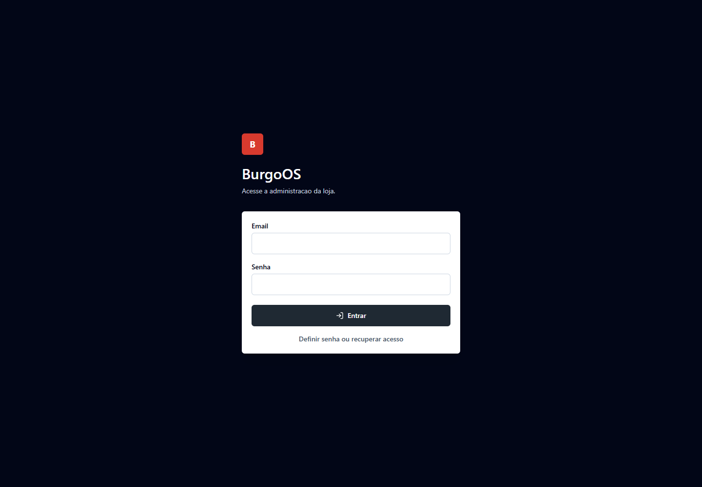

Depois da autenticação:

- confirme o nome do usuário no canto superior direito;
- confira a loja selecionada no topo da página;
- quando possuir acesso a mais de uma loja, selecione a unidade correta antes de operar;
- use **Sair** ao terminar, principalmente em computadores compartilhados.

Nunca compartilhe usuário ou senha. Cada operador deve usar sua própria conta para que ações e alterações possam ser auditadas.

## 2. Navegação

O menu lateral agrupa as funções por área:

- **Visão geral**: painel operacional;
- **Operação**: novo pedido, comandas, pedidos, importação e estoque;
- **Supervisão**: exceções de pagamento;
- **Cardápio e custos**: catálogo, insumos, fichas técnicas, precificação e engenharia de cardápio;
- **Financeiro**: contas a pagar, caixa e instituições;
- **Relatórios e administração**: itens exibidos conforme as permissões do usuário.

O cabeçalho mostra a loja ativa, as notificações e a sessão atual. Em telas menores, o menu pode ser recolhido.

## 3. Painel operacional

O painel é a página inicial da administração. Ele resume pedidos entregues, receita, margem, alertas e resultados do período.

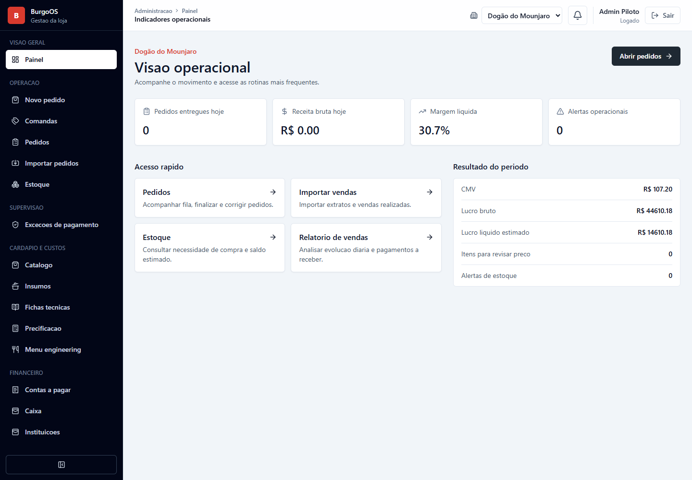

Use os atalhos para acessar rapidamente pedidos, importações, estoque e relatório de vendas. Os indicadores respeitam a loja selecionada; confirme a unidade antes de tomar decisões.

## 4. Atendimento e pedidos

### 4.1 Criar uma venda no PDV

Acesse **Novo pedido**.

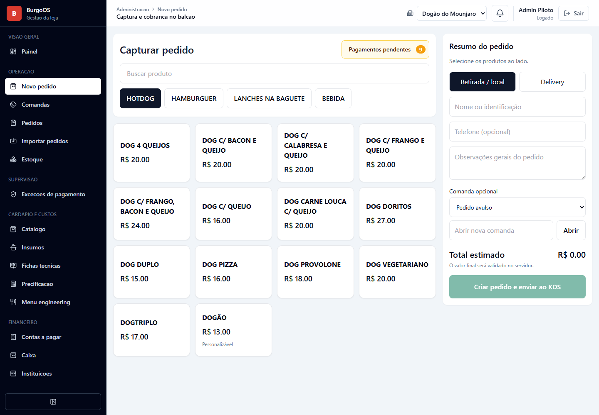

Fluxo recomendado:

1. Localize o produto e adicione-o ao pedido.
2. Configure complementos, observações ou remoções quando disponíveis.
3. Revise itens, quantidades e total.
4. Identifique o tipo de atendimento e o cliente quando necessário.
5. Avance para o pagamento.
6. Selecione a forma de pagamento ou o terminal integrado.
7. Confirme somente depois de validar o valor cobrado.

Evite atualizar ou fechar a página durante a confirmação do pagamento. Se houver dúvida sobre o resultado de uma cobrança, consulte o pedido ou **Exceções de pagamento** antes de tentar novamente.

### 4.2 Trabalhar com comandas

Acesse **Comandas** para abrir e acompanhar consumos que permanecem em atendimento.

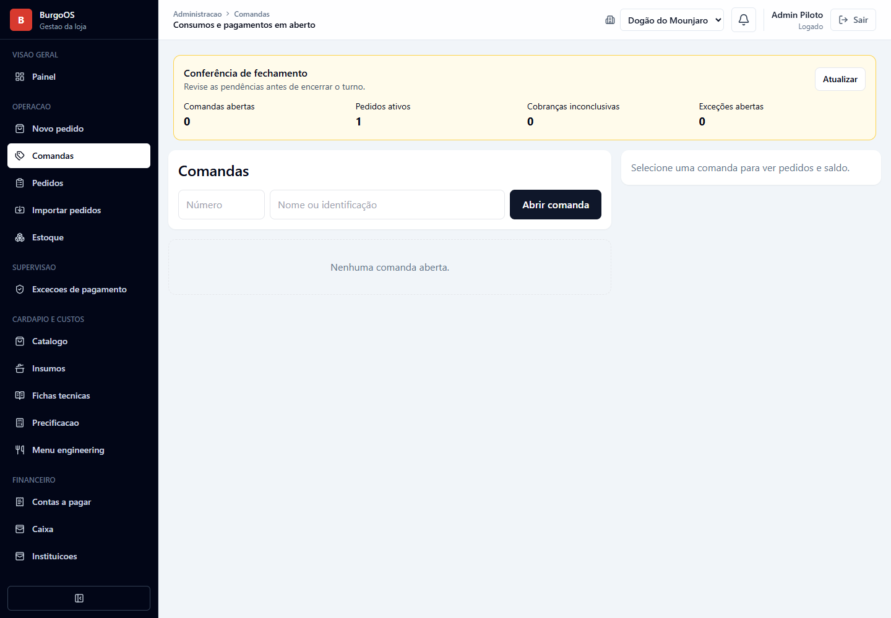

Procedimento geral:

1. Abra uma nova comanda e informe a identificação solicitada.
2. Inclua os itens consumidos.
3. Revise a comanda sempre que adicionar itens.
4. No encerramento, confira o total e registre o pagamento.
5. Finalize a comanda apenas após a confirmação do recebimento.

O fechamento de turno deve ocorrer após a revisão das comandas pendentes e divergências de pagamento.

### 4.3 Acompanhar a fila de pedidos

Acesse **Pedidos** para visualizar a fila operacional.

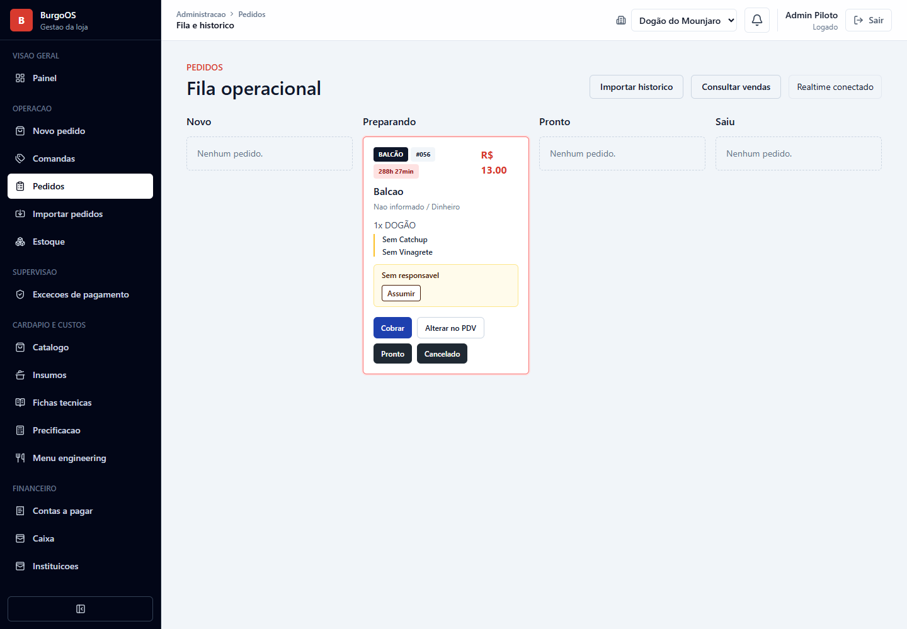

Os pedidos são distribuídos por etapa, como **Novo**, **Preparando**, **Pronto** e **Saiu**. Dependendo do estado e da permissão, o cartão permite:

- assumir a responsabilidade pelo pedido;
- iniciar ou concluir a preparação;
- registrar ou corrigir a cobrança;
- abrir o pedido no PDV;
- cancelar o pedido.

Antes de cancelar, confirme o pedido, o cliente e o estado do pagamento. O cancelamento é uma ação de negócio; não deve ser usado apenas para retirar um cartão da tela.

A indicação **Realtime conectado** informa que a tela está recebendo sinais de atualização. Caso a conexão seja perdida, aguarde a reconexão ou atualize a página. A API continua sendo a fonte de verdade dos pedidos.

### 4.4 Consultar e corrigir pedidos

Na tela de pedidos, use **Consultar vendas** ou a manutenção de pedidos para localizar registros históricos. Utilize data, origem, status ou identificador para reduzir o resultado.

Ao corrigir um pedido:

- valide se está na loja correta;
- confira a data da venda, origem e pagamento;
- registre apenas a alteração necessária;
- não recrie manualmente uma venda integrada sem confirmar se ela já existe;
- considere pedidos cancelados ou excluídos logicamente nas conferências históricas.

## 5. Cardápio público

Cada loja pode possuir um endereço público próprio. O cliente utiliza esse cardápio para escolher produtos e montar o pedido.

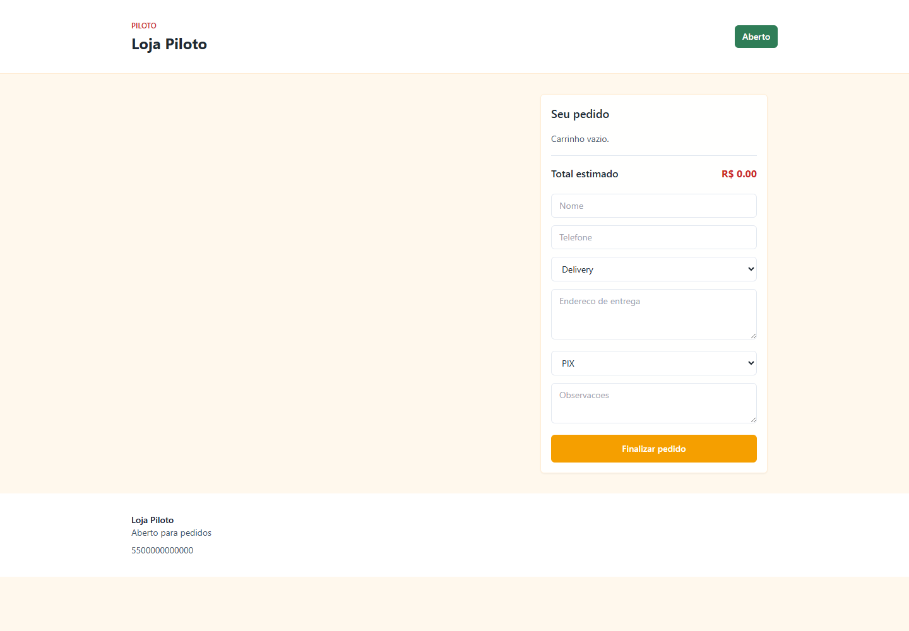

O cliente deve:

1. Selecionar os produtos.
2. Configurar os complementos obrigatórios e opcionais.
3. Revisar o carrinho.
4. Informar os dados solicitados para atendimento ou entrega.
5. Confirmar o pedido.
6. Guardar a identificação apresentada para acompanhamento.

A disponibilidade, o preço e a descrição mostrados ao cliente são definidos no catálogo e nas configurações da loja.

## 6. Catálogo, custos e estoque

### 6.1 Catálogo

Acesse **Catálogo** para administrar categorias, produtos, preços, disponibilidade e complementos.

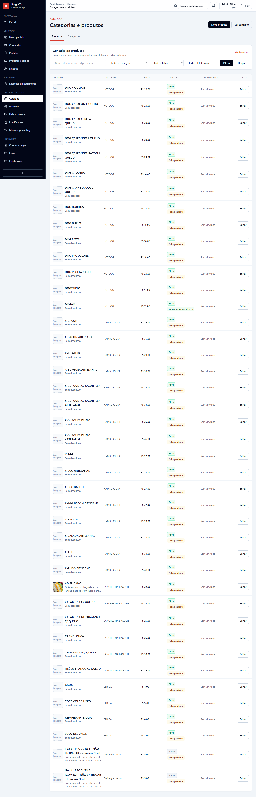

Ao publicar mudanças:

- mantenha nomes e descrições claros para o cliente;
- confira preço, categoria e disponibilidade;
- verifique grupos de complementos e suas quantidades mínima e máxima;
- desative itens indisponíveis em vez de criar duplicatas;
- revise o cardápio público após uma alteração relevante.

### 6.2 Insumos e fichas técnicas

Cadastre os insumos antes de elaborar fichas técnicas. A ficha relaciona cada produto aos ingredientes e quantidades usados na produção. Esses dados alimentam custo, estoque, CMV e precificação.

Ao alterar unidade ou rendimento de um insumo, revise as fichas relacionadas antes de utilizar os novos indicadores.

### 6.3 Estoque

Acesse **Estoque** para consultar saldos e necessidades de compra.

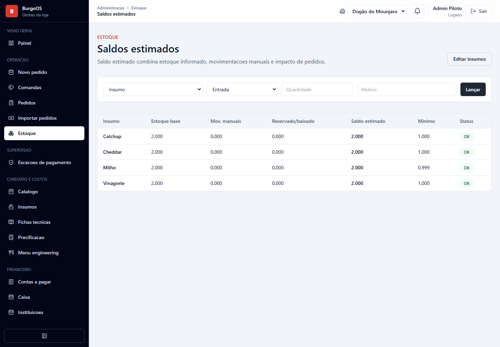

Registre entradas, saídas e ajustes com a data e o motivo corretos. Ajustes manuais devem representar uma contagem ou ocorrência real; não os use para compensar cadastro incorreto sem investigar a origem.

### 6.4 Precificação e engenharia de cardápio

Use as telas de precificação e engenharia para comparar custo, preço, margem e desempenho dos produtos. Antes de alterar preços, confirme:

- fichas técnicas atualizadas;
- custo e rendimento dos insumos;
- taxas dos canais e meios de pagamento;
- período analisado;
- loja selecionada.

## 7. Financeiro

### 7.1 Contas a pagar

Acesse **Contas a pagar** para cadastrar e acompanhar compromissos financeiros.

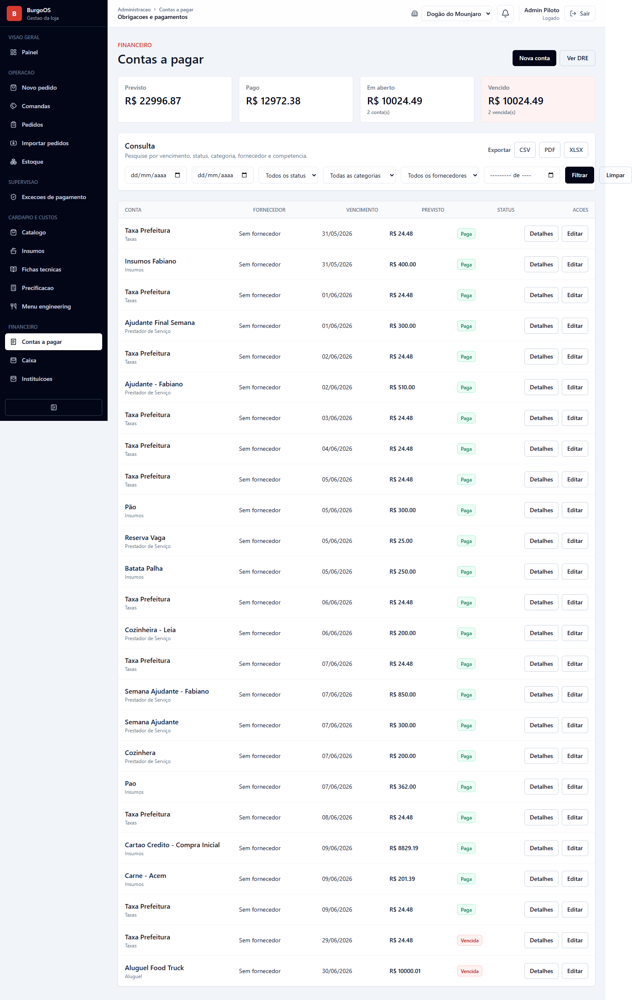

Fluxo recomendado:

1. Pesquise se a conta já existe.
2. Cadastre fornecedor, descrição, competência, vencimento e valor.
3. Revise parcelas e recorrência, quando aplicáveis.
4. Registre o pagamento somente quando ele ocorrer.
5. Use filtros para acompanhar vencidas, próximas do vencimento e pagas.

Não altere uma conta paga para representar outra despesa. Corrija o lançamento com rastreabilidade ou crie um novo registro conforme a política financeira.

### 7.2 Caixa

Acesse **Caixa** para acompanhar contas financeiras e movimentações.

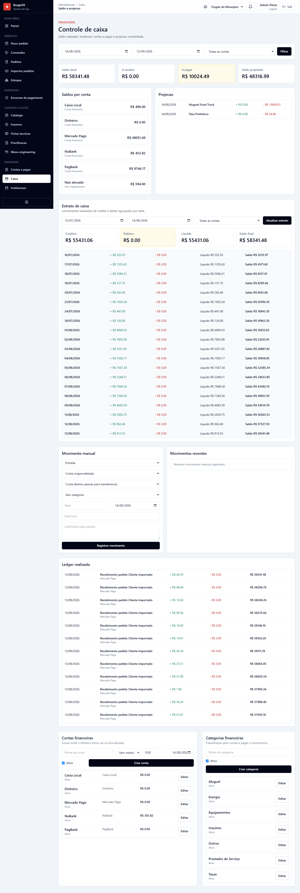

Use a tela para registrar movimentos manuais autorizados, consultar entradas e saídas e acompanhar o saldo. Movimentos trazidos por integrações devem ser reconciliados antes de qualquer duplicação manual.

Transferências entre contas, aplicações e resgates não são vendas. Elas devem permanecer classificadas como movimentações financeiras e não gerar pedidos.

### 7.3 Instituições e exceções de pagamento

Em **Instituições**, configure os meios e instituições usados na conciliação. Em **Exceções de pagamento**, trate cobranças cujo resultado automático ficou inconclusivo.

Antes de repetir uma cobrança, consulte o provedor e o pedido. Webhooks podem chegar depois da tentativa inicial e confirmar uma operação já realizada.

## 8. Relatórios

Acesse **Relatório de vendas** para analisar evolução, canais e pagamentos.

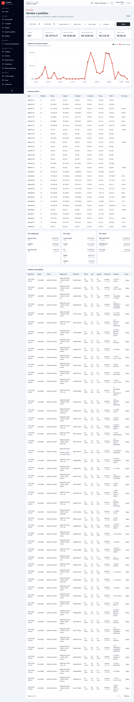

Para uma análise confiável:

1. Selecione a loja.
2. Informe o período desejado.
3. Confira os filtros de status, canal ou pagamento.
4. Aguarde a atualização dos indicadores.
5. Exporte apenas o intervalo necessário.

Relatórios podem usar a data efetiva da venda, enquanto `created_at` representa a criação técnica do registro em alguns fluxos. Em conferências de integrações, priorize o campo de data de negócio documentado para a origem.

## 9. Importação de vendas

Acesse **Importar pedidos**. A tela oferece importação por arquivo e consulta por API.

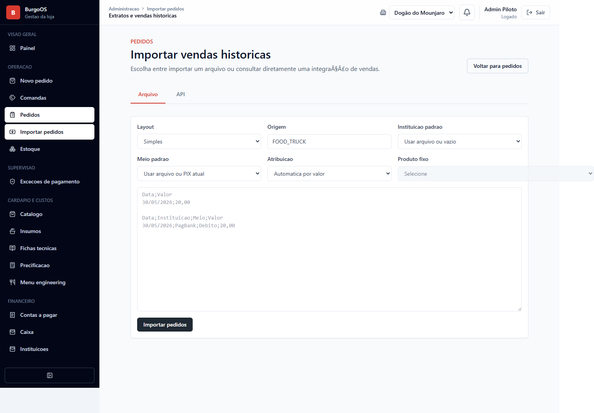

### 9.1 Arquivo CSV

1. Selecione o layout.
2. Informe a origem.
3. Escolha instituição e meio de pagamento padrão quando necessário.
4. Defina a regra de atribuição de produto.
5. Cole ou envie os dados no formato indicado.
6. Revise a prévia e os avisos.
7. Confirme a importação.
8. Consulte o histórico para validar totais, datas e rejeições.

Não importe novamente o mesmo arquivo sem analisar o histórico. O sistema possui mecanismos de idempotência, mas mudanças de layout ou identificador podem impedir o reconhecimento de duplicatas.

### 9.2 Integrações de venda

Na aba **API**, selecione o provedor configurado, informe o período e execute primeiro a consulta ou prévia quando disponível. Confirme se a quantidade e os valores correspondem a vendas reais antes de persistir.

Para Mercado Pago, o fluxo deve importar somente pagamentos originados de venda, independentemente do canal. Transferências, PIX entre contas, aplicações e resgates devem ser desconsiderados. Se um desses movimentos aparecer como pedido, não faça correção em massa: registre os identificadores, valores e datas para investigação.

Datas próximas da meia-noite exigem atenção ao fuso horário. Confira a data apresentada pelo provedor e a data efetiva gravada no pedido.

## 10. Integrações de delivery

Acesse **Integrações de delivery** para conectar e acompanhar canais como iFood.

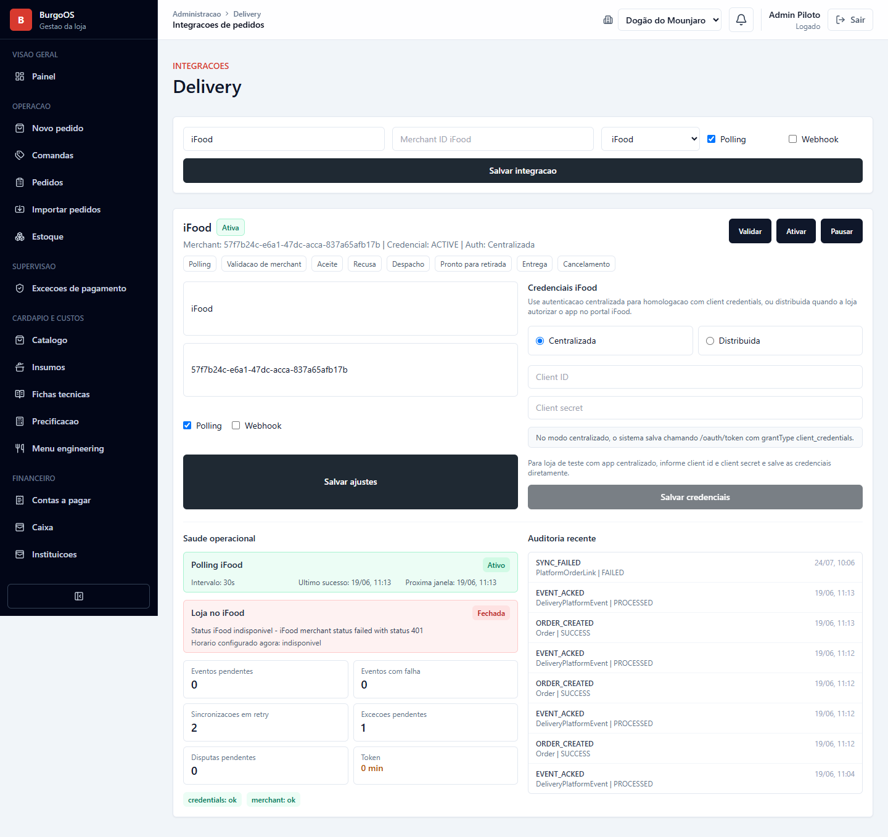

Cada conexão pertence à loja selecionada. Utilize as ações apresentadas para autorizar, reconectar ou verificar o estado. Ao diagnosticar problemas, registre horário, loja, canal e identificador externo; nunca copie tokens ou segredos para chamados.

Pedidos externos podem levar alguns instantes para entrar na fila. Antes de criar um pedido manual, pesquise pelo identificador externo para evitar duplicidade.

## 11. Configurações e acesso

Acesse **Configurações** para dados operacionais da loja.

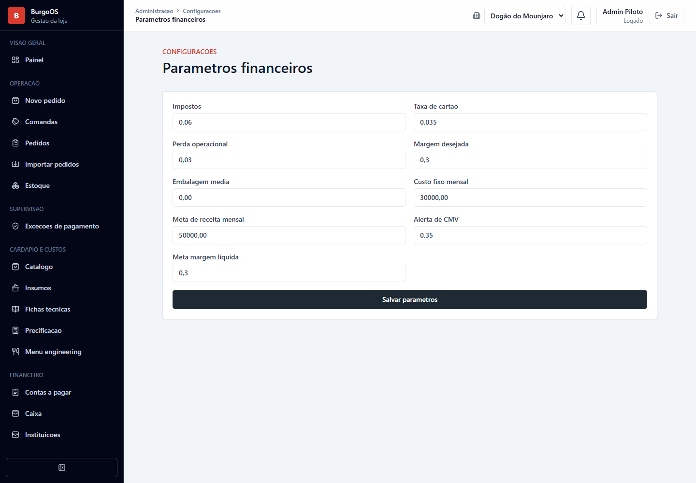

Usuários com permissão administrativa também podem gerenciar:

- identidade visual e dados públicos;
- usuários e estado de acesso;
- perfis de acesso e permissões;
- auditoria de acessos;
- plataformas e integrações autorizadas.

Conceda somente as permissões necessárias. Ao desligar um colaborador, inative o acesso em vez de reutilizar a conta.

## 12. Notificações

O sino no cabeçalho reúne notificações operacionais. Acesse a central para consultar itens anteriores quando disponível.

- leia o conteúdo antes de navegar para a ocorrência;
- marque como lida após a avaliação;
- evite abrir várias abas do painel sem necessidade;
- se os números parecerem desatualizados, atualize a página uma vez e verifique a conexão em tempo real.

## 13. Solução de problemas

### A tela não atualizou

Verifique a conexão, a loja selecionada e o indicador de tempo real. Atualize a página. Se persistir, registre horário, endereço da tela e ação realizada.

### Um pedido ou pagamento está duplicado

Não exclua os dois registros. Compare origem, identificador externo, horário e valor; preserve o registro confirmado e encaminhe a divergência para análise.

### A data importada está diferente

Registre a data exibida pelo provedor, o fuso horário, o identificador externo e a data apresentada pelo BurgoOS. Não altere manualmente antes de determinar se o problema é de origem, conversão ou exibição.

### Uma integração parou

Confira a loja e o status da conexão. Tente reconectar somente quando a tela indicar credencial expirada ou ação necessária. Evite sincronizações repetidas em sequência.

### A aplicação está lenta

Reduza o período dos filtros e evite múltiplas exportações ou sincronizações simultâneas. Informe a tela, o período consultado e o horário ao suporte.

## 14. Atualização das capturas

As imagens deste manual podem ser regeneradas em ambiente local com `scripts/capture-user-guide.mjs`. Com API e web em execução, defina:

```powershell
$env:USER_GUIDE_EMAIL = "usuario-local"
$env:USER_GUIDE_PASSWORD = "senha-local"
$env:USER_GUIDE_BROWSER_EXECUTABLE = "C:\Program Files\Google\Chrome\Application\chrome.exe"
node scripts\capture-user-guide.mjs
```

Use somente uma base local com dados fictícios ou anonimizados. Não versione capturas que exponham clientes, credenciais ou informações financeiras reais.
